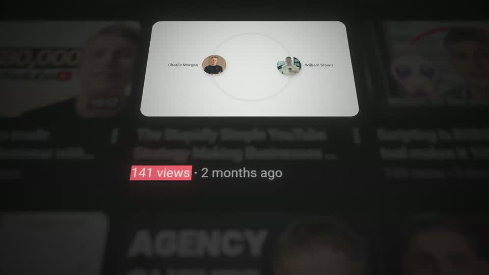
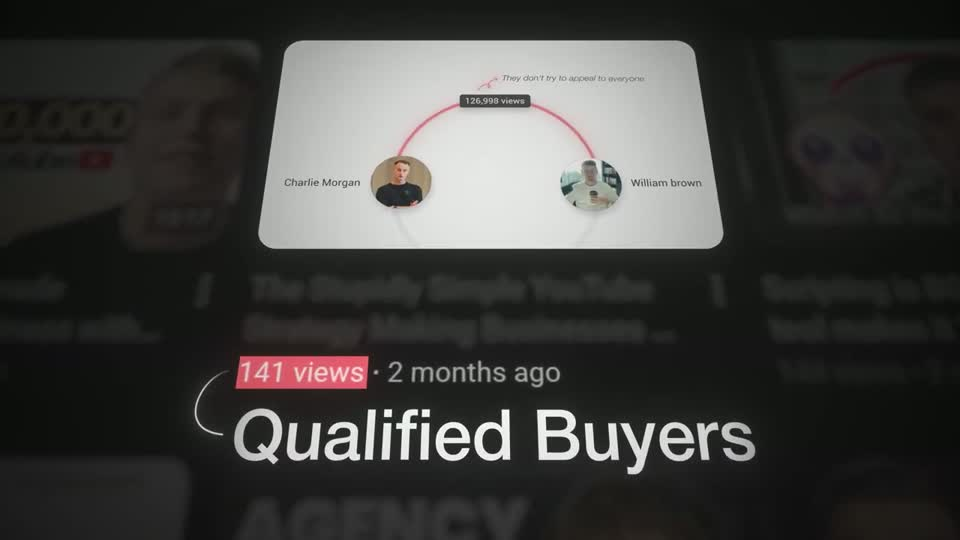
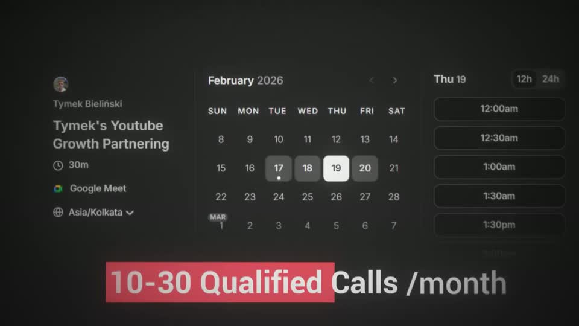
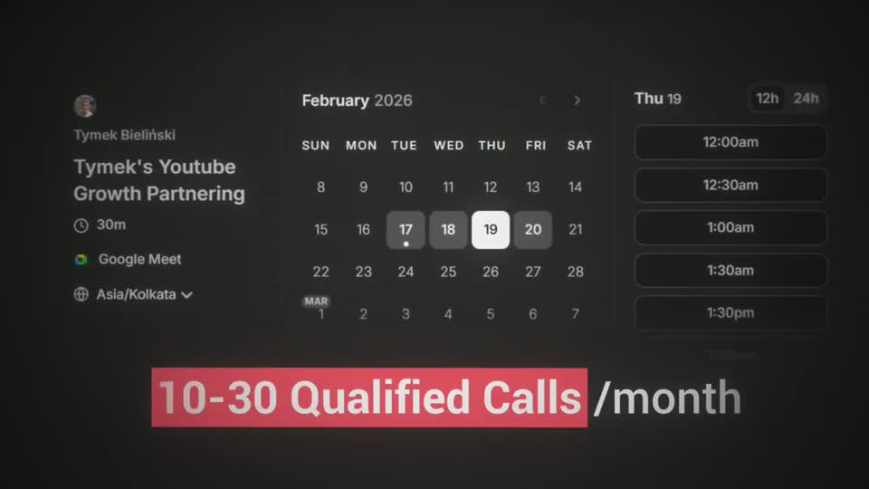

# A1 — Screenshot focus + highlight

Rule: `standards/formats/long-form.md` (catalogue row A1). This card holds the evidence and the quality bar; the rule stays in the format profile.

## Quality bar

- The proof is **real UI** (booking page, video tile, watch page) — never a drawn stand-in. Exactly one element is sharp; its siblings or its own page sit behind it blurred (σ ≈ 4–6 px at 1080) and dimmed to ≈ 35 %, still recognisable.
- Focus element reads big: the card/tile is ≥ 40 % W after the camera settles (s047 tile ≈ 40 %, s002 card ≈ 55 %). The rule row says ≈ 55–60 %; two exemplars sit lower — promotion pending the Tymek checkpoint.
- First beat after the card lands is a mark on the real UI: red highlight block behind the key number (`141 views`, `1.2M views`) or a block wipe L → R behind the key phrase (s083), ≈ 0.3–0.5 s after the settle.
- Headline sits **beneath** the card, centred, cap height ≥ 70 px, 1 line (+ an optional 2-line subline ≈ 50 px); only the meaning word is red. A thin hand-drawn bracket/arrow ties the marked number to the headline.
- Depth: ≥ 3 layers — grid/vignette ground, blurred backdrop UI, sharp card (light border 1–2 px, rounded ≈ 30 px), marks/text on top.
- Long A1 shots are chains: each new beat (card swap, split, tilt to the punchline) is one camera leg with a readable stop; the card's own content may keep playing (s047) while text lands.
- Ends on a still hold of 0.6–1.5 s with everything settled.

<!-- generated:start -->
## Evidence (generated by tools/ref_index.py — do not edit)

**4 exemplars** from 1 video · duration median 8.22 s (p25–p75 3.83–12.33 s) · largest text median 71.0 px at 1080 · word build 0.25 s/word · hold 1.05 s

| Video | Time | Stills | Why it works |
|---|---|---|---|
| ultra-predictable-funnel s002 ★ | 0:01.1–0:13.2 |   | Proof is real UI stacked in depth: a crisp light booking card floats over a blurred, dimmed copy of the channel it belongs to, so the eye lands on the card and the context is still readable. Five beats in 12 s never feel busy because each beat is one camera leg with a readable stop, and the red divider line literally becomes the path the camera travels down to the punchline. |
| ultra-predictable-funnel s047 ★ | 4:46.5–4:58.9 |   | The sharpest example of screenshot focus: one real tile pulled forward, everything else in the same grid blurred to ≈35 %, a red block behind '141 views', a 75 px headline 'Qualified Buyers' tied to the count by a thin hand-drawn bracket, then an italic + bold two-line subline with one red word ('Confirming'). The tile keeps playing, so the proof is alive while the text lands. |
| ultra-predictable-funnel s045 | 4:36.5–4:40.8 |   | Same A1 grammar as s047: a real video tile pulled forward out of its own grid; the red block wipes onto '141 views' as the first beat, then a hand-drawn bracket and 'Qualified' build below. |
| ultra-predictable-funnel s083 | 5:58.1–6:01.8 |   | A real dark booking page with several days filled, and the one line that matters ('10-30 Qualified Calls /month', ≈72 px) under it with a red block wiping left → right behind the key phrase — the block sweep is the beat, ≈0.5 s after the whip settles. |
<!-- generated:end -->
