# A1 — Screenshot focus + highlight

Rule: `standards/formats/long-form.md` (catalogue row A1). This card holds the evidence and the quality bar; the rule stays in the format profile.

## Quality bar

- The proof is **real UI** (booking page, video tile, landing-page hero, pricing modal, results list), never a drawn stand-in. Exactly one element is sharp. Its siblings or its own page sit behind it blurred (σ ≈ 4–6 px at 1080) and dimmed to ≈ 35 %, still recognisable. A horizontal streak smear of the page's own edges also works (Hormozi s004).
- The focus card or tile reads big: 40–60 % W after the camera settles (pilot s047 ≈ 40 %, pilot s002 and Hormozi s004 ≈ 55 %, Clay s041 ≈ 45 %). A list row or modal may sit smaller (≈ 30 %: Mentors s026, Ottley s011) only when focus comes by subtraction, with every sibling sunk to ≈ 25 % and blurred. These are the weaker exemplars.
- The first beat after the card lands is one mark on the real UI, ≈ 0.3–0.6 s after the settle. It is a red block behind the key number, a block wipe L → R behind the key phrase, one hand-drawn underline, or a synthetic cursor arriving on the button (Clay s041).
- The headline is optional; the UI's own text may carry the point (Hormozi, Ottley, Clay). When used, it sits centred beneath the card (Stupidly s031 puts it above), cap height ≥ 48 px (≥ 70 px when it is the only text), 1 line plus an optional 2-line subline ≈ 50 px. Only the meaning word is red. A thin hand-drawn bracket or arrow may tie the marked number to the headline.
- Dark-ground depth: ≥ 3 layers. Grid/vignette ground, blurred backdrop UI, sharp card (light border 1–2 px, rounded ≈ 30 px), then marks and text on top.
- Light ground: the backdrop page is greyed and blurred (≈ 60 % toward grey), never darkened, so the frame stays light (Ottley s011, Clay s041). Or there is no backdrop at all and the white vignette does the focusing (Stupidly s031, Clay s010). The card takes a soft neutral shadow; a red block behind the headline turns its text white.
- Long A1 shots are chains: each new beat is one camera leg with a readable stop. While text lands, the card's own content may keep playing (s047) or the camera may push slowly (≈ 1.6 %/s, Hormozi s004).
- Ends on a still hold of 0.6–1.5 s with everything settled.

<!-- generated:start -->
## Evidence (generated by tools/ref_index.py — do not edit)

**12 exemplars** from 6 videos · duration median 4.73 s (p25–p75 3.98–7.56 s) · largest text median 57.5 px at 1080 · word build 0.25 s/word · hold 1.45 s

| Video | Time | Stills | Why it works |
|---|---|---|---|
| hormozi-100-posts s004 ★ | 0:08.8–0:14.1 |   | A real landing-page hero (headline, VSL thumbnail, 'Chat with me' button) as a sharp card ≈55 % W on near-black, with a horizontal light-streak smear of the page's own edges flanking it — a cheap way to give a flat screenshot speed and depth. The continuous slow push keeps a 5 s static page alive. |
| liam-ottley-540k s011 ★ | 2:18.3–2:22.2 | 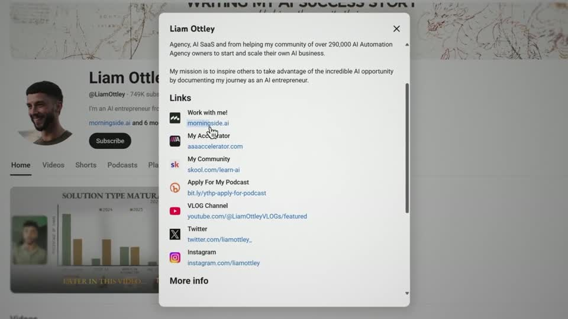 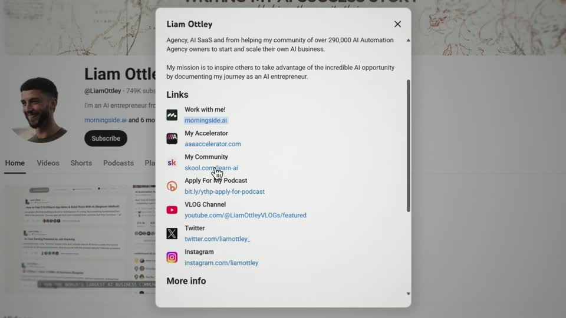 | Real UI focus on the light ground: a crisp white modal (≈30 % W) over its own page, which is blurred and greyed rather than darkened, so the frame stays light. One mark only, drawn on the link being talked about. |
| problem-with-clay s041 ★ | 0:04.2–0:07.5 | 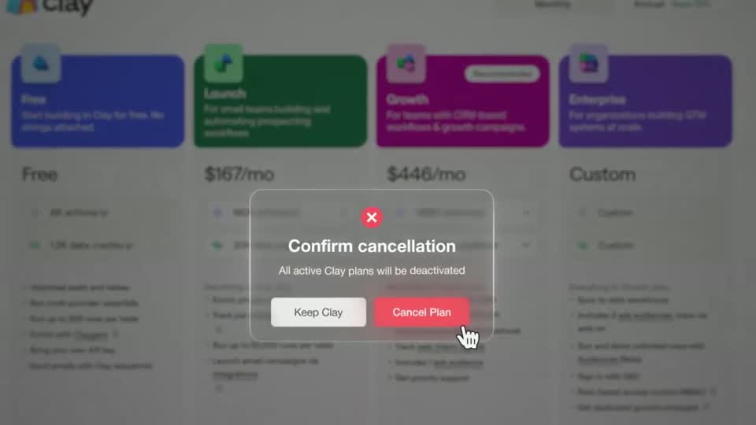  | Real UI stacked in depth on a light ground: the full-colour pricing page is pushed back by greying and blurring it (not by darkening to black), so the white glass modal with its red ✕ badge and red 'Cancel Plan' button is the only crisp, saturated thing in frame. The cursor arriving on the button is the beat — no headline needed. |
| spent-10k-on-mentors s026 ★ | 4:10.9–4:19.1 | 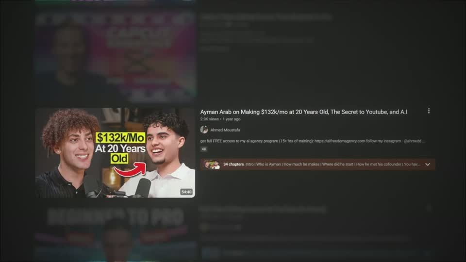 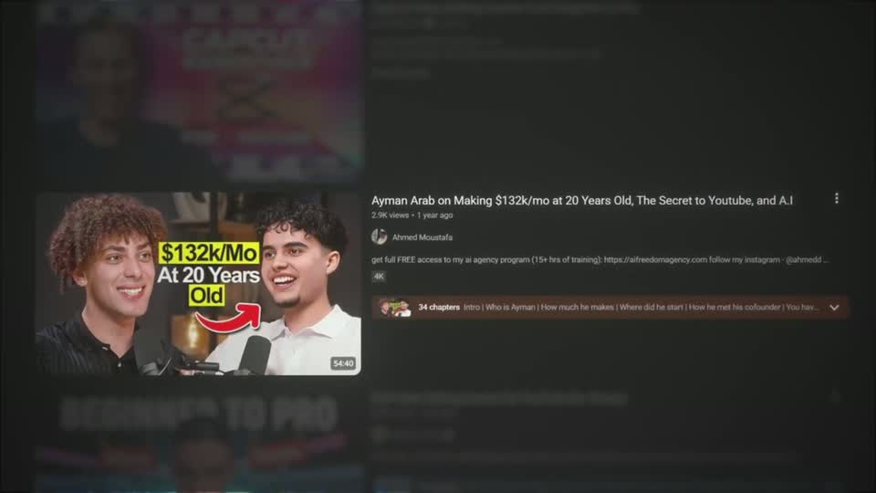 | Focus by subtraction on a real list: the camera scrolls the actual search results, then every sibling sinks to a dim blur and only the one video he means stays lit, so the viewer finds it without any arrow or box. |
| stupidly-simple-youtube-strategy s031 ★ | 1:42.5–1:47.4 | 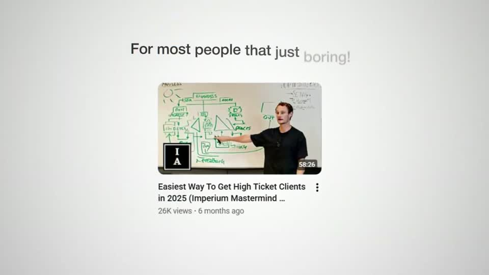 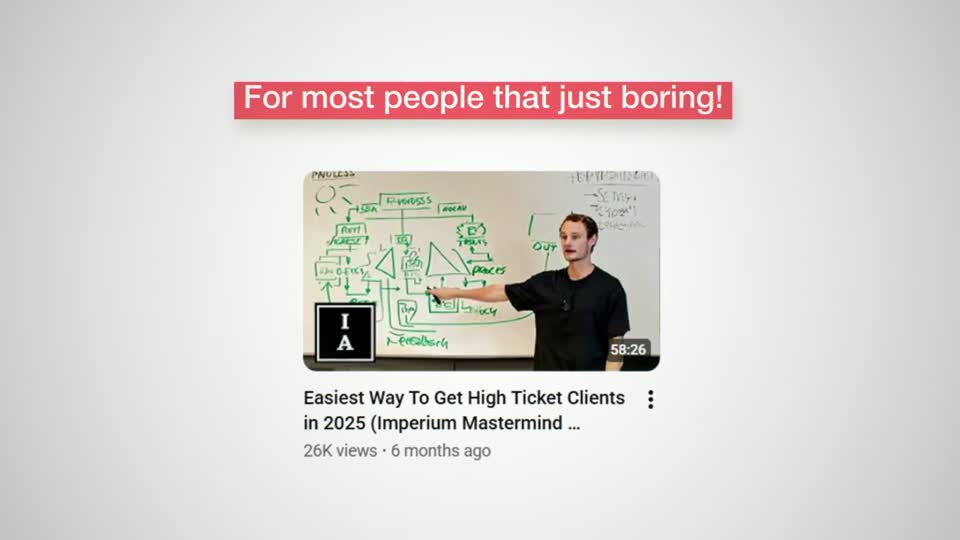 | Real UI as the subject with the verdict written over it: the tile is sharp and alone on the light canvas, the line builds in plain dark type and only becomes a judgement when the red block wipes behind it. No blurred backdrop — on the light ground the vignette and empty white do the focusing. |
| ultra-predictable-funnel s002 ★ | 0:01.1–0:13.2 | 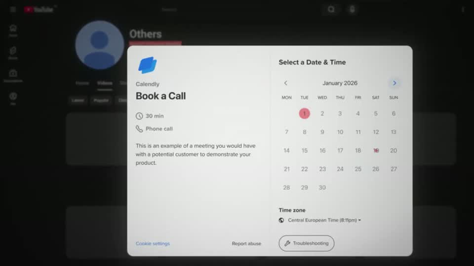 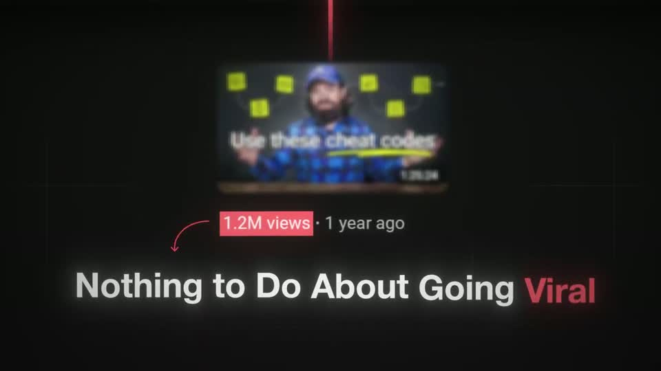 | Proof is real UI stacked in depth: a crisp light booking card floats over a blurred, dimmed copy of the channel it belongs to, so the eye lands on the card and the context is still readable. Five beats in 12 s never feel busy because each beat is one camera leg with a readable stop, and the red divider line literally becomes the path the camera travels down to the punchline. |
| ultra-predictable-funnel s047 ★ | 4:46.5–4:58.9 | 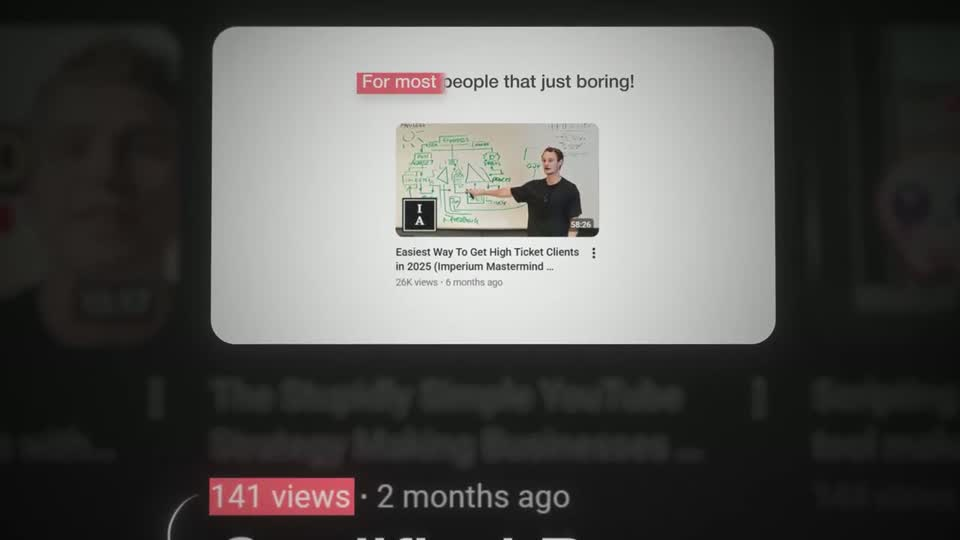 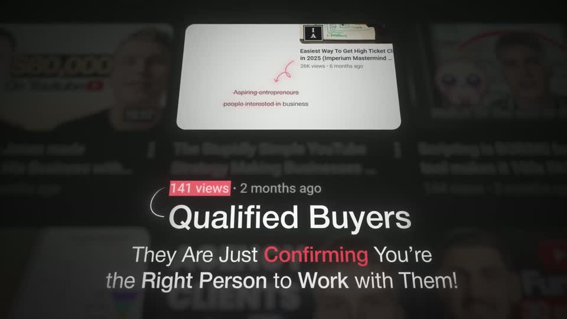 | The sharpest example of screenshot focus: one real tile pulled forward, everything else in the same grid blurred to ≈35 %, a red block behind '141 views', a 75 px headline 'Qualified Buyers' tied to the count by a thin hand-drawn bracket, then an italic + bold two-line subline with one red word ('Confirming'). The tile keeps playing, so the proof is alive while the text lands. |
| hormozi-100-posts s034 | 12:27.2–12:31.8 |   | Same landing-page hero card on its horizontal-streak smear as s004; bookending the video with the same asset makes the closing ask feel like a promise kept. |

…and 4 more in references/index.json.
<!-- generated:end -->
