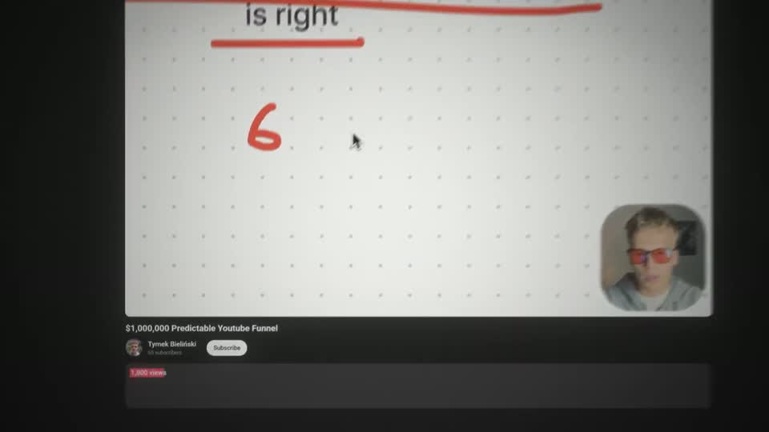
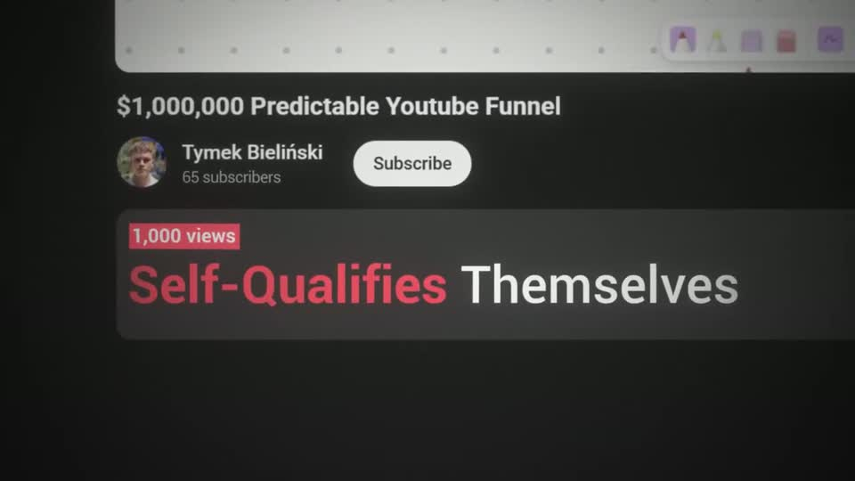

# A2 — Screenshot camera pass

Rule: `standards/formats/long-form.md` (catalogue row A2). This card holds the evidence and the quality bar; the rule stays in the format profile.

## Quality bar

- Starts *inside* the real content (a playing video / zoomed page) and the camera pulls back to reveal the page it belongs to — the reveal is the beat (s061, ≈ 1.5 s, `ease.camera`).
- At most 2–3 legs, each ending on a readable stop; the final stop frames the line that carries the point.
- The headline is typeset **inside the UI** (in the description box, at the page's own type style scaled up), ≥ 80 px cap height, meaning word red.
- A red highlight block on the real metric (`1,000 views`) lands at a stop, not mid-move.
- Entering from another canvas uses a directional whip (motion blur along the move, ≈ 0.5 s), never a dissolve.

<!-- generated:start -->
## Evidence (generated by tools/ref_index.py — do not edit)

**1 exemplar** from 1 video · duration median 5.5 s · largest text median 86 px at 1080 · word build 0.2 s/word · hold 0.8 s

| Video | Time | Stills | Why it works |
|---|---|---|---|
| ultra-predictable-funnel s061 | 6:45.7–6:51.2 |   | The camera starts inside the actual video and pulls back to reveal it is a YouTube page ('$1,000,000 Predictable Youtube Funnel', 1,000 views in a red block), and the headline 'Self-Qualifies Themselves' (≈86 px, 'Self-Qualifies' red) is typeset inside the description box as if it were page text. |
<!-- generated:end -->
