# A2 — Screenshot camera pass

Rule: `standards/formats/long-form.md` (catalogue row A2). This card holds the evidence and the quality bar; the rule stays in the format profile.

## Quality bar

- Real pages only: own site, channel page, checkout, article, pricing. The page's own text is the headline. Added type is optional; when it is typeset inside the UI it reads ≥ 80 px cap height with the meaning word red (pilot s061 only).
- Reading pass: 1–3 legs of ≈ 1.5–3 s (`ease.camera`), each ending on a readable stop. A push-in from the wide page and a pull-back from inside the content both work (pilot s061; Instantly s012 snaps back from ≈ 300 %).
- Volume pass: the page tilts back 20–50° in 3D (a tilt, never a flip), near rows sharp and the far edge in blur. One slow glide of 3–8 s runs with no stops and no added text (Mentors s014, Instantly s006, Stupidly s043, Ottley s021).
- Exactly one mark lands per stop, never mid-move: a red block wiping L → R behind the metric or name, a red hand-drawn circle/ellipse, or a grey block behind a sentence. Two highlight colours on one page may separate cause (blue) from result (yellow-green) (Instantly s004).
- After the push, body text at a stop reads ≥ 30 px cap height at 1080 and the metric being talked about ≥ 60 px (Ottley s040 ≈ 66 px).
- Entering from or leaving to another canvas: a directional whip (motion blur along the move, ≈ 0.5 s), a zoom-out that slides the page away (Instantly s002), or a hand-drawn red line that becomes the camera path (Clay s019 → s046). Never a dissolve.
- Light ground: depth comes from focus, not shadow. Tilt the page with far-edge blur, or defocus the frame edges and outer columns; pages keep a soft neutral shadow.
- Don't: enter on a white overexposure flash (Mentors s021). Long-form never uses light leaks or flashes.

<!-- generated:start -->
## Evidence (generated by tools/ref_index.py — do not edit)

**26 exemplars** from 7 videos · duration median 4.64 s (p25–p75 3.2–6.04 s) · largest text median 30.0 px at 1080 · word build 0.2 s/word · hold 0.9 s

| Video | Time | Stills | Why it works |
|---|---|---|---|
| hormozi-100-posts s038 ★ | 0:48.0–0:52.6 | 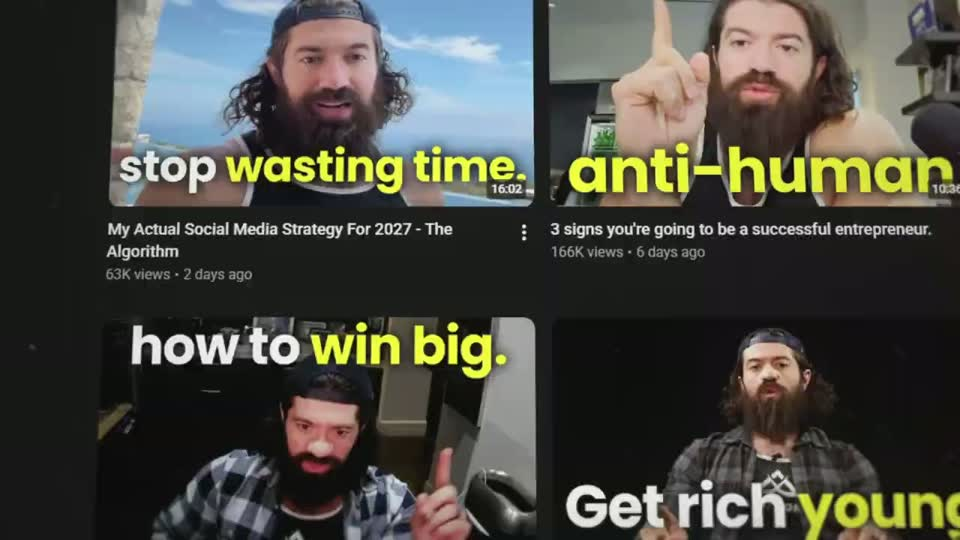 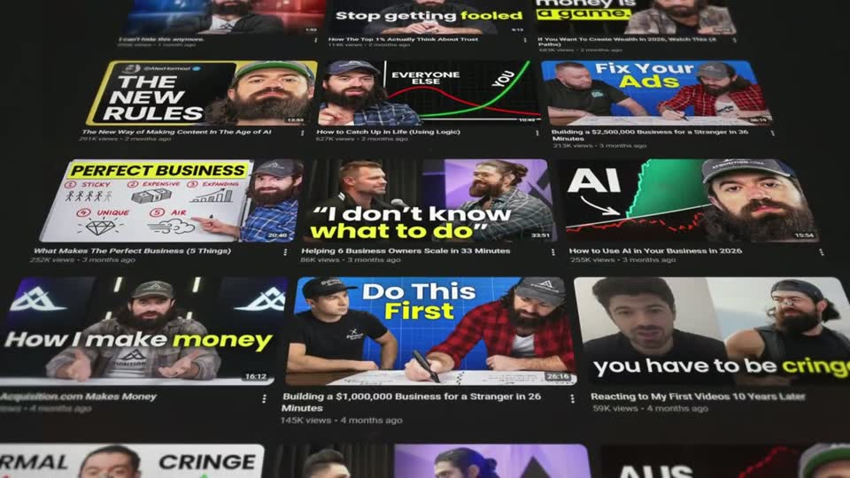 | The 3D tilt turns a static channel page into a sense of endless volume: thumbnails recede in perspective while the camera keeps travelling, so the 'he posts a lot' point is shown, not said. The rack-focus hand-off from the B1 backdrop to the same page sharp keeps it one continuous canvas. |
| instantly-1m-arr-channel s004 ★ | 0:05.4–0:08.9 |  | Third-party proof (Google's own AI answer) shown as the real dark-mode UI, and the camera does the reading: one slow push toward the claim, with the second highlight landing only when the push settles. Two highlight colours separate 'what they posted' (blue) from 'what it earned' (yellow-green). |
| instantly-1m-arr-channel s006 ★ | 0:10.0–0:13.3 | 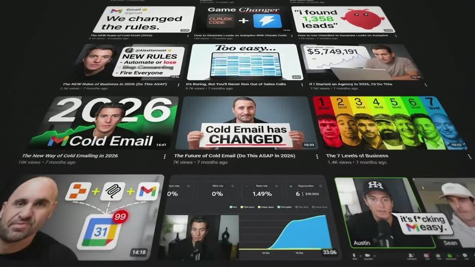 | Volume as proof: a real channel's thumbnails tilted into a 3D floor with perspective depth-of-field (far rows soft, near rows sharp) so the camera travel itself says 'hundreds of videos'. The wall does not cut away, it dims in place and becomes the backdrop of the next headline. |
| liam-ottley-540k s040 ★ | 0:29.1–0:31.9 | 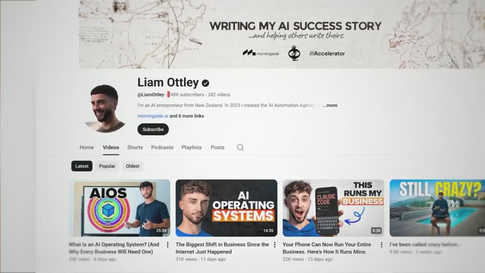 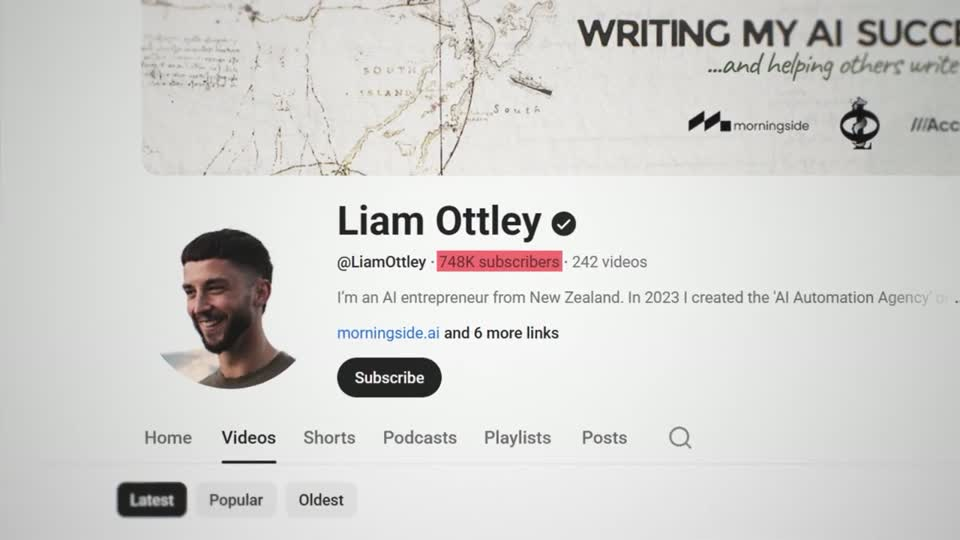 | A real page pushed until the channel name reads ≈66 px, with exactly one mark — the red block behind the subscriber count — landing as the push settles. The page keeps a faint vignette edge on the silver ground. |
| liam-ottley-540k s037 ★ | 1:13.6–1:19.6 |   | A real page made cinematic by a single move: push plus a gentle 3D tilt (a tilt, never a flip) with depth-of-field softening the far edge, ending on one hand-drawn red circle around the number that matters. The page keeps a soft neutral shadow on the silver ground. |
| problem-with-clay s008 ★ | 0:26.3–0:31.5 | 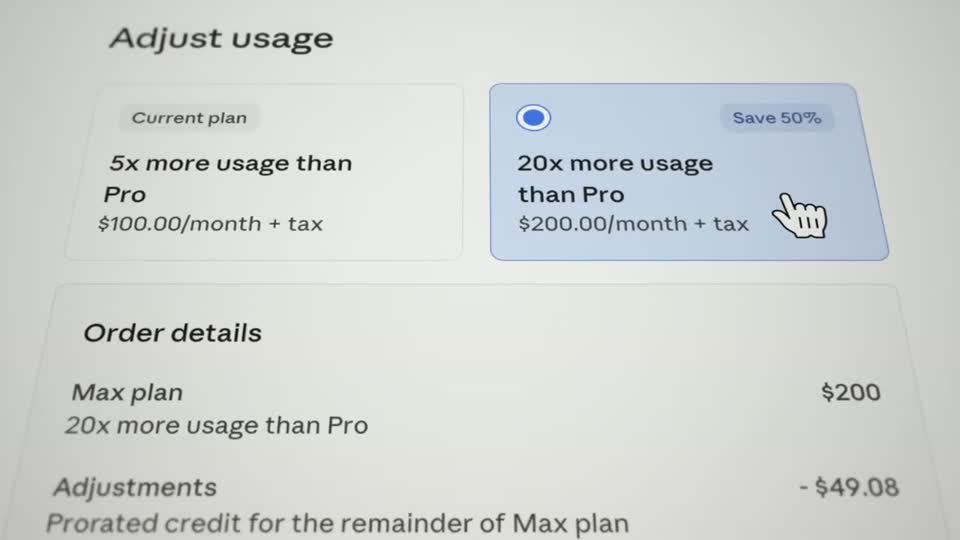 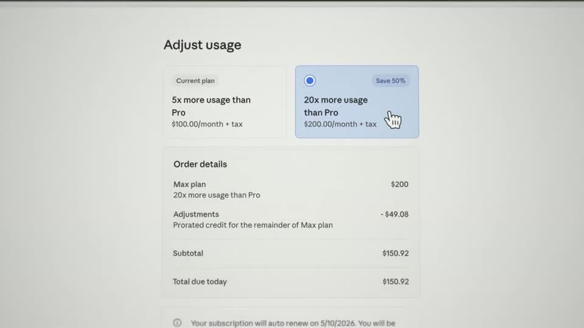 | The camera pass uses a real page with a gentle 3D tilt (never a flip) and shallow focus — the far edge of the page falls off into blur, which gives depth on a white page where shadows alone wouldn't. The stop lands with the selected blue plan card under a cursor, so the proof ('I pay $200/mo for this') is a real UI state, not a label. |
| problem-with-clay s017 ★ | 1:50.6–1:59.2 | 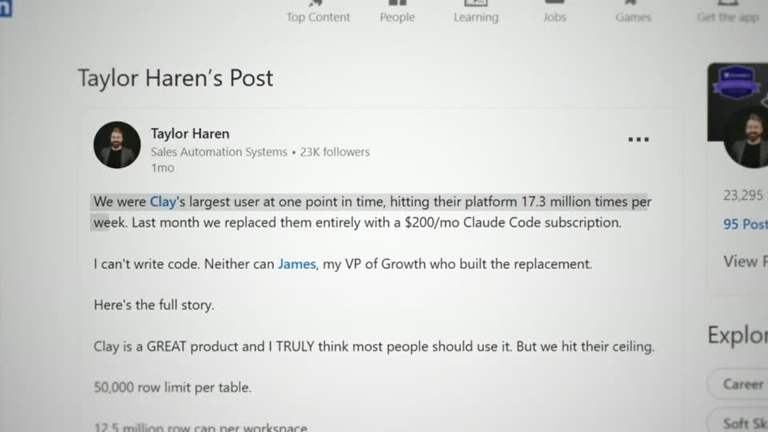 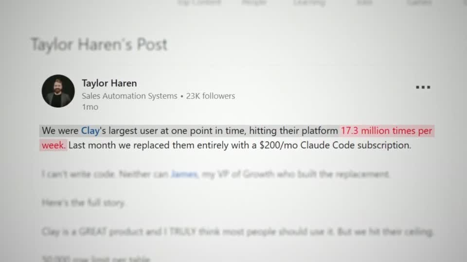 | A long document reduced to one sentence without leaving it: the rest of the post blurs and fades in place (focus blur), the kept line gets a neutral grey block and only the number phrase turns red. On a white page the grey block (not yellow) keeps it calm and premium. |
| spent-10k-on-mentors s010 ★ | 0:36.7–0:43.7 | 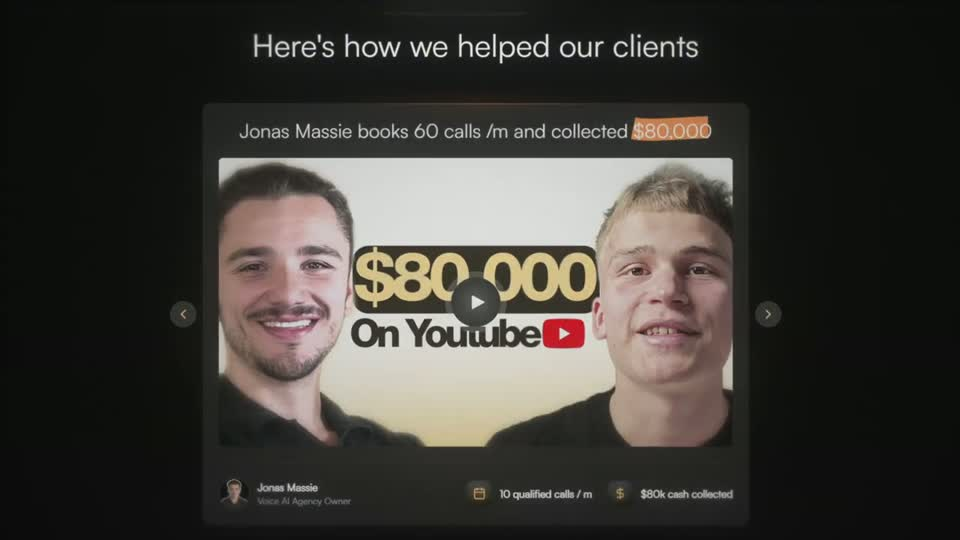 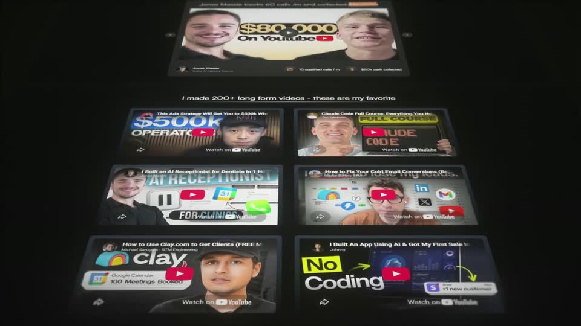 | A real page, not a mock: the camera scrolls it in short legs with readable stops (headline, client results, thumbnail wall) and ends by laying the page back in 3D so the grid of 200+ thumbnails reads as volume. The carousel swap inside the page keeps the proof alive between legs. |

…and 18 more in references/index.json.
<!-- generated:end -->
