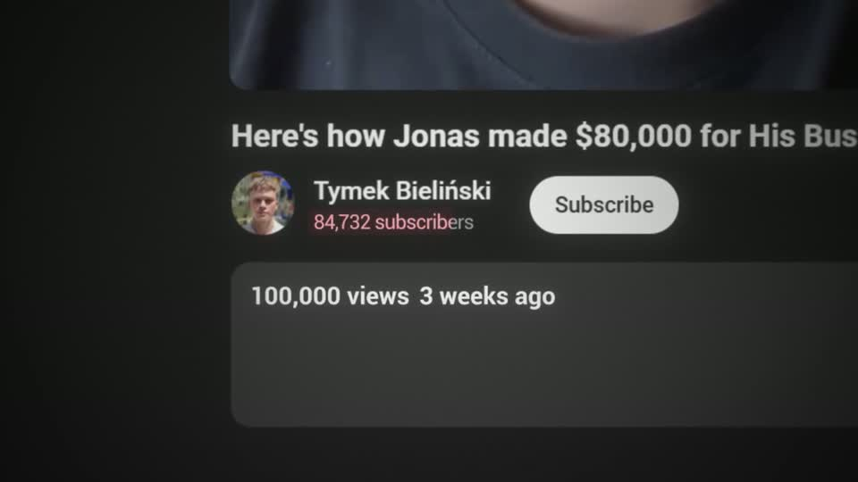
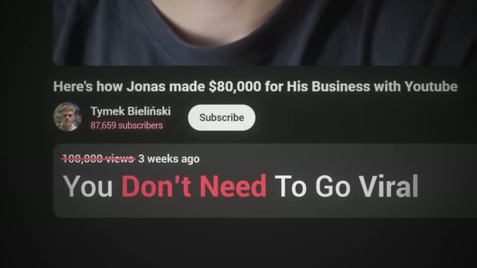

# A3 — Counter on screenshot

Rule: `standards/formats/long-form.md` (catalogue row A3). This card holds the evidence and the quality bar; the rule stays in the format profile.

## Quality bar

- The number counts on the **real UI** where it lives (watch-page views, subscriber count), not on a blank card; the page is pushed to ≈ 2–2.5× so the number reads ≥ 30 px cap height.
- Odometer roll decelerates (`ease.enter`) over ≈ 2 s per number and lands exactly on the spoken figure; a second counter may follow, never run at the same time.
- Camera keeps a slow continuous push (3–4.5 %/s, `ease.camera.slow`) while numbers roll — the shot never freezes before the payoff.
- The twist mark lands after both counts settle: a red strike sweeping L → R through the metric (s057) or an underline under its label.
- Payoff headline builds word by word inside the UI box (≈ 0.2 s/word), cap height ≥ 80 px, red on the contradiction words; hold ≥ 1 s before the exit (whip allowed).

<!-- generated:start -->
## Evidence (generated by tools/ref_index.py — do not edit)

**1 exemplar** from 1 video · duration median 10.2 s · largest text median 87 px at 1080 · word build 0.2 s/word · hold 1.4 s

| Video | Time | Stills | Why it works |
|---|---|---|---|
| ultra-predictable-funnel s057 ★ | 5:47.9–5:58.1 |   | Two real counters on real UI roll odometer-style in sequence — views 93,549 → 100,000 (≈2 s), then subscribers 65 → 87,659 in red (≈2 s) — while the camera creeps in. Then the twist: a red strike sweeps through '100,000 views' and 'You Don't Need To Go Viral' (≈87 px, 'Don't Need' red) builds inside the description box, so the headline lives in the UI. |
<!-- generated:end -->
