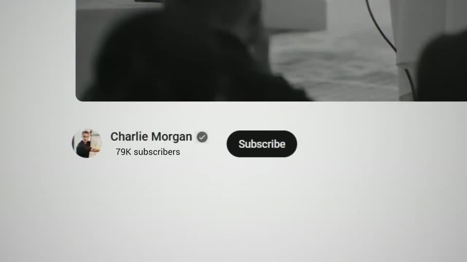
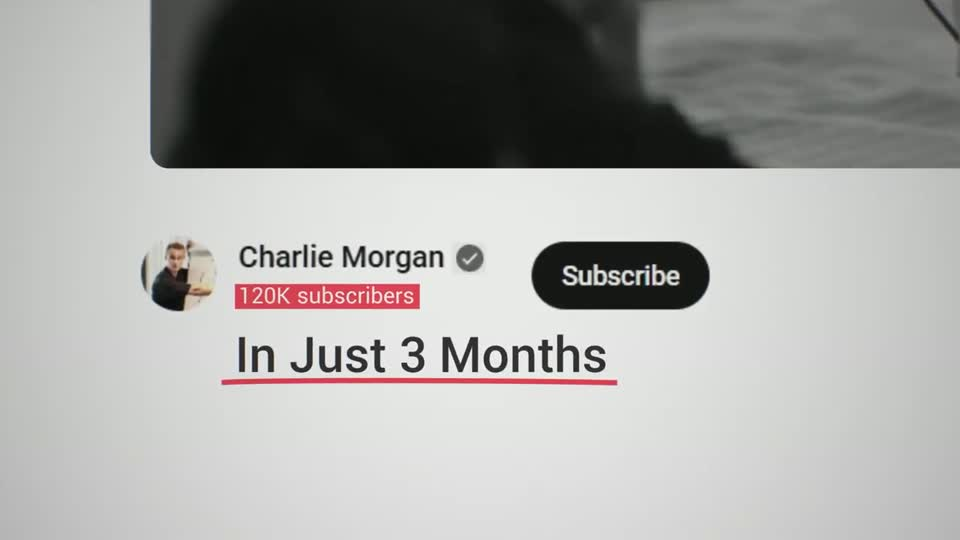
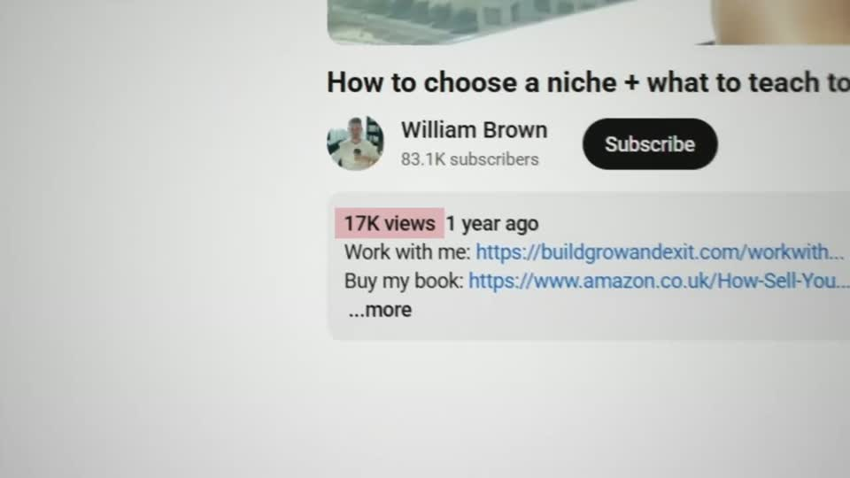
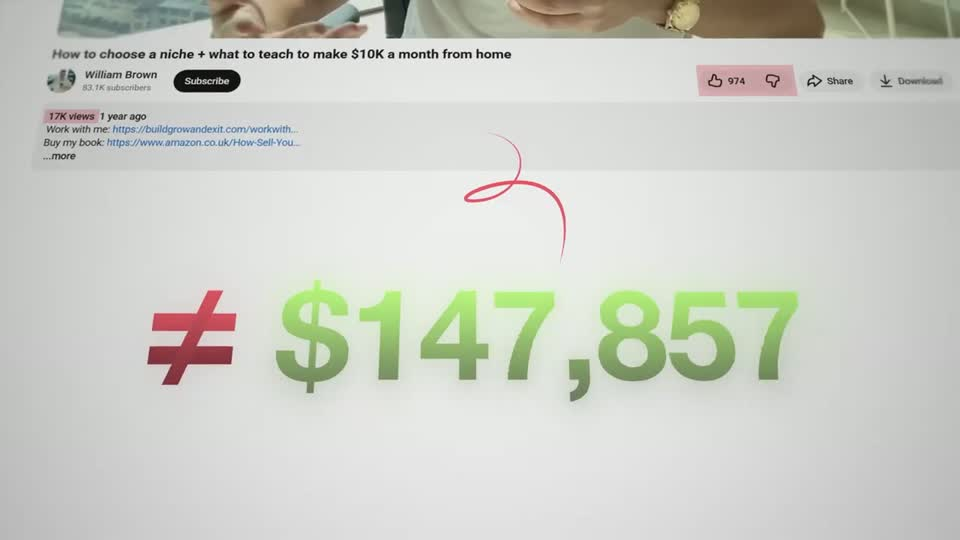
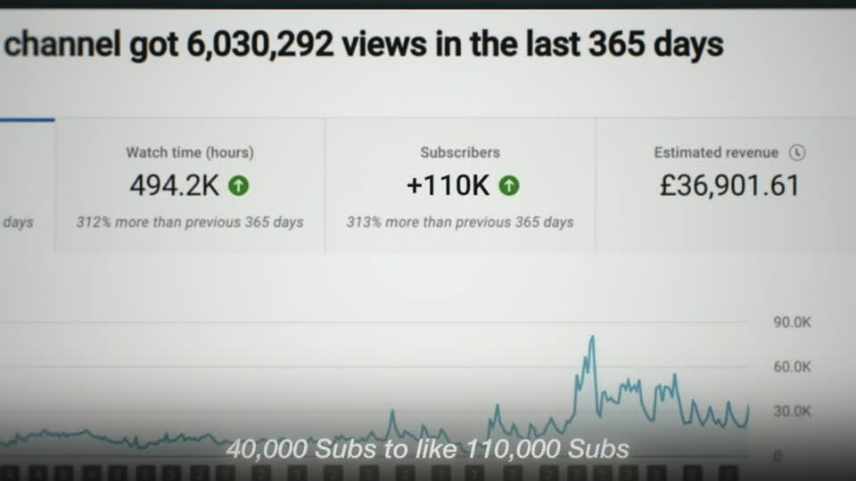
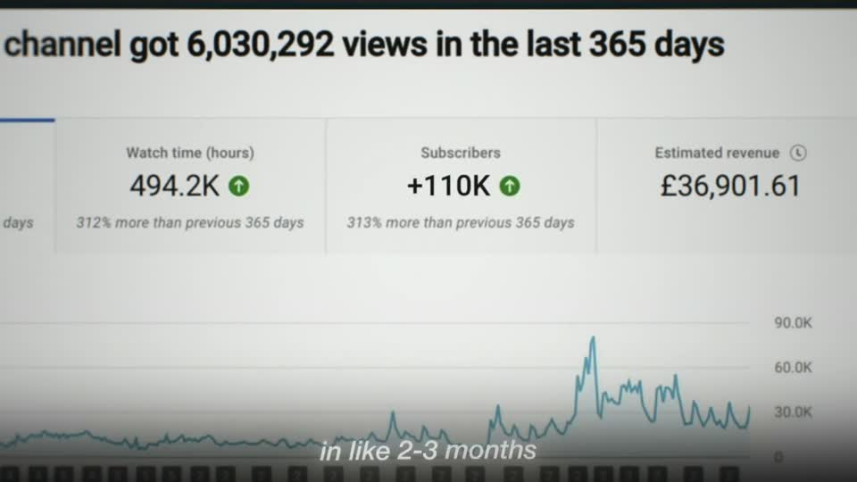

# A3 — Counter on screenshot

Rule: `standards/formats/long-form.md` (catalogue row A3). This card holds the evidence and the quality bar; the rule stays in the format profile.

## Quality bar

- The number counts on the **real UI** where it lives (watch-page views, channel-header subscriber count), with the page font and neighbours intact. The page is pushed to ≈ 2–2.5× so the number reads ≥ 30 px cap height.
- The odometer roll decelerates (`ease.enter`) over ≈ 1.5–2 s per number and lands exactly on the spoken figure. Instantly s011 takes 1.5 s, with half the gain in the first 0.5 s; Stupidly s105 takes ≈ 2 s. A second counter may follow, never run at the same time. (outside the rule — open for Tymek; build to the rule/kit)
- The camera keeps moving while numbers roll, as a slow push (3–4.5 %/s, `ease.camera.slow`) or a slow drift; the shot never freezes before the payoff. After a whip, the number starts only once the camera has settled.
- One mark on the metric: a red underline under its label (before the count in Instantly s011, after it in the pilot), a red block once the count settles (Stupidly s105), or a red strike sweeping L → R through it for a twist (pilot s057).
- Payoff, when the number needs a verdict: a headline built word by word inside the UI box (≈ 0.2 s/word), cap height ≥ 80 px, red on the contradiction words (pilot). Or a big figure (≈ 18 % H) under the small real number, tied to it by one hand-drawn red curl with a "≠" (Stupidly s039).
- Hold ≥ 1 s before the exit; a whip is allowed.

<!-- generated:start -->
## Evidence (generated by tools/ref_index.py — do not edit)

**5 exemplars** from 3 videos · duration median 4.47 s (p25–p75 3.17–7.67 s) · largest text median 80 px at 1080 · word build 0.23 s/word · hold 1.2 s

| Video | Time | Stills | Why it works |
|---|---|---|---|
| instantly-1m-arr-channel s011 ★ | 0:24.3–0:26.7 |  | The number counts inside the real YouTube UI (same font, same '• 1.5K videos' after it) rather than on a designed card, so it reads as the channel growing live. Strong ease-out: half the gain lands in the first 0.5 s, the last 1K creeps in. |
| stupidly-simple-youtube-strategy s105 ★ | 0:44.8–0:49.9 |   | Real UI doing the counting: the subscriber number on the actual channel header rolls up (≈ 2 s, decelerating) instead of a drawn counter, then gets the red block. Only one line of added type (≈ 65 px, dark grey) and one hand-drawn red underline — the screenshot carries the proof, the marks carry the meaning. |
| stupidly-simple-youtube-strategy s039 ★ | 2:30.8–2:35.3 |   | Low views set against big money in one frame: the real '17K views' (red block) sits small at the top and a huge lime-green gradient figure (≈ 18 % H) with a red '≠' rolls up beneath it, linked by one hand-drawn red curl. The whips use real directional motion blur and the camera settles before the number lands. |
| ultra-predictable-funnel s057 ★ | 5:47.9–5:58.1 |   | Two real counters on real UI roll odometer-style in sequence — views 93,549 → 100,000 (≈2 s), then subscribers 65 → 87,659 in red (≈2 s) — while the camera creeps in. Then the twist: a red strike sweeps through '100,000 views' and 'You Don't Need To Go Viral' (≈87 px, 'Don't Need' red) builds inside the description box, so the headline lives in the UI. |
| stupidly-simple-youtube-strategy s084 | 7:06.7–7:10.7 |   | A real analytics screen pushed in until the subscriber card is a headline; the number rolls on the actual UI as the camera settles, and nothing is added except the speaker's own caption under it. |
<!-- generated:end -->
