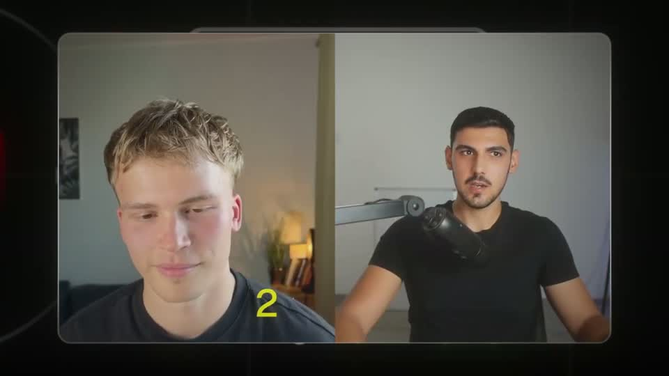
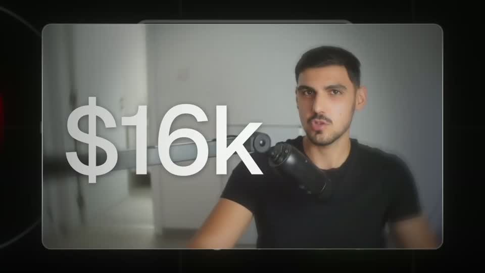
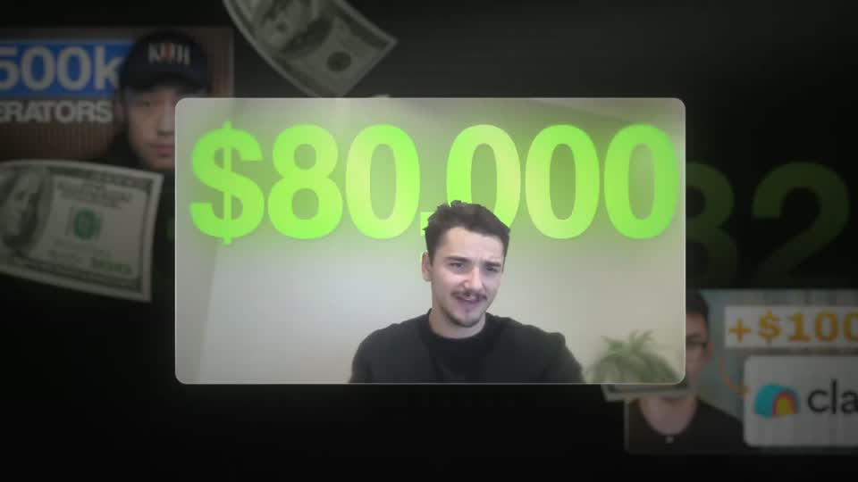
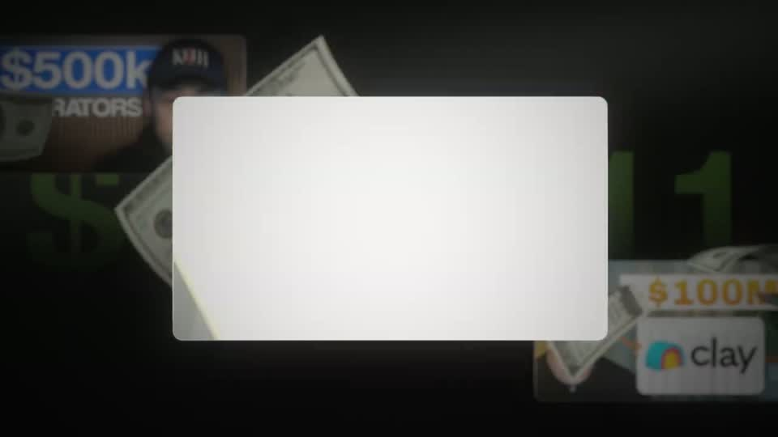

# A4 — Proof clip in framed card

Rule: `standards/formats/long-form.md` (catalogue row A4). This card holds the evidence and the quality bar; the rule stays in the format profile.

## Quality bar

- Client footage plays in a rounded card (radius ≈ 30 px, 1–2 px light border, glass edge) that **rises** onto the canvas (≈ 0.6 s `power3.out`) and pushes from ≈ 56–60 % W toward ≈ 72–83 % W.
- The client's own words appear word by word *inside* the card's lower third, white, ≈ 45–55 px; only the result words ('calls', 'signing') are green (`status.ok` family, here a bright `#90D752`).
- The payoff figure lands at the end, **huge** (cap height ≥ 20 % H: `$16k` ≈ 280 px, `$80,000` ≈ 240 px), blur → sharp, and holds ≥ 0.5 s.
- Backdrop is never empty: the grid ground, or a dimmed wall of other results (ghost giant numbers, other client cards) behind the card — ≥ 3 depth layers.
- Do **not** copy the warm flash / white flash-out transitions in s009/s012 — long-form forbids light leaks; switch clips inside the card with a hard cut.

<!-- generated:start -->
## Evidence (generated by tools/ref_index.py — do not edit)

**2 exemplars** from 1 video · duration median 5.97 s · largest text median 260.0 px at 1080 · word build 0.28 s/word · hold 0.7 s

| Video | Time | Stills | Why it works |
|---|---|---|---|
| ultra-predictable-funnel s009 ★ | 0:39.4–0:47.9 |   | The client's own words build word by word inside the card, with only the result words ('calls', 'signing') in green, so the testimony reads like proof rather than captions. The card keeps a soft border and glass edge over the dark grid, and the payoff '$16k' lands huge (≈26 % H) across the clip with a blur→sharp settle and a held beat before the cut. |
| ultra-predictable-funnel s012 ★ | 0:49.1–0:52.5 |   | The big figure ('$80,000', ≈22 % H) is a glowing lime number laid across the client's face card, with ghosted copies of other giant figures and other client proof cards blurred in the backdrop, so one result sits inside a wall of results. Five depth layers: grid, dimmed result cards, ghost numbers, the sharp card, flying bills. |
<!-- generated:end -->
