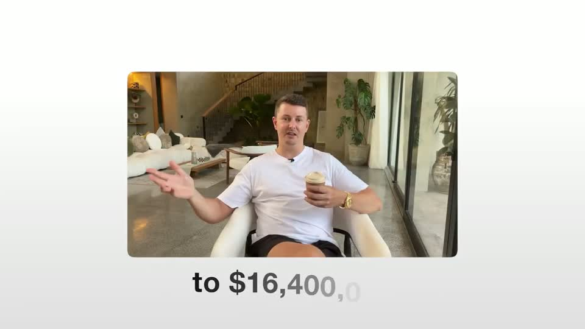
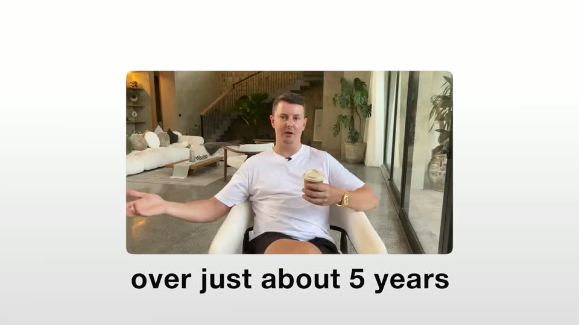
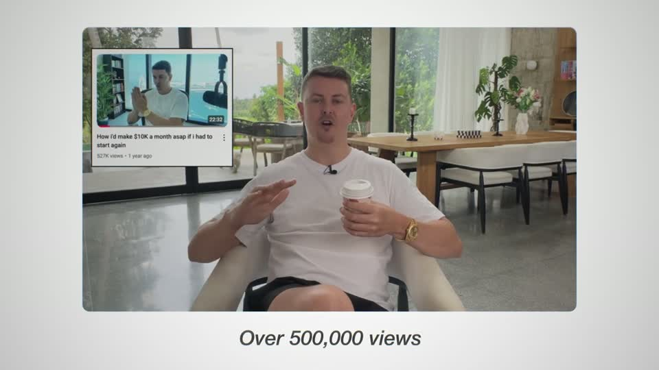
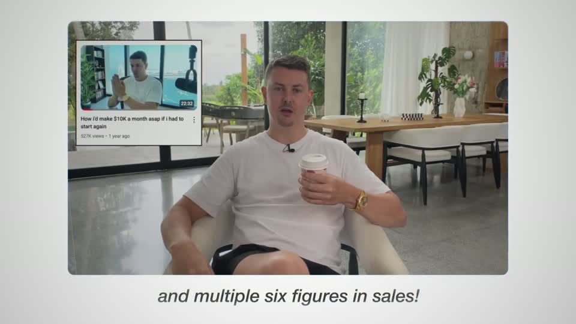
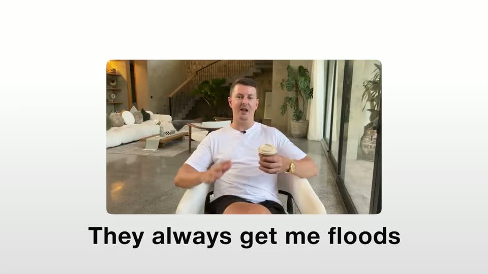
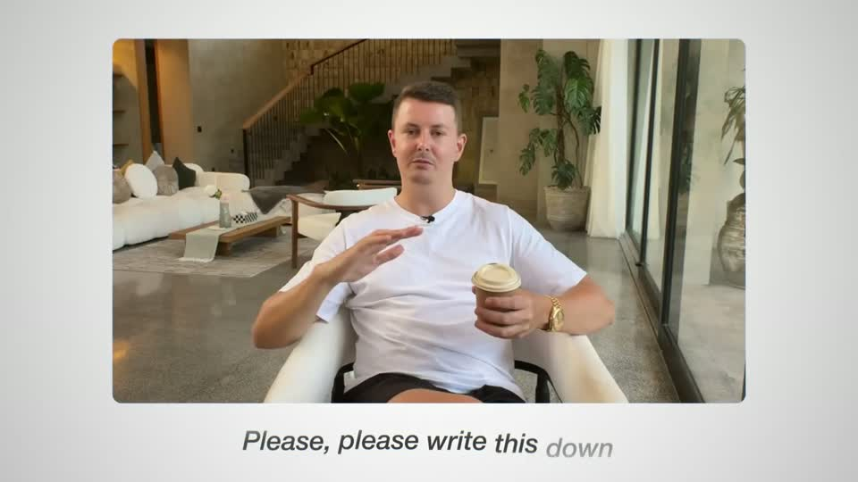
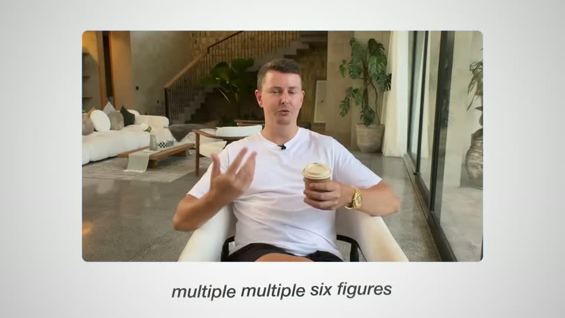
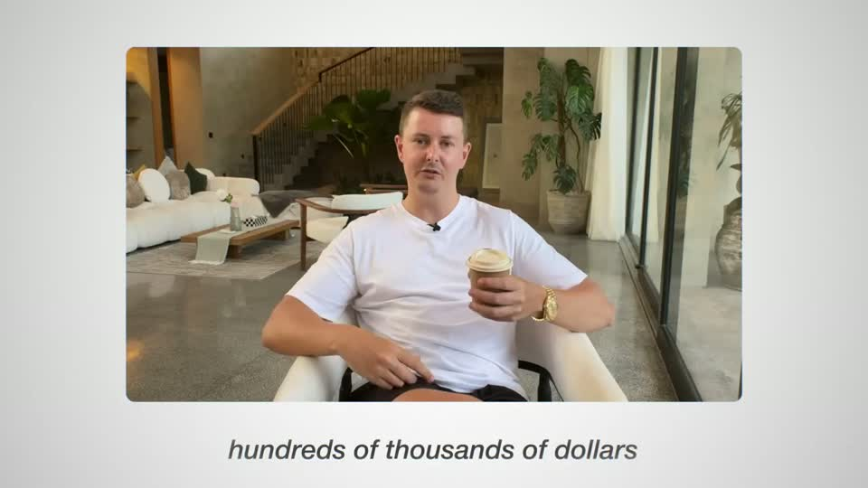
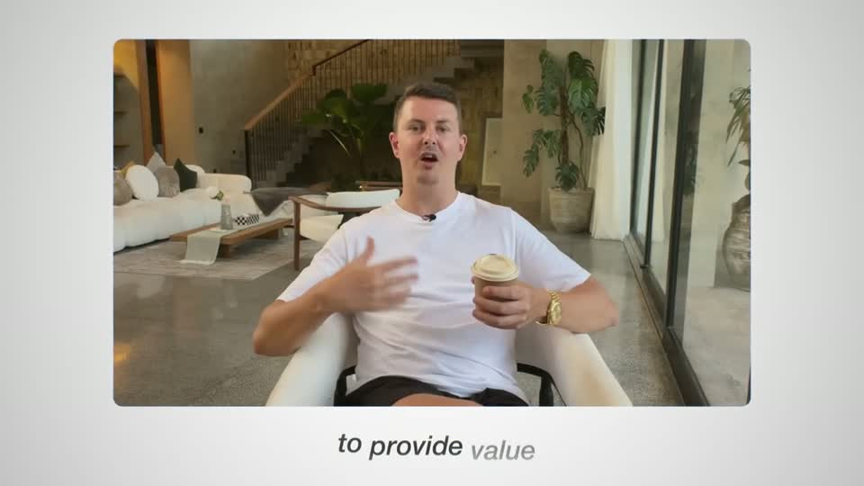
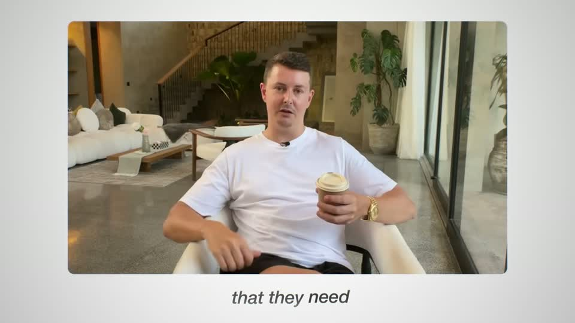

# A4 — Proof clip in framed card

Rule: `standards/formats/long-form.md` (catalogue row A4). This card holds the evidence and the quality bar; the rule stays in the format profile.

## Quality bar

- Footage plays in a rounded card (radius 12–30 px) that **rises** onto the canvas (≈ 0.6 s `ease.enter`; the rule's card entrance is 0.43 s `ease.card`) and pushes from ≈ 56–60 % W toward ≈ 72–83 % W. On the dark ground the card has a 1–2 px light border and a glass edge; on the light ground it is a plain card with no border (Stupidly s004/s012). (outside the rule — open for Tymek; build to the rule/kit)
- The speaker's own words appear word by word at ≈ 0.2–0.3 s/word, ≈ 42–55 px. On the dark ground they sit inside the card's lower third in white (pilot); on the light ground they sit beneath the card in dark bold sans (Stupidly). Each phrase clears before the next starts.
- Only the result words get meaning colour (`status.ok` family, here a bright `#90D752`). The light-ground video uses no meaning colour (one video). (outside the rule — open for Tymek; build to the rule/kit)
- The payoff figure lands at the end, **huge** (cap height ≥ 20 % H: `$16k` ≈ 280 px, `$80,000` ≈ 240 px), blur → sharp, and holds ≥ 0.5 s. This is pilot only; Stupidly ends without a figure, which is the weaker version.
- The backdrop is never empty on the dark ground: the grid ground, or a dimmed wall of other results (ghost giant numbers, other client cards), giving ≥ 3 depth layers. While a real YouTube tile is being talked about, it may sit as an inset in the card's corner (Stupidly s012, s037).
- Don't: copy the warm flash or white flash-out transitions (pilot s009/s012; Stupidly s004 and ≈ 6 more). Long-form forbids light leaks; switch clips inside the card with a hard cut.
- Don't: let the clip's words turn into running captions on b-roll or face shots (Stupidly s003, s025–s027 and its b-roll). Proof-clip words are the client's quote only, and long-form never has running captions.

<!-- generated:start -->
## Evidence (generated by tools/ref_index.py — do not edit)

**10 exemplars** from 2 videos · duration median 7.77 s (p25–p75 5.67–10.86 s) · largest text median 42.0 px at 1080 · word build 0.2 s/word · hold 0.5 s

| Video | Time | Stills | Why it works |
|---|---|---|---|
| stupidly-simple-youtube-strategy s004 ★ | 0:07.9–0:12.5 |   | The proof clip sits in a rounded card (≈ 57 % W, radius ≈ 12 px, no border) high in frame on a white→light-grey vertical gradient with a soft vignette, and the speaker's words build beneath it phrase by phrase — each word fades from light grey to near-black with a short blur→sharp, so the line reads like the clip is typing its own testimony. Bold sans ≈ 50 px, one line, never more than ≈ 6 words on screen. |
| stupidly-simple-youtube-strategy s012 ★ | 0:33.4–0:40.5 |   | The card grows to ≈ 75 % W with a real YouTube tile inset in its corner, so the claim ('one take… over 500,000 views') and its proof are on screen at once. Captions switch to a smaller italic (≈ 42 px) and build word by word grey→black under the card; slow push-in keeps the 7 s shot alive. |
| ultra-predictable-funnel s009 ★ | 0:39.4–0:47.9 |   | The client's own words build word by word inside the card, with only the result words ('calls', 'signing') in green, so the testimony reads like proof rather than captions. The card keeps a soft border and glass edge over the dark grid, and the payoff '$16k' lands huge (≈26 % H) across the clip with a blur→sharp settle and a held beat before the cut. |
| ultra-predictable-funnel s012 ★ | 0:49.1–0:52.5 |   | The big figure ('$80,000', ≈22 % H) is a glowing lime number laid across the client's face card, with ghosted copies of other giant figures and other client proof cards blurred in the backdrop, so one result sits inside a wall of results. Five depth layers: grid, dimmed result cards, ghost numbers, the sharp card, flying bills. |
| stupidly-simple-youtube-strategy s008 | 0:19.2–0:25.3 |   | Same A4 card grammar as s004: one phrase at a time under the card, each word arriving grey and darkening as it is spoken, the previous phrase cleared before the next — the caption never stacks, so the card stays the hero. |
| stupidly-simple-youtube-strategy s035 | 2:05.0–2:18.0 |   | Long A4 (13 s) held together by rhythm alone: the card never moves, the italic caption swaps phrase by phrase in time with the speech, and every new phrase starts light grey and darkens word by word. |
| stupidly-simple-youtube-strategy s037 | 2:23.6–2:29.6 |   | Two real video tiles pinned inside the clip's top corners (white bordered, ≈ 20 % of card W each) carry the proof while the speaker talks, then disappear the moment the sentence moves on — proof appears only for as long as it is being referenced. |
| stupidly-simple-youtube-strategy s066 | 5:10.5–5:23.3 |   | Standard A4 beat on the light ground: card ≈ 72 % W, soft grey vignette, italic caption phrase by phrase beneath with grey→black word build. |

…and 2 more in references/index.json.
<!-- generated:end -->
