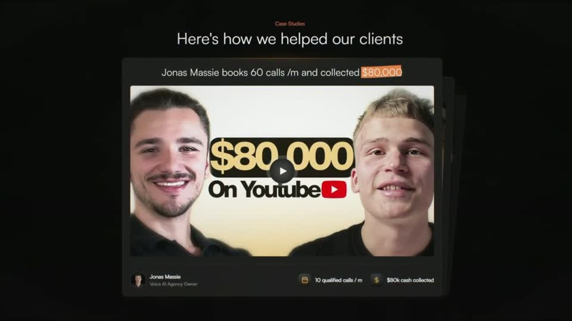
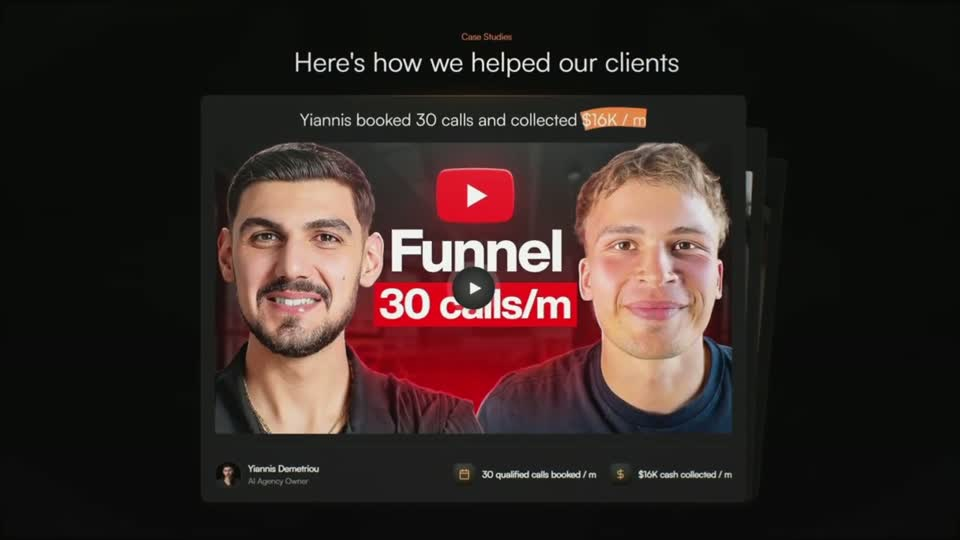
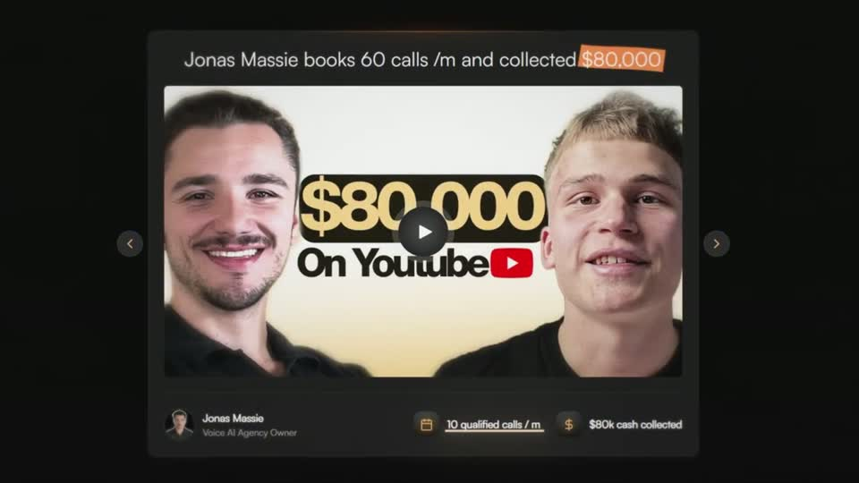
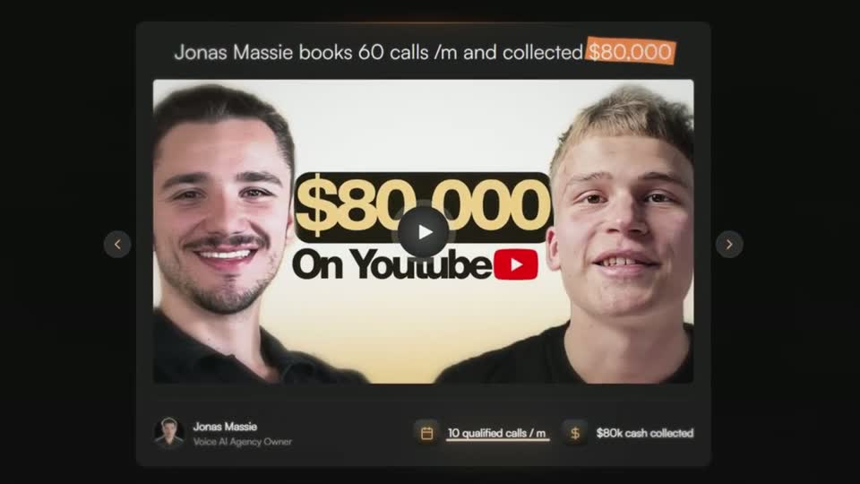
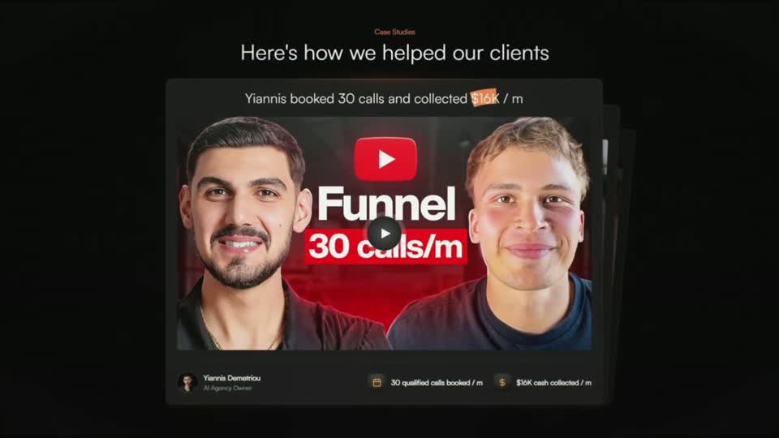

# A5 — Case-study card stack

Rule: `standards/formats/long-form.md` (catalogue row A5). This card holds the evidence and the quality bar; the rule stays in the format profile.

## Quality bar

- Every card carries real data: a client thumbnail or the site's own carousel card, a one-line quote with the money figure on an orange highlight block, and a footer with avatar, name, role and two icon metric chips (Hormozi s006, Instantly s008, Clay s012).
- The front card is ≈ 53–57 % W and centred, with 1–2 cards peeking behind on the right (offset ≈ 30 px, darker). A small orange kicker ("Case Studies") sits over a thin ≈ 40 px header above the stack; the light header weight keeps it premium, not salesy.
- Pace follows the voice: ≈ 0.9–1 s per card in a montage of results (Instantly s008, Hormozi s031), 2–6 s when the voice tells each card's story (Clay s012, Hormozi s006).
- The swap is a slide-off to the left with the next card coming forward (≈ 0.5 s, Hormozi), or a hard cut at the same framing (Instantly, Clay). The 3D step-away tilt stays allowed, but no reference uses it. Never a flip.
- The number may be seen first: open on a close-up of the metric row, then pull back (≈ 0.9 s) to frame the whole card (Clay s012).
- A5 sits on the dark ground even inside a light-ground video (Clay s012); the card border is a 1 px warm-lit edge.
- Headline-on-stack variant (single exemplar, Stupidly s002): two real pages fanned a few degrees with a soft shadow, ≈ 65 % W, and one ≈ 60 px line across the lower third that becomes a statement when a red block wipes behind it.

<!-- generated:start -->
## Evidence (generated by tools/ref_index.py — do not edit)

**5 exemplars** from 4 videos · duration median 4.23 s (p25–p75 2.88–11.33 s) · largest text median 40 px at 1080 · word build 0.2 s/word · hold 1.5 s

| Video | Time | Stills | Why it works |
|---|---|---|---|
| hormozi-100-posts s006 ★ | 0:19.7–0:37.4 |   | Recreated case-study cards (≈53 % W) with 2 cards peeking behind on the right, each card a real client thumbnail framed by a one-line quote whose money figure sits on an orange highlight block, plus a footer with avatar, name, role and two icon metric chips — dense, but every piece is real data. An orange 'Case Studies' kicker over a light 40 px header ties it to the brand accent. |
| instantly-1m-arr-channel s008 ★ | 0:18.8–0:21.5 |   | Each result is a full product-style card (≈57 % W): one-line quote with the figure on an orange marker block, the real video thumbnail, and a footer with avatar, name, role and two icon metric chips — and the two cards peeking behind promise more. Thin, light headline weight keeps it premium rather than salesy. |
| problem-with-clay s012 ★ | 0:58.0–1:02.2 |   | The case studies are the real website carousel cards (prev/next arrows, avatar, metric chips) rather than drawn cards, and each headline has an orange highlight block behind the result figure ('$16K / m', '$80,000'). The pull-back from a close-up of the metrics row makes the number the first thing seen, then gives it context. |
| stupidly-simple-youtube-strategy s002 ★ | 0:01.3–0:04.4 |   | Real proof stacked in depth on a light ground: two sharp channel pages fanned like physical cards with a soft grey shadow, so the white ground reads as a tabletop rather than empty space. The headline sits across the lower third of the stack and only becomes a statement when the red block sweeps behind it — white type on red, one line, ≈ 85 % W. |
| hormozi-100-posts s031 | 12:20.1–12:25.0 |   | Reuses the hook's case-study stack as an outro recap; the faster swaps (≈1 s) are closer to the catalogue's A5 rhythm and read as 'many results' rather than individual stories. |
<!-- generated:end -->
