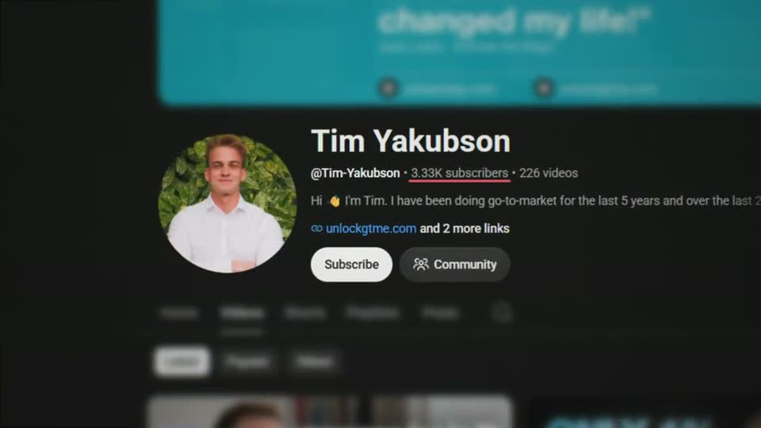
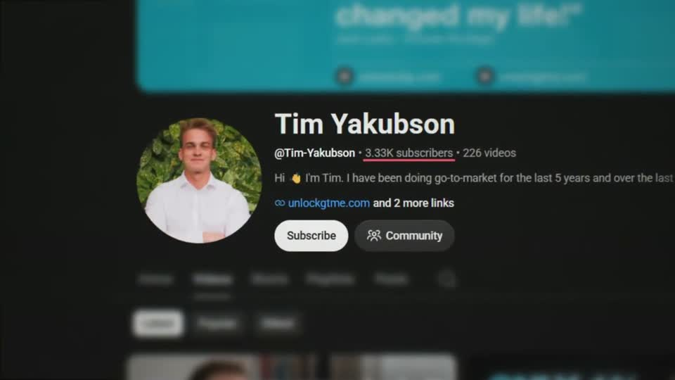
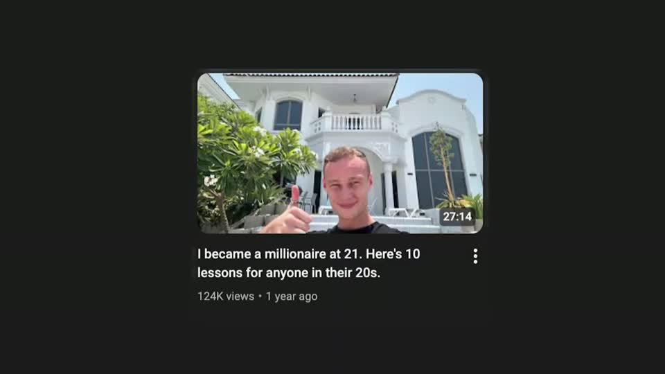
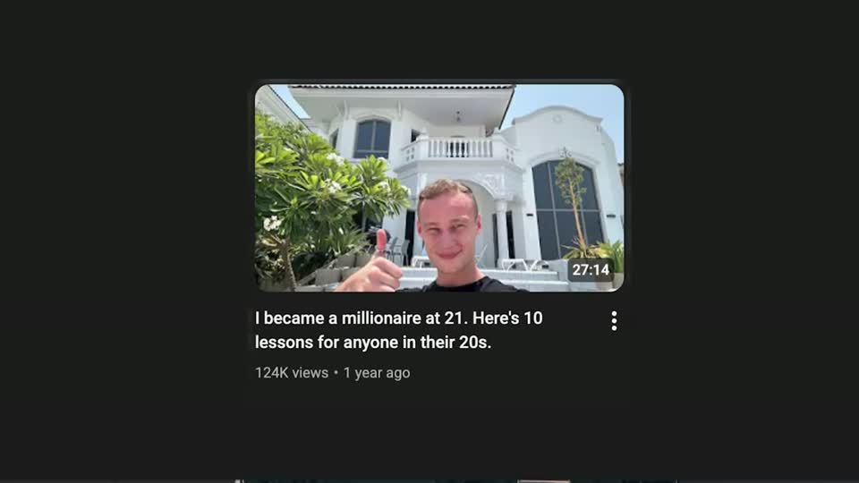
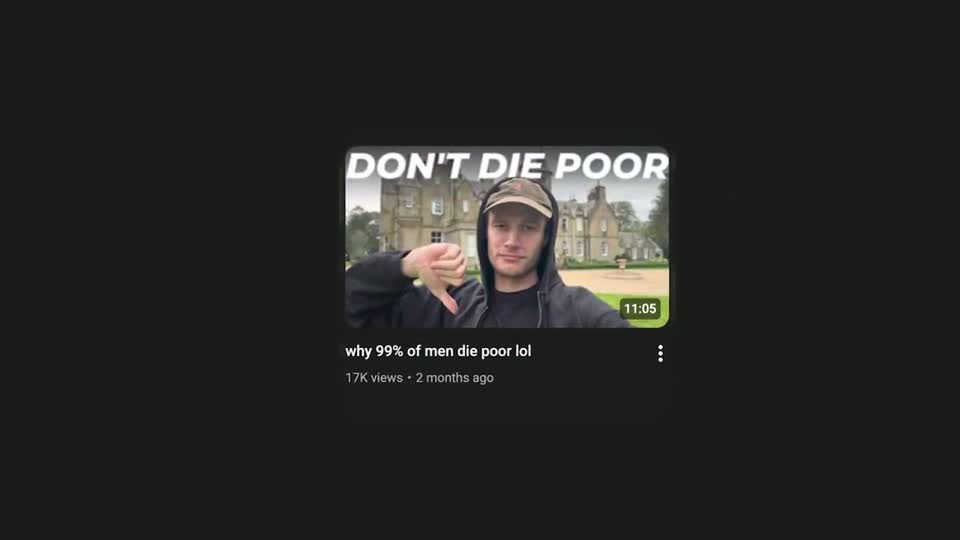
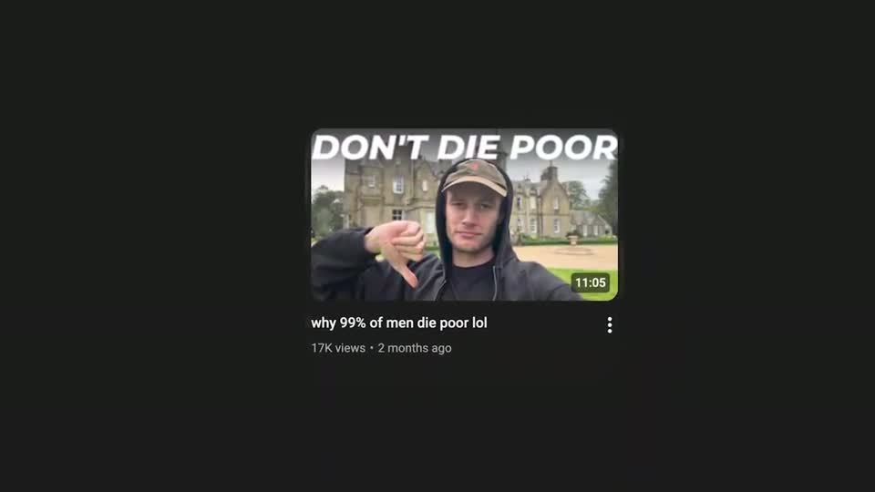

# A6 — Channel flash montage

Rule: `standards/formats/long-form.md` (catalogue row A6). This card holds the evidence and the quality bar; the rule stays in the format profile.

## Quality bar

- Every item is real: a channel page (Hormozi s008) or a single video tile with its thumbnail and title (Clay s002, Stupidly s049), one centred at a time.
- One fact per item is readable. Either a sharp band through the name/subscriber row with tilt-shift blur above and below (Hormozi), or a sharp title with the thumbnail softened to texture (Clay). The fact gets one mark: a pink highlight block behind the keyword phrase, or a red underline under the count.
- Rhythm: 0.5–1.3 s per item (Clay 0.5–0.7 s, Hormozi 0.7–0.9 s). One video lets sharp, readable tiles hold up to ≈ 2.5 s, each with a slow push ≈ 2 %/s (Stupidly s049). (outside the rule — open for Tymek; build to the rule/kit)
- Hard cuts inside the montage are its rhythm, not transitions. The other option is a fast push-up, where the next page slides up from below in ≈ 0.2 s (Hormozi, one video).
- Ground: near-black on the dark look. On the light look, a faint vignette, with the tile keeping its own soft shadow rather than sitting on flat white.
- The montage may hand off on a hand-drawn red line that becomes the camera path to the next beat (Clay s002 → s041). After a face cut-in it resumes as the same scene (Stupidly s107).

<!-- generated:start -->
## Evidence (generated by tools/ref_index.py — do not edit)

**4 exemplars** from 3 videos · duration median 3.22 s (p25–p75 2.83–5.18 s) · largest text median 22.5 px at 1080 · hold 0.7 s

| Video | Time | Stills | Why it works |
|---|---|---|---|
| hormozi-100-posts s008 ★ | 0:39.2–0:42.0 |   | Each real channel page is shown at ≈200 % with a tilt-shift depth of field: a sharp band through the name/subscriber row and heavy blur above and below, so 0.7–0.9 s is enough to read one fact. A red hand-drawn underline lands under the subscriber count on each page. |
| problem-with-clay s002 ★ | 0:01.2–0:04.2 |   | Breadth of proof without noise: each competitor tutorial is a real YouTube tile (thumbnail softly blurred so it reads as texture, title sharp) with a pink highlight block behind just the Clay keyword phrase, so the eye reads one phrase per 0.6 s. On the light ground the tiles keep their own drop shadow and sit on a faint vignette, not a flat white. |
| stupidly-simple-youtube-strategy s049 ★ | 3:21.1–3:26.9 |   | Proof by repetition: one dark-theme tile at a time, small (≈ 22 % W) and centred on near-black, so each title can be read and the breadth comes from the sequence. Tiles stay sharp — the A6 rhythm with readable content. |
| stupidly-simple-youtube-strategy s107 | 3:29.0–3:32.4 |   | Continuation of the s049 montage after a face cut-in; same ground and tile size, so the montage resumes as one scene. |
<!-- generated:end -->
