# B1 — Backdrop headline

Rule: `standards/formats/long-form.md` (catalogue row B1). This card holds the evidence and the quality bar; the rule stays in the format profile.

## Quality bar

- The backdrop is the real thing being talked about (call recording, channel page, thumbnail wall, team photo, the previous proof), still recognisable as a shape, dimmed to ≈ 15–30 % and blurred. A clip may play sharp ≈ 1–2 s first (Mentors s016); a page is sharp ≈ 0.3–1 s or dimmed from the first frame. The dim takes ≈ 0.3–0.5 s and lands with the first word.
- The headline is 1–2 centred lines, cap height 65–95 px (≈ 6–9 % H), white with a soft glow halo, with the longest line ≤ 80 % W. A long line (≈ 15 words) may drop to ≈ 45 px (Mentors s012).
- Sans words build one by one with rise + blur → sharp, landing on the spoken word at 0.11–0.25 s/word, following the speech. Never per character. A script line writes on as a stroke (Hormozi s012, Instantly s017); script is the only text that draws letter by letter.
- Meaning colour goes on 1–3 words only, or on an underline that sweeps (0.3–0.7 s) under the emphasis phrase 0–1 s after the line completes. Red means problem or topic; a thick lime `status.ok` underline (≈ 15 px) means the positive decision (Mentors s016).
- Variants: a real logo tile (≈ 150 px) above one line (Ottley s007). A full-height cut-out of the subject on one third, tied to the line by a hand-drawn arrow (Hormozi s012). A list of frosted glass pills or chips with icon tiles, one per spoken point ≈ 1.3–6 s apart, or chips landing together on one phrase (Ottley s023, Clay s039, Instantly s017).
- Light ground: B1 still goes dark. The light page is dimmed toward charcoal (≈ 30 %), not to black, so the white glowing type sits on a recognisable page (Clay s049, Ottley s007, Stupidly s045).
- A slow drift/push (≈ 3 %/s) is allowed on shots ≥ 2.5 s; shorter shots stay locked.
- Ends on a clean hold of 0.6–1.8 s with every word sharp; lists may hold up to ≈ 5 s.

<!-- generated:start -->
## Evidence (generated by tools/ref_index.py — do not edit)

**17 exemplars** from 7 videos · duration median 3.3 s (p25–p75 2.68–7.1 s) · largest text median 70 px at 1080 · word build 0.16 s/word · hold 1.2 s

| Video | Time | Stills | Why it works |
|---|---|---|---|
| hormozi-100-posts s012 ★ | 0:45.1–0:48.0 | 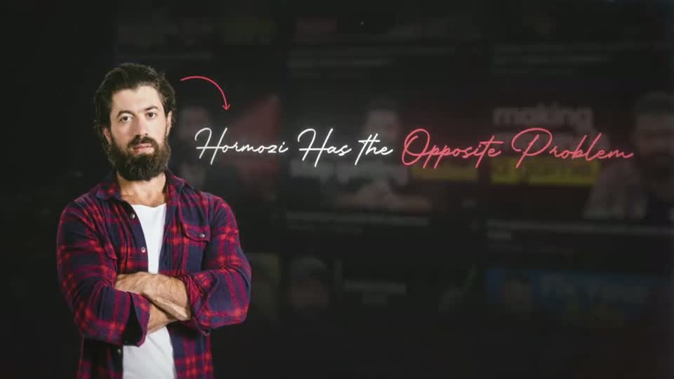 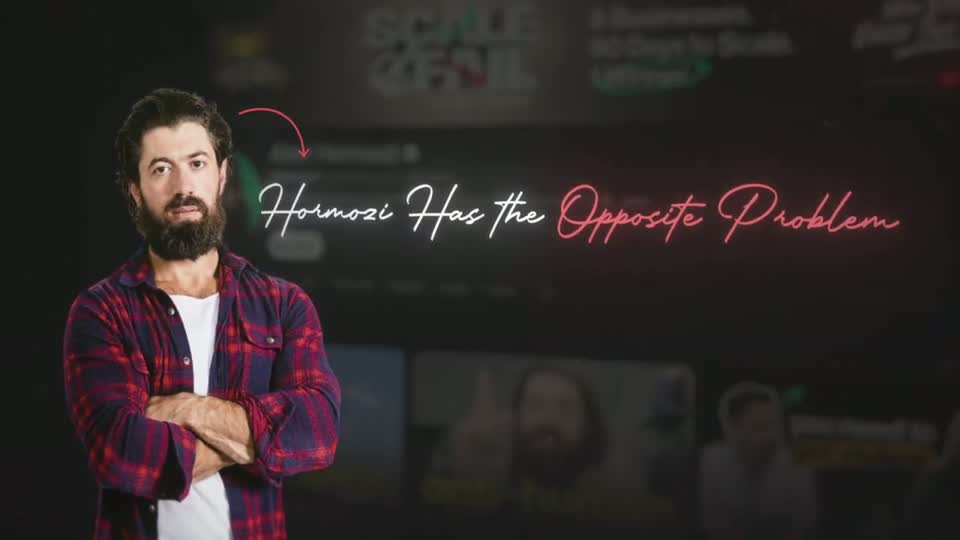 | A full-height cut-out of the subject on the left third, a backdrop of his own real video grid blurred to ≈25 % brightness, and a single-line script headline in white with the payoff 'Opposite Problem' in glowing red — a red hand-drawn curved arrow ties his head to the line. The emphasis colour is the problem colour, as the B1 row asks. |
| instantly-1m-arr-channel s017 ★ | 0:45.0–0:51.4 |  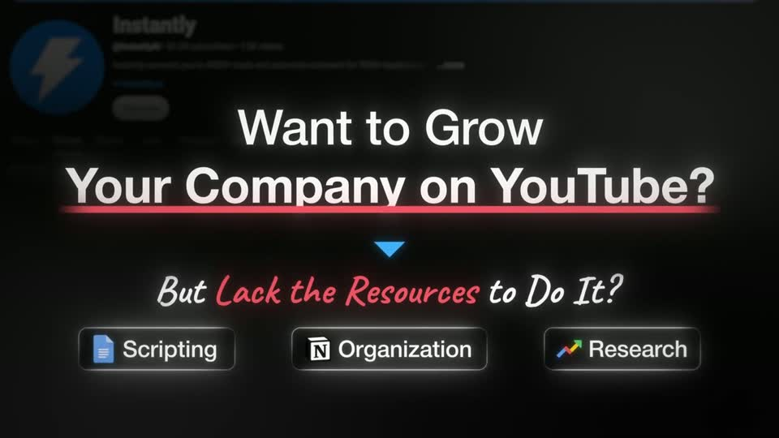 | Question → turn → list in one frame: bold sans question with a red problem underline, a small blue chevron as the beat, a script counter-line with the pain phrase in red, then real app-icon chips as the list. Soft white glow on all type separates it from the near-black blurred page. |
| liam-ottley-540k s007 ★ | 0:34.0–0:37.9 |   | One real logo tile (≈150 px, dark rounded square) above a single 78 px white line with a soft halo, over the dimmed channel it belongs to — a backdrop headline whose headline is the brand. Long clean 3 s hold. |
| liam-ottley-540k s023 ★ | 6:09.4–6:38.1 | 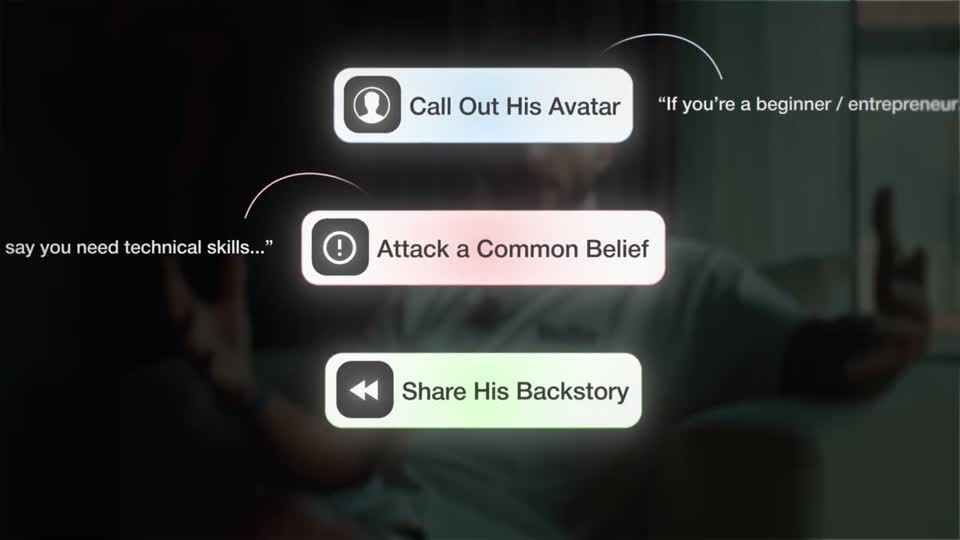 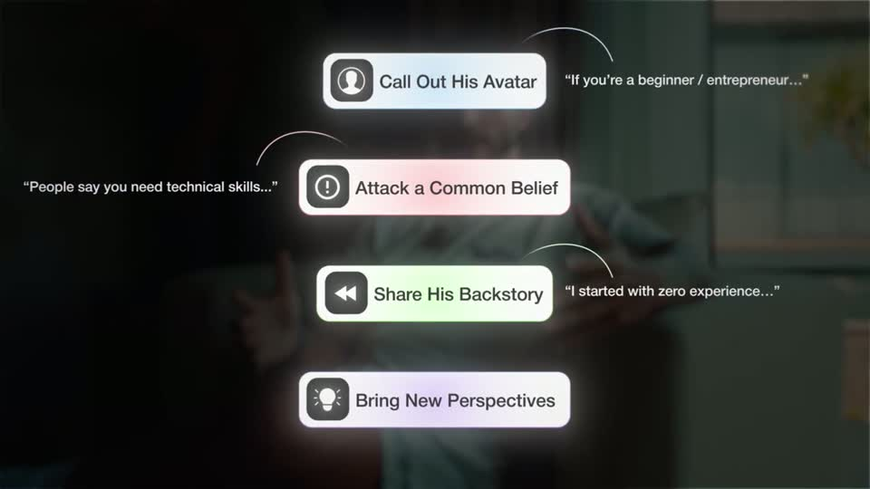 | List variant of the backdrop headline built from frosted white glass pills (≈500 px wide, 33 px labels, dark icon tiles, inner glow and a coloured tint per pill) over the dimmed source clip — the only dark-ground beat in the video, and the glow belongs to the glass, not the type. Each pill gets an italic example quote on an alternating side with a hand-drawn arc, so the list reads like annotated proof. |
| problem-with-clay s049 ★ | 3:43.4–3:46.0 | 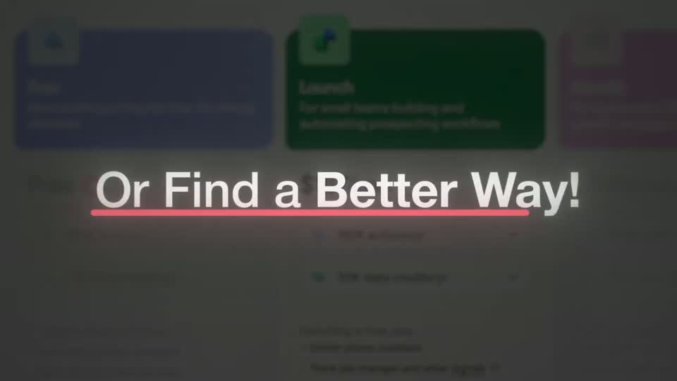 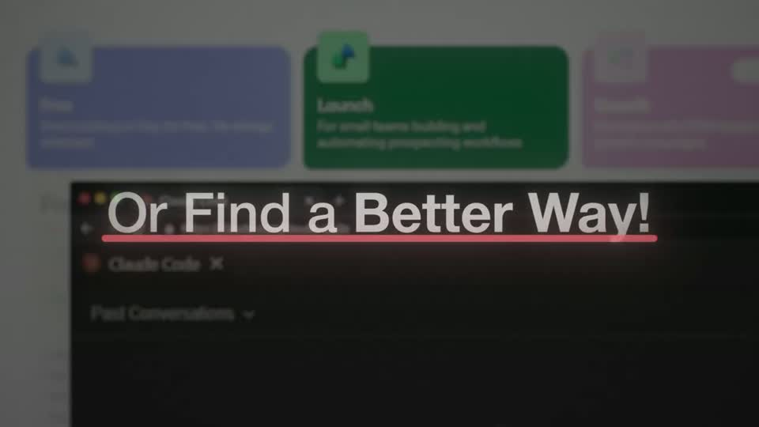 | The light page is dimmed toward charcoal (not black), so the 95 px white headline with a soft glow still sits on a recognisable pricing page; one red underline the full line width is the only colour. |
| problem-with-clay s039 ★ | 9:30.8–9:45.6 | 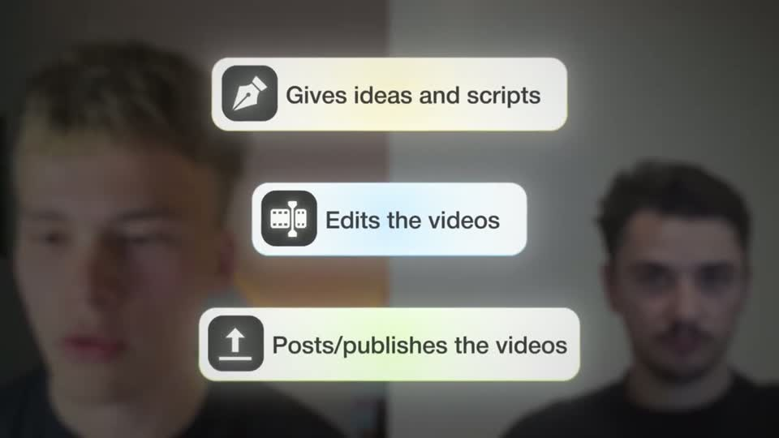 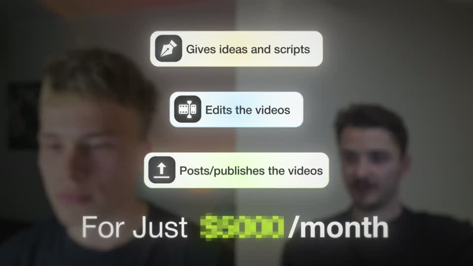 | List variant of the backdrop headline: the backdrop is the real team, defocused into colour, the bullets are white glass pills with a soft rainbow sheen and dark icon tiles, and only the price gets colour (lime block). The 70 px white price line sits low with a glow. |
| spent-10k-on-mentors s016 ★ | 2:03.0–2:08.9 | 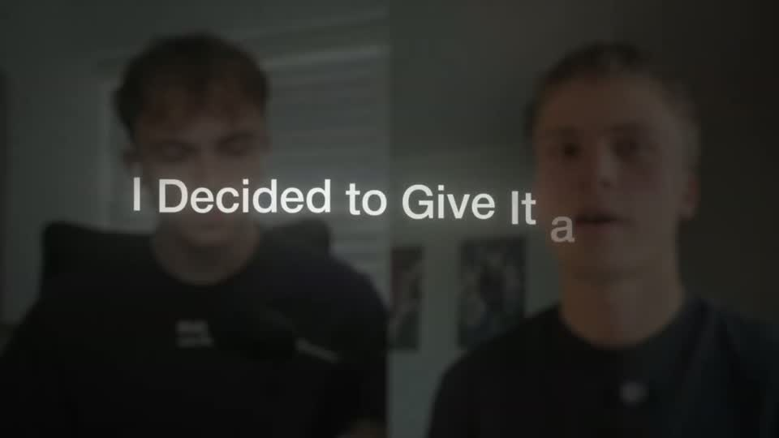 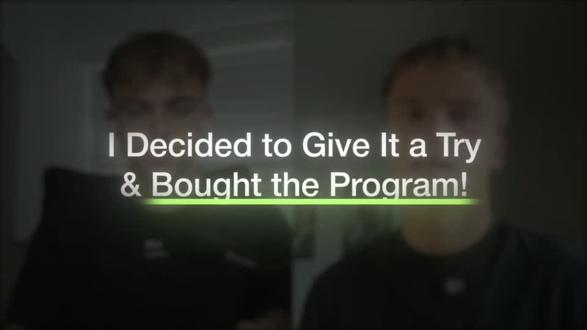 | Textbook B1 on live footage: the real call plays sharp long enough to register, then falls back to a dim blurred texture as the first word lands; 9 words build in ≈1.4 s on the speech, and the thick lime underline is the only colour in frame, saved for the positive decision. |
| spent-10k-on-mentors s024 ★ | 3:08.0–3:11.2 | 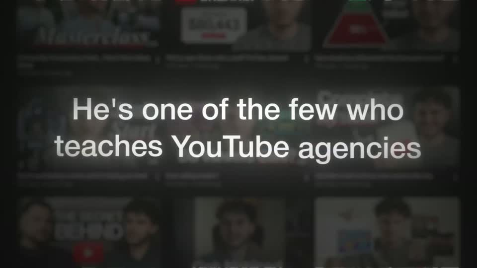 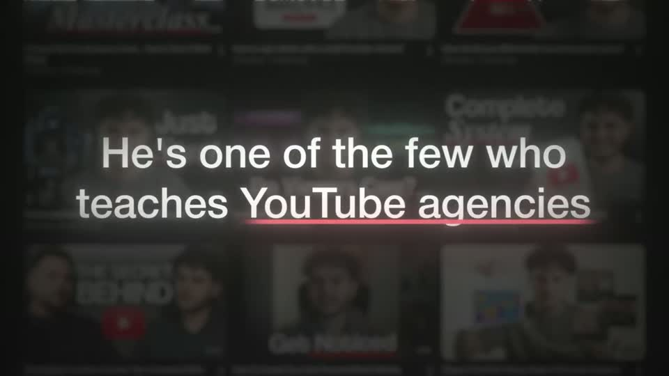 | Two short centred lines over a wall of the mentor's real thumbnails pushed back to texture; 8 words build in ≈1 s on fast speech, the red underline lands on the niche phrase the instant the line completes, then a clean 1.5 s hold. |

…and 9 more in references/index.json.
<!-- generated:end -->
