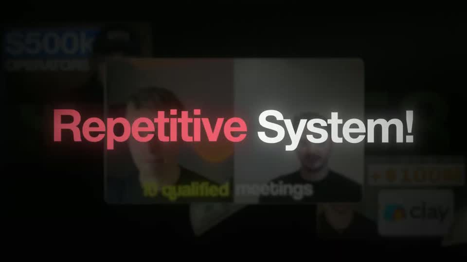
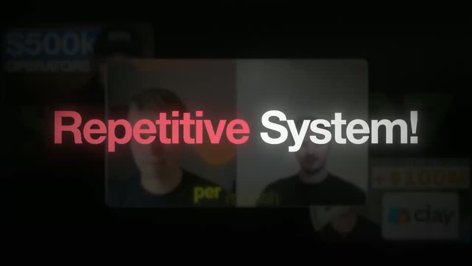

# B1 — Backdrop headline

Rule: `standards/formats/long-form.md` (catalogue row B1). This card holds the evidence and the quality bar; the rule stays in the format profile.

## Quality bar

- The backdrop is the real thing being talked about (calendar, thumbnail wall, the previous proof) — still recognisable as a shape, dimmed to ≈ 15 % and blurred; if it starts sharp it holds ≈ 1–2 s, then dims in ≈ 0.3–0.5 s as the first word lands.
- Headline 1–2 centred lines, cap height 75–95 px (≈ 7–9 % H), white with a soft glow halo on the dark ground; the longest line spans ≤ 80 % W.
- Words build one by one with rise + blur → sharp, landing on the spoken word; never per character. s026 builds at ≈ 0.25 s/word (inside the 110–330 ms rule); s079 at ≈ 0.11 s/word on fast speech — inside the 110–330 ms rule (stagger follows the speech).
- Meaning colour on 1–3 words only: red for the problem words ('Wasting Time', 'Flop'), or a red underline sweeping under the emphasis phrase after the line completes (s026).
- A slow drift/push (≈ 3 %/s) is allowed on shots ≥ 2.5 s; shorter shots stay locked.
- Ends on a clean hold of 0.6–1 s with every word sharp.

<!-- generated:start -->
## Evidence (generated by tools/ref_index.py — do not edit)

**3 exemplars** from 1 video · duration median 2.03 s · largest text median 90 px at 1080 · word build 0.25 s/word · hold 1.0 s

| Video | Time | Stills | Why it works |
|---|---|---|---|
| ultra-predictable-funnel s079 ★ | 1:06.0–1:08.0 |   | Textbook backdrop headline: the real calendar stays recognisable as a dim, defocused rectangle behind two lines of ≈75 px white type with a glow halo; only the pain words ('Wasting Time', 'Flop') are red. Words rise and sharpen fast (≈0.11 s apart, spoken quickly) then the frame holds a clean full second. |
| ultra-predictable-funnel s026 ★ | 2:21.2–2:24.0 |   | The backdrop is the real problem (an endless wall of other creators' thumbnails) blurred to texture, and the question sits on it in two centred lines with a red underline sweeping under 'Next Video' only. Type ≈90 px with glow; the drift keeps a 2.8 s shot alive. |
| ultra-predictable-funnel s014 | 0:55.3–0:57.0 |   | Two words, ≈95 px caps, each with a soft glow halo over a backdrop that is still recognisably the proof just shown — the claim visibly sits on top of its evidence. Red on the problem-coded word, white on the rest, nothing else in frame. |
<!-- generated:end -->
