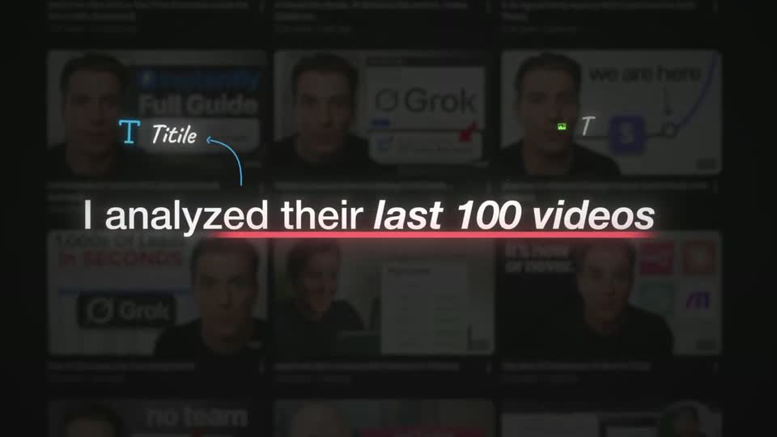
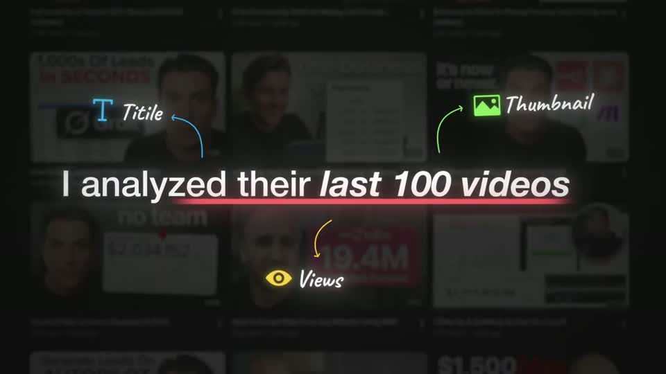
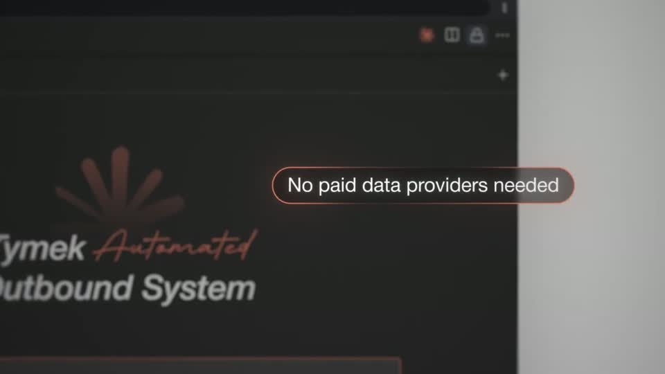
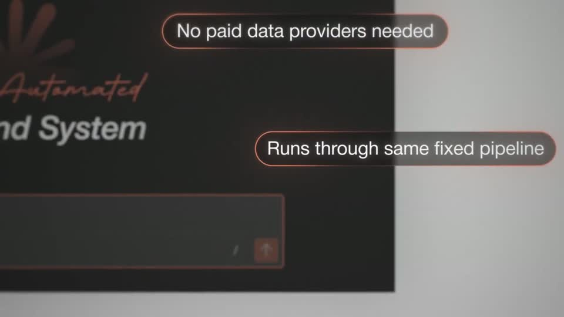
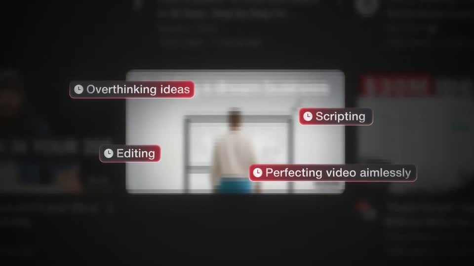
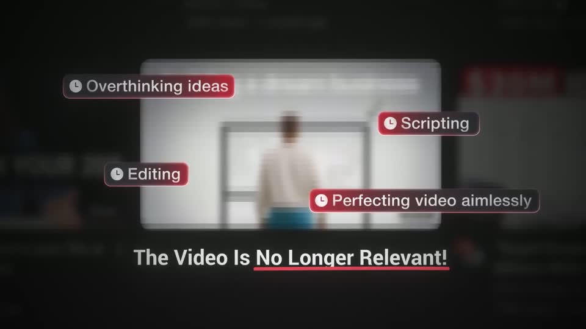

# B2 — Headline + labelled callouts

Rule: `standards/formats/long-form.md` (catalogue row B2). This card holds the evidence and the quality bar; the rule stays in the format profile.

## Quality bar

- A sharp centre object (a real thumbnail, card, app window or the headline itself). As the beat starts, its real context racks out of focus and dims (≈ 0.3–1.5 s).
- 3–4 callouts in one of two forms. A: a hand-drawn curved arrow pointing at the centre, then an icon + script label, with the arrow in the icon's colour (Instantly s015, ≈ 0.6 s apart, in a triangle). B: glass chips or pills (red tint or a warm-red rim glow) with ≈ 30–45 px text, overlapping the object's edge so the layering reads (pilot s018, Clay s037).
- Peer chips land together (≤ 0.1 s stagger) when they are one thought. When each is spoken separately they land one per phrase, and the camera pans between them in ≈ 0.8 s legs (Clay s037).
- The headline (≈ 55–65 px) builds word by word (≈ 0.12–0.2 s/word) with one red underline under the verdict phrase. It may come before the callouts (Instantly) or ≥ 1 s after they settle (pilot).
- ≥ 4 depth layers: dimmed blurred context, sharp object, callouts, headline and marks.
- Hold ≥ 1.5 s with a slow creep (≤ 0.5 %/s).

<!-- generated:start -->
## Evidence (generated by tools/ref_index.py — do not edit)

**3 exemplars** from 3 videos · duration median 6.87 s · largest text median 55 px at 1080 · word build 0.16 s/word · hold 2.3 s

| Video | Time | Stills | Why it works |
|---|---|---|---|
| instantly-1m-arr-channel s015 ★ | 0:35.1–0:41.7 |   | Textbook B2: headline mid-frame on the blurred real grid it is about, three colour-coded callouts each a hand-drawn curved arrow pointing at the headline, an app-style glyph and a script label with soft glow. Every element is colour-paired (arrow = icon colour), so the triangle reads as a system, not decoration. |
| problem-with-clay s037 ★ | 7:03.7–7:18.2 |   | The callouts are glass pills with a warm red rim glow placed on and around a real dark app window, so the method's named parts hang off the tool itself; the brand title uses the same script-plus-italic pairing as the name lower third. |
| ultra-predictable-funnel s018 ★ | 1:12.5–1:19.4 |   | Depth by focus: the thumbnail wall becomes a blurred, dimmed field and one card stays sharp; four glass chips with red tint and a clock icon pop around it nearly together, then the headline builds under the card and a red underline sweeps only 'No Longer Relevant!'. The chips overlap the card edge, which sells the layering. |
<!-- generated:end -->
