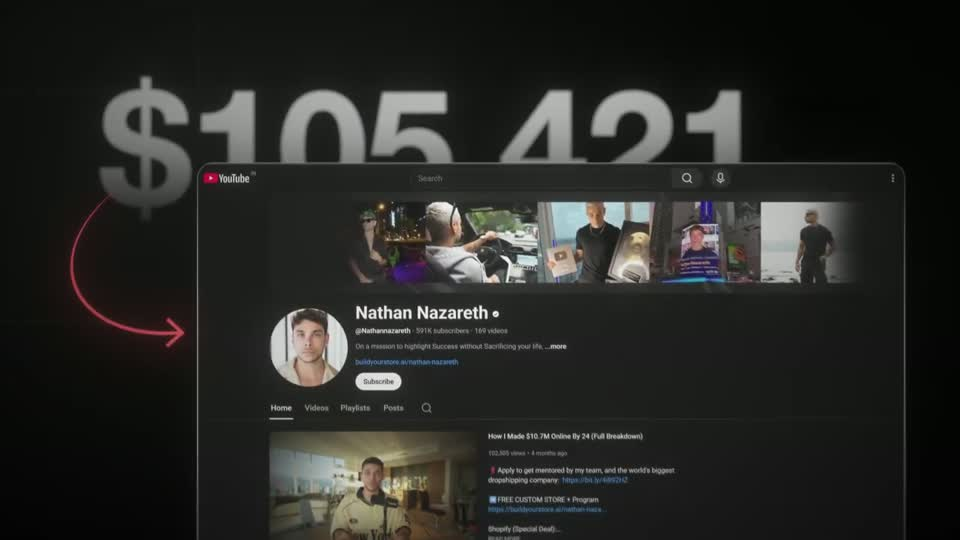
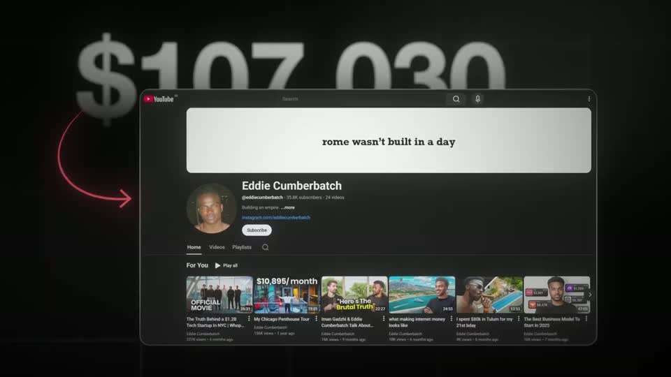

# B3 — Big stat / counter title

Rule: `standards/formats/long-form.md` (catalogue row B3). This card holds the evidence and the quality bar; the rule stays in the format profile.

## Quality bar

- The number is enormous — cap height ≈ 20 % H (≈ 220 px at 1080) — grey-white with a soft gradient, and it is treated as a **backdrop object**: proof cards slide in front of it.
- It counts continuously and decelerates over ≈ 5 s (`ease.enter`), still moving while each proof card lands; it settles on the spoken number.
- Each proof card (a real channel page in a bordered dark card) rises from below and swaps every ≈ 1 s; a hand-drawn red curved arrow links the number to the card.
- Depth: ground, the number, the proof card, and a foreground element passing through both (here photoreal 3D bills, sourced asset).
- Hold ≥ 0.3 s on the final card before the cut.

<!-- generated:start -->
## Evidence (generated by tools/ref_index.py — do not edit)

**1 exemplar** from 1 video · duration median 5.8 s · largest text median 220 px at 1080 · hold 0.3 s

| Video | Time | Stills | Why it works |
|---|---|---|---|
| ultra-predictable-funnel s004 ★ | 0:18.2–0:24.0 |   | The number is set enormous (≈20 % of frame height) and treated as a backdrop object, so the channel screenshots can slide in front of it and inherit its authority — two depth planes plus bills flying through both. The count decelerates continuously across 5 s (98k → 107k) so it is still moving while each proof card lands, and every card is tied back to the number by a hand-drawn red curved arrow. |
<!-- generated:end -->
