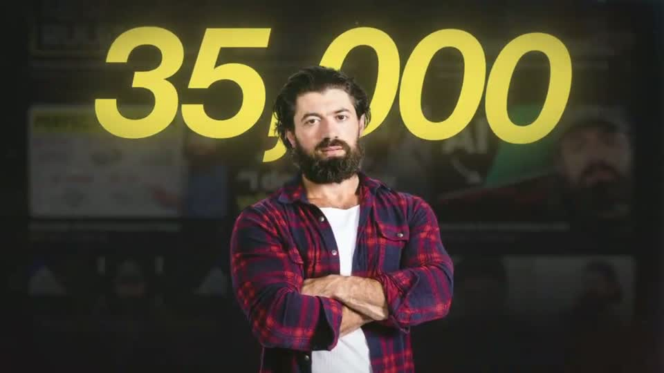
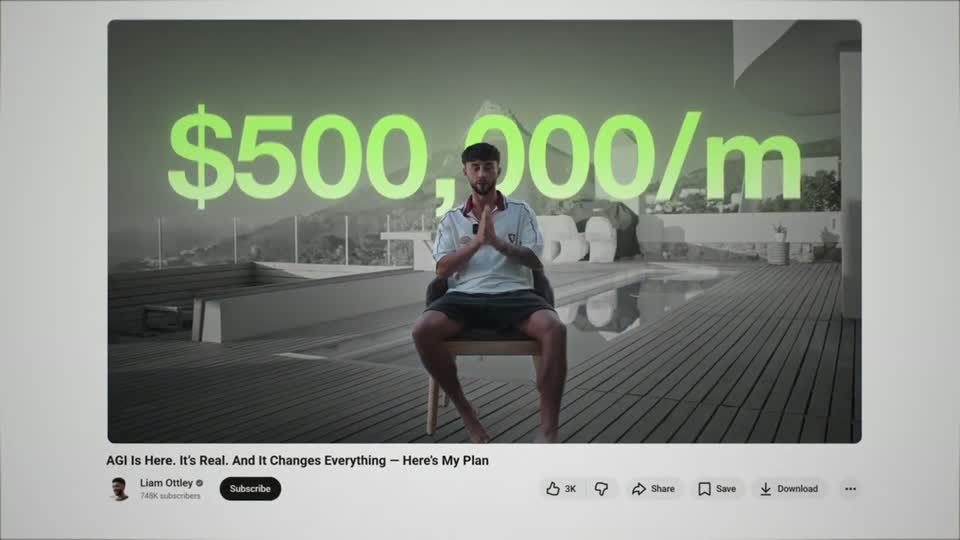
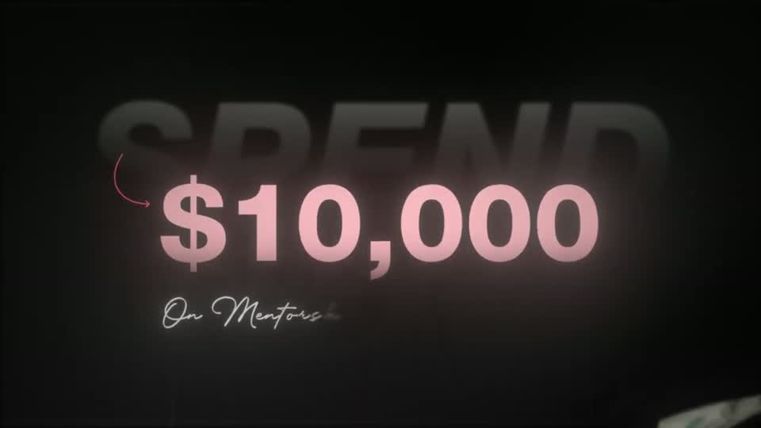
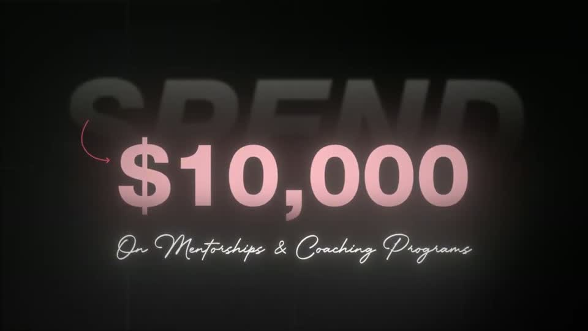
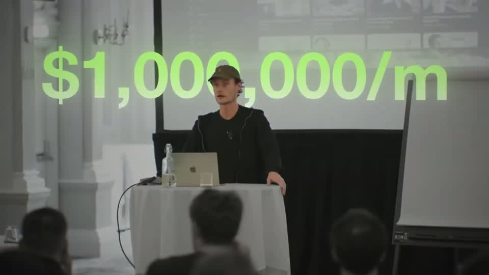
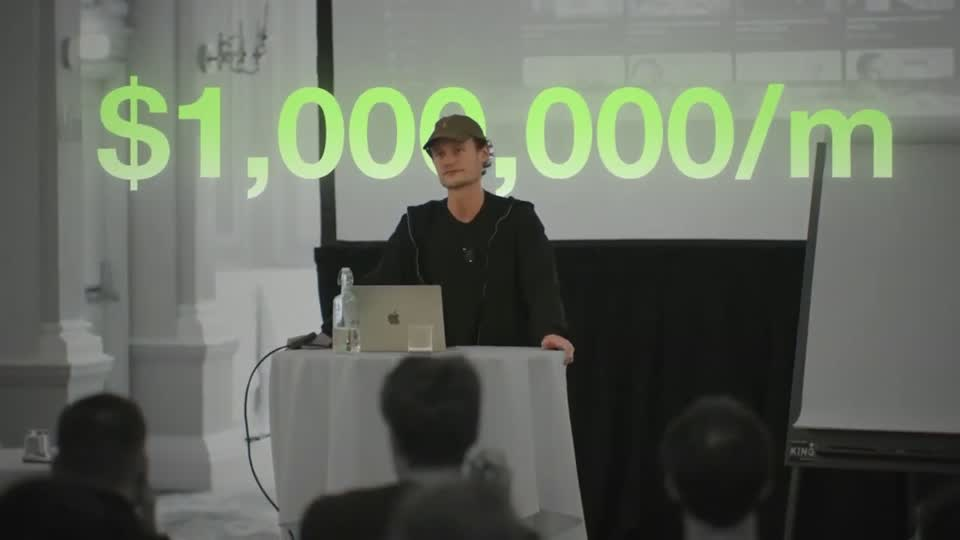

# B3 — Big stat / counter title

Rule: `standards/formats/long-form.md` (catalogue row B3). This card holds the evidence and the quality bar; the rule stays in the format profile.

## Quality bar

- The number is enormous, cap height ≈ 14–28 % H (150–300 px at 1080), and is treated as a **backdrop object**: something passes in front of it. That can be proof cards (pilot), a cut-out of the speaker (Hormozi s002), his body in the source clip (Stupidly s014) or photoreal 3D bills (pilot, Mentors s002; sourced asset).
- Colour is grey-white with a soft gradient, or one saturated colour with a soft glow of the same hue (yellow, pink, lime → green). A ghost word in dim grey caps behind the number is optional (Mentors "SPEND").
- It counts with deceleration (`ease.enter`) and settles exactly on the spoken number: ≈ 1.2–1.5 s for a short stat (Mentors s002 1.3 s). One video counts for ≈ 5 s, and only because proof cards keep landing in front (pilot s004).
- ≥ 3 layers: the real page or clip blurred and dimmed to ≈ 30 % as ground, the number, the foreground object.
- After the number lands (≈ 0.3–0.6 s), a script subtitle writes on with a hand-drawn swoosh or curved arrow; icons may then pop 0.1 s apart.
- Hold ≥ 0.8 s clean (≥ 0.3 s on the final proof card in the long variant).
- Don't: type the digits on one by one (3 → 35 → 35,000: Hormozi s002, Ottley s041, Stupidly s014). That is a per-character build; roll the whole number as an odometer instead.

<!-- generated:start -->
## Evidence (generated by tools/ref_index.py — do not edit)

**5 exemplars** from 5 videos · duration median 3.57 s (p25–p75 2.95–5.95 s) · largest text median 195 px at 1080 · word build 0.1 s/word · hold 0.8 s

| Video | Time | Stills | Why it works |
|---|---|---|---|
| hormozi-100-posts s002 ★ | 0:01.3–0:07.4 |   | Three depth layers do the work: a blurred, dimmed real channel page as ground, the giant yellow figure (≈300 px cap, ≈68 % W) behind the cut-out's head, and the cut-out in front, so the number reads as huge without hiding the person. The digits build left → right (3 → 35 → 35,000) over ≈1.4 s with a warm glow, and only after the number settles does the white script subtitle write on with a hand-drawn yellow swoosh, then four platform icons pop in 0.1 s apart. |
| liam-ottley-540k s041 ★ | 0:00.3–0:03.4 |   | The number is laid inside a real watch page, so the stat reads as the subject's own claim: a ≈165 px lime figure with a soft green glow over the playing clip, on a silver page with real title, channel row and buttons. The page itself sits on the light radial ground with a thin white frame, three planes (ground, page, number) in 3 s. |
| spent-10k-on-mentors s002 ★ | 0:01.1–0:04.6 |   | The number (≈195 px caps, ≈18 % H) is a soft-pink glowing figure sitting on a ghost word, with real 3D bills flying through two depth planes, so a plain stat reads like a cinematic title. The count decelerates and lands exactly on '$10,000' as it is said, then the script subline writes on one beat later and everything holds clean for ≈1.3 s. |
| stupidly-simple-youtube-strategy s014 ★ | 0:42.0–0:44.8 |   | The big figure is placed into the footage, not over it: the speaker's head and body occlude the middle zeros, so the number lives on the stage wall behind him. Green gradient type ≈ 14 % H with a soft halo, single line, then the whole clip becomes the banner of the next screenshot — a match-cut from proof footage to proof UI. |
| ultra-predictable-funnel s004 ★ | 0:18.2–0:24.0 |   | The number is set enormous (≈20 % of frame height) and treated as a backdrop object, so the channel screenshots can slide in front of it and inherit its authority — two depth planes plus bills flying through both. The count decelerates continuously across 5 s (98k → 107k) so it is still moving while each proof card lands, and every card is tied back to the number by a hand-drawn red curved arrow. |
<!-- generated:end -->
