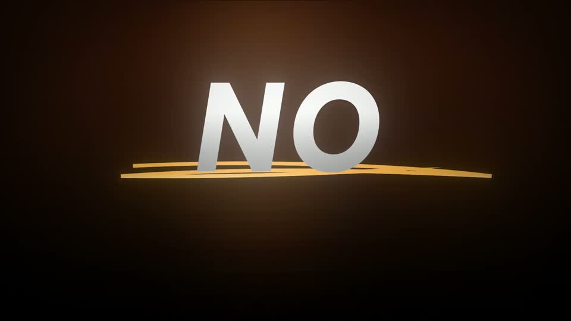
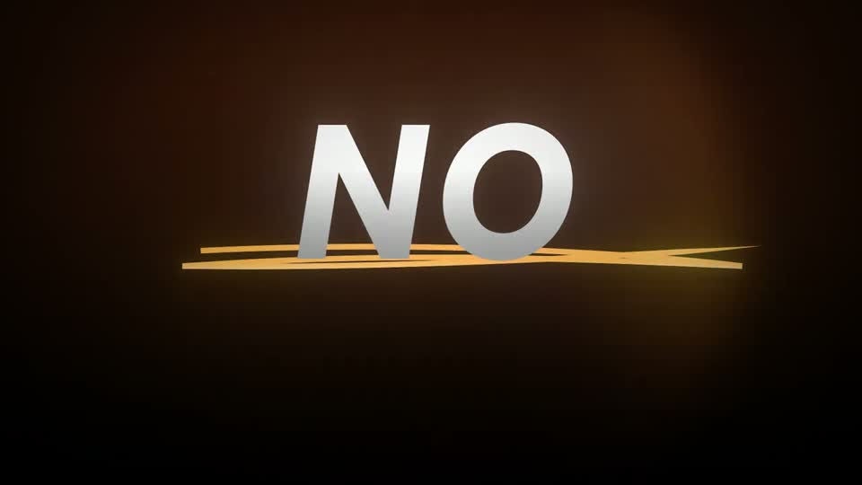

# B4 — Punch word

Rule: `standards/formats/long-form.md` (catalogue row B4). This card holds the evidence and the quality bar; the rule stays in the format profile.

## Quality bar

- Single exemplar (Stupidly s020), so the evidence is thin.
- One bold italic word, cap height ≈ 18 % H (≈ 190 px), white with a subtle bevel, centred.
- Ground: a dark warm vignette (here `#402010` brown) with a soft orange glow behind the word. In this light-ground video it is the only dark frame, so the lighting change is the punch.
- The word fades and sharpens in over ≈ 0.3 s, with no scale pop and no overshoot. Then a doubled scribble underline in the glow colour draws L → R in ≈ 0.3 s.
- The shot runs ≈ 1.8 s, holds ≈ 0.9 s, then hard-cuts out.

<!-- generated:start -->
## Evidence (generated by tools/ref_index.py — do not edit)

**1 exemplar** from 1 video · duration median 1.77 s · largest text median 190 px at 1080 · hold 0.9 s

| Video | Time | Stills | Why it works |
|---|---|---|---|
| stupidly-simple-youtube-strategy s020 ★ | 1:04.5–1:06.3 |   | The only dark frame in a light video, so the hard turn is felt as a lighting change: one bold italic white word with a subtle bevel, a warm glow behind it and a doubled hand-drawn orange scribble under it. ≈ 18 % H, nothing else in frame. |
<!-- generated:end -->
