# C1 — Flow strip

Rule: `standards/formats/long-form.md` (catalogue row C1). This card holds the evidence and the quality bar; the rule stays in the format profile.

## Quality bar

- Nodes are real or UI-like objects, never plain boxes: real logos in glass tiles, dark glass tiles styled as the real product, real clips or thumbnails in rounded cards. They sit ≈ 8–28 % W against the rule's ≈ 12 %: one video goes smaller (Clay ≈ 8 %) and one bigger (Hormozi 15–28 %).
- One node per spoken phrase. Each connector draws (≈ 0.3 s) before the next node arrives: a thin 1–2 px line, a red dashed line with a centred swap-glyph tile (Clay s021), or a hand-drawn curved arrow (Stupidly s009).
- When the flow is right vs wrong, it gets a verdict: a small red ✕ / green ✓ on the links (pilot s039), or a red underline under the key phrase of the caption (Clay s021). A neutral process needs none (Hormozi s039).
- The caption is ≈ 45–60 px, 1–2 lines, built word by word (≈ 0.2–0.3 s/word). It may grow in step with the pan, line 2 extending line 1 (Stupidly s009).
- Depth on the dark ground: each node has its own glow or tinted rim, or a large blurred, dim brand mark sits behind the nodes. Light ground: light glass tiles with tinted borders and a charcoal caption.
- The camera moves only to follow a new node (legs ≈ 0.8–1 s), or steps out as each node arrives. It holds 0.8–2.5 s on the full diagram.

<!-- generated:start -->
## Evidence (generated by tools/ref_index.py — do not edit)

**6 exemplars** from 4 videos · duration median 6.72 s (p25–p75 5.57–8.06 s) · largest text median 54.0 px at 1080 · word build 0.25 s/word · hold 1.35 s

| Video | Time | Stills | Why it works |
|---|---|---|---|
| hormozi-100-posts s039 ★ | 0:55.2–1:03.2 | 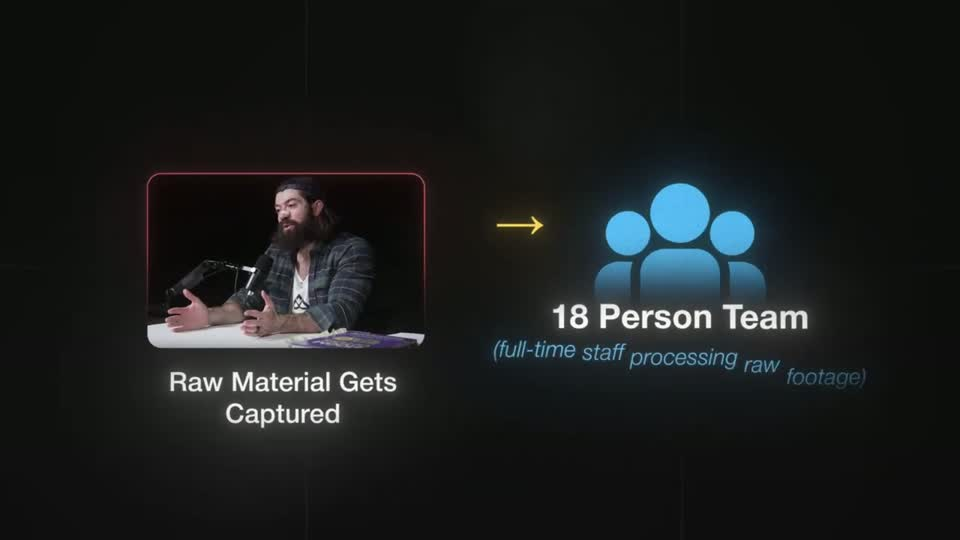 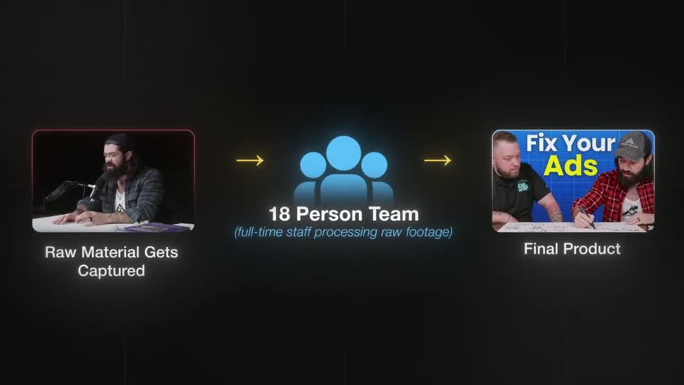 | Three nodes, three visual languages kept consistent by glow: a real clip with a warm rim, a flat blue icon with a soft bloom and a blue italic aside, a real thumbnail as the output — all on a faint grid ground that keeps depth without noise. The camera only ever reveals the next node as the arrow reaches it, so the process reads left → right at speaking pace. |
| problem-with-clay s021 ★ | 2:32.9–2:39.2 | 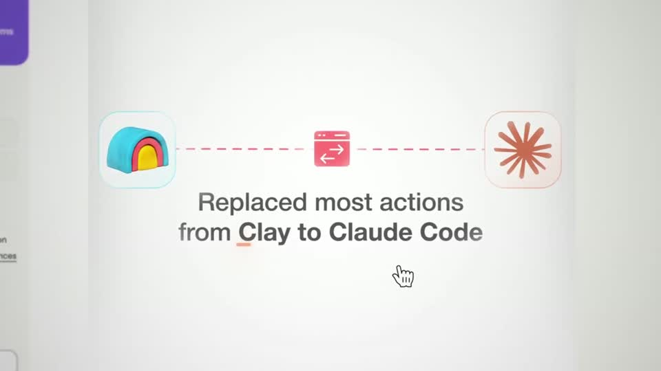 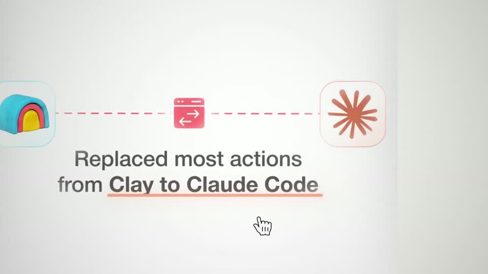 | Textbook flow strip on light: two logo tiles in soft glass with tinted borders (blue-ish for Clay, warm for Claude), a red dashed connector with a centred swap icon, and a 52 px charcoal 2-line caption with one red underline under the key phrase. The cursor parked under the caption keeps it feeling like a live screen. |
| stupidly-simple-youtube-strategy s009 ★ | 0:25.3–0:31.5 | 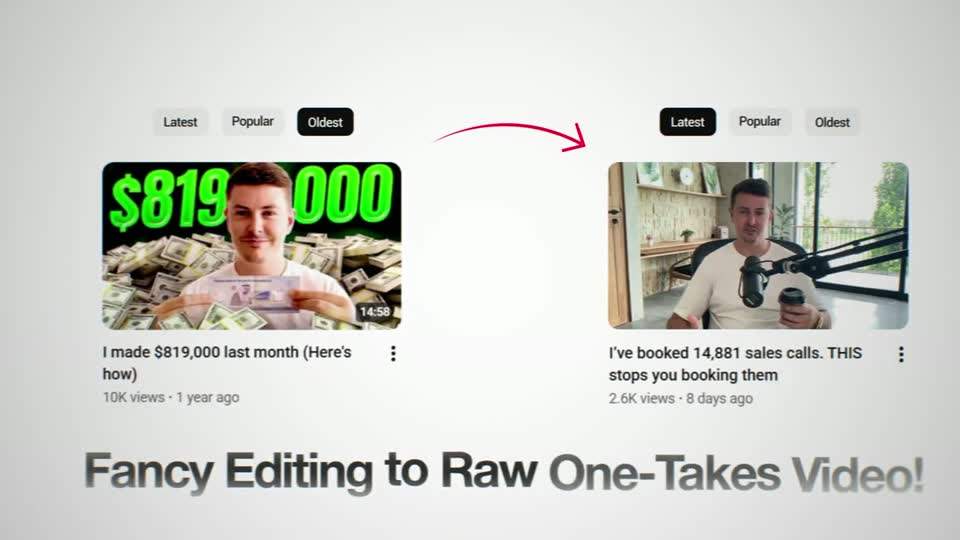 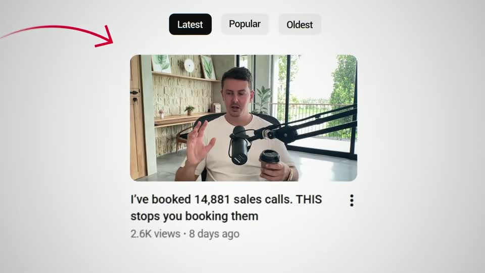 | The substitution is told by camera direction: the frame leaves the loud green-money thumbnail and travels along a thin red hand-drawn arrow to a quiet raw video, and the caption grows in step ('Fancy Editing' → '…to Raw One-Takes Video!'). Real thumbnails, real titles and view counts; one ≈ 60 px dark caption line under the UI, no box. |
| ultra-predictable-funnel s082 ★ | 2:24.0–2:32.2 | 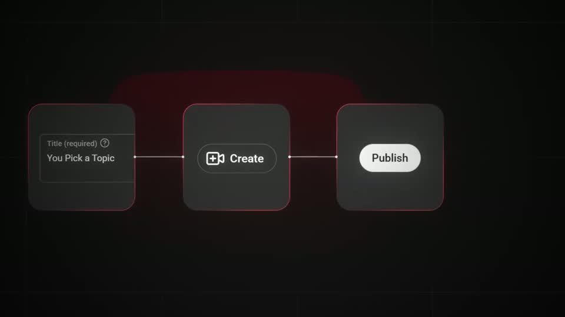 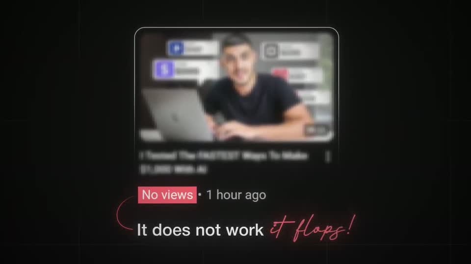 | Three small UI-like nodes (styled like YouTube Studio fields and buttons) read as the real workflow; the giant blurred YouTube play logo behind gives the canvas depth without competing. The payoff lands on a real video card: red highlight block on 'No views', a hand-drawn bracket, 'It does not work' and a red signature-script 'it flops!'. |
| ultra-predictable-funnel s039 ★ | 3:59.0–4:06.1 | 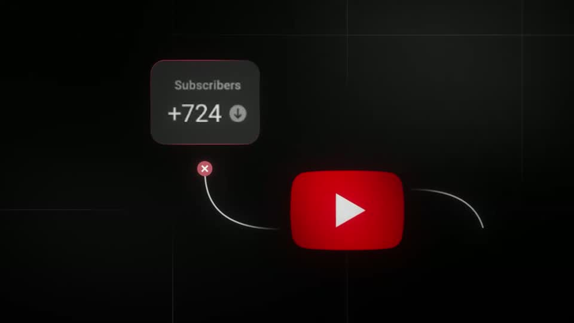 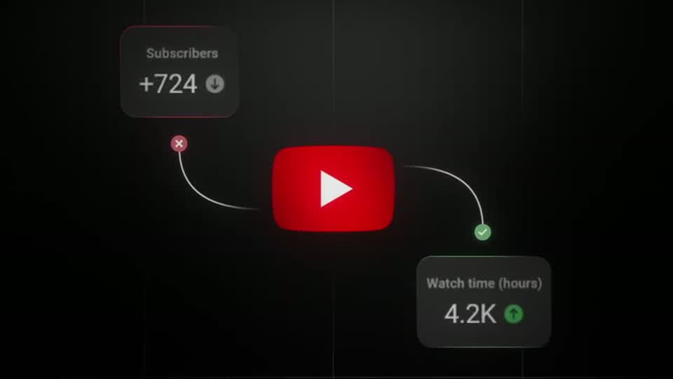 | Real YouTube Studio metric chips (dark glass, the exact label text and up/down icons) wired to the logo with thin hand-drawn-looking connectors; a small red ✕ sits on the subscriber link and a green ✓ on the watch-time link, so a two-node diagram makes a verdict without a single word of headline. |
| problem-with-clay s051 | 4:11.3–4:15.0 | 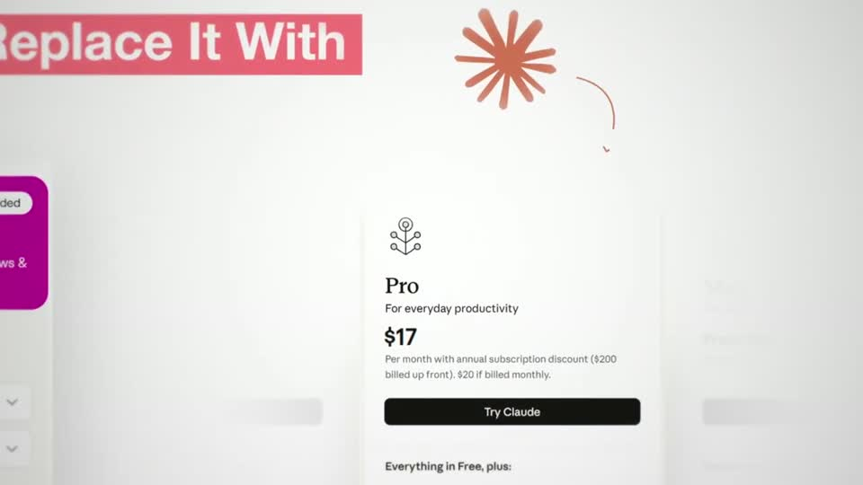 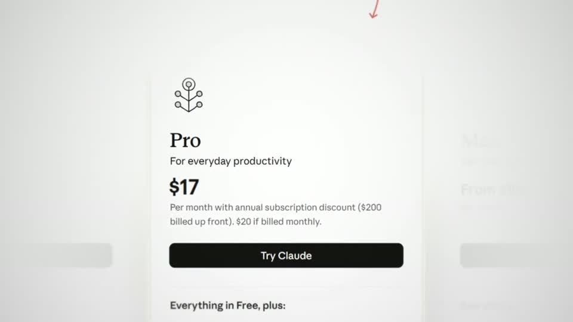 | Substitution told by camera: the Clay tree exits left as the 'Replace It With' label leads right, and the destination is a real pricing card picked out by fading its siblings. |
<!-- generated:end -->
