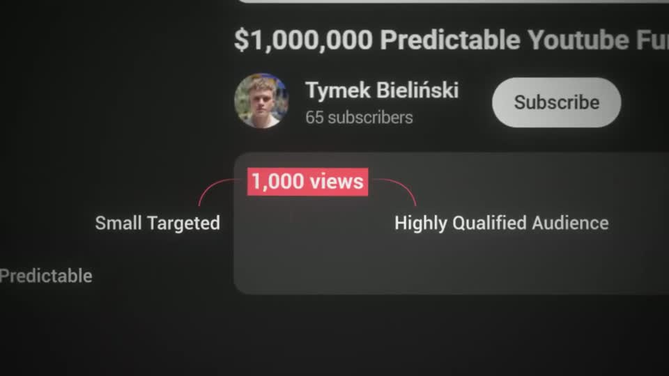
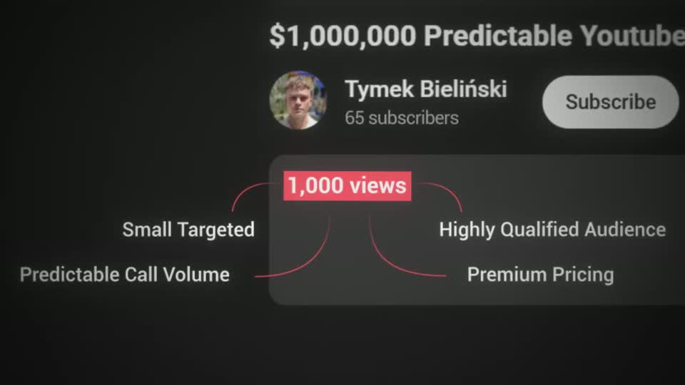

# C2 — Tree

Rule: `standards/formats/long-form.md` (catalogue row C2). This card holds the evidence and the quality bar; the rule stays in the format profile.

## Quality bar

- The tree grows **out of real UI**: its root is a marked element on a real page (the `1,000 views` chip in a red block), not a free-floating label.
- Connectors are thin red lines (straight elbows for a formula, curves for a mind-map) that draw top → bottom / outward, one row per spoken phrase.
- Rows read ≥ 45 px at the settled framing; the result row gets the red highlight block (`$15 for every view`).
- Leaves that are tools use real logos in dark glass tiles with a 2-line label; peer verdict badges (✕ ×3) land together at the end.
- Camera glides down as each row appears (legs ≈ 1.5 s, `ease.camera`) and pulls back once to frame the leaves; hold ≥ 1.5 s.
- A long tree is one persistent canvas: after a face cut-in it resumes where it was and may leave on a whip.

<!-- generated:start -->
## Evidence (generated by tools/ref_index.py — do not edit)

**2 exemplars** from 1 video · duration median 11.75 s · largest text median 47.5 px at 1080 · word build 0.28 s/word · hold 1.15 s

| Video | Time | Stills | Why it works |
|---|---|---|---|
| ultra-predictable-funnel s059 ★ | 6:25.7–6:43.7 |   | A formula told top to bottom: thin red connectors draw from the views chip to 'Booked 10 calls' → 'Close 3 clients x $5,000/month' → '$15,000 ÷ 1,000 views = $15 for every view' (red block), then branch to three real-logo tiles (Gmail, LinkedIn, Meta) in dark glass cards that arrive one per phrase ≈2 s apart; three red ✕ badges land together at the end. The camera only moves when a new row appears. |
| ultra-predictable-funnel s063 | 6:52.9–6:58.4 |   | A mind-map grown out of a real UI element: the red '1,000 views' chip is the root, and 'Small Targeted', 'Highly Qualified Audience', 'Predictable Call Volume', 'Premium Pricing' hang off it on thin red curves that overlap the page edge. |
<!-- generated:end -->
