# C2 — Tree

Rule: `standards/formats/long-form.md` (catalogue row C2). This card holds the evidence and the quality bar; the rule stays in the format profile.

## Quality bar

- The tree grows **out of real UI** or a real object. Its root is a marked element on a real page (`1,000 views`, `752K subscribers` in a red block), a real logo or a real tile, never a free-floating label.
- Connectors are thin lines that draw outward from the root, one row or branch per spoken phrase: red elbows for a formula, red hand-drawn curves for a mind-map, grey elbows or dashed lines on the light ground. A converging tree may give each branch its own colour all the way into the shared node (Clay s035).
- At the settled framing, headers and rows read ≥ 45 px and points ≥ 38 px (Ottley ≈ 40 px). The result row gets the red highlight block, and only the problem words are red.
- Leaves are real: logos in dark glass tiles with a 2-line label, cut-outs of the real pricing tiers (Clay s027), a real landing page in a browser card (Ottley s009). A node may pair a glass icon chip with a script kicker in its own colour (Mentors s008). Peer verdict badges (✕ ×3) land together at the end.
- Camera, either way: it glides down as each row appears (legs ≈ 1.5 s, `ease.camera`), or it tours node by node or column by column in short legs of ≈ 0.6–0.8 s with 2–3 s stops, the next column half in frame (Mentors s008, Ottley s015). Then it pulls back once to frame the whole tree and holds ≥ 1.5 s.
- A long tree is one persistent canvas: after a face cut-in it resumes where it was, and it may leave on a whip.
- Light ground: canvas text is flat dark grey with no glow. Glow appears only on a dark surface inside the frame (the dark landing page, Ottley s009). Depth comes from labels set in slight perspective with defocus, over a backdrop grid washed toward white.
- Don't: type labels on letter by letter (Ottley s009 "VSL Page"). Sans text builds word by word.

<!-- generated:start -->
## Evidence (generated by tools/ref_index.py — do not edit)

**11 exemplars** from 4 videos · duration median 8.17 s (p25–p75 5.47–11.53 s) · largest text median 57 px at 1080 · word build 0.3 s/word · hold 1.0 s

| Video | Time | Stills | Why it works |
|---|---|---|---|
| liam-ottley-540k s015 ★ | 3:39.0–3:47.5 | 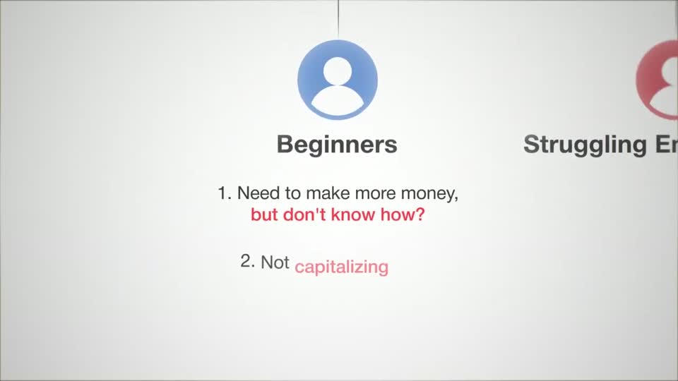 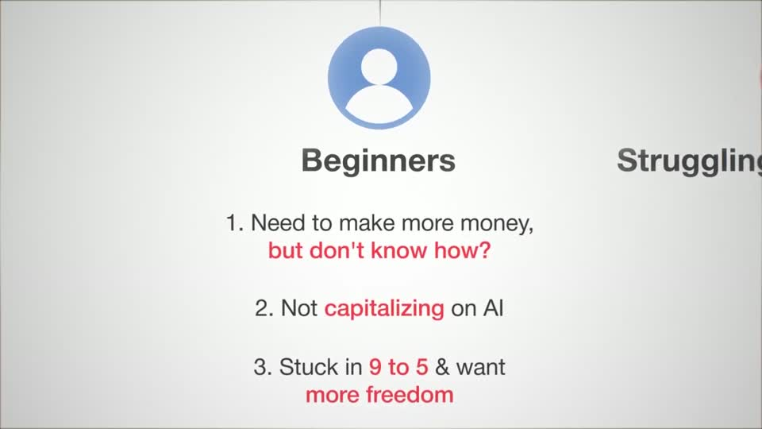 | Column tour of a tree: after the push the column header reads 57 px and the points ≈40 px, centred, with only the pain words red ('but don't know how?', 'capitalizing', '9 to 5', 'more freedom'); the next column stays visible at the right edge, so the viewer knows the camera will move on. |
| liam-ottley-540k s034 ★ | 5:45.2–6:04.9 |  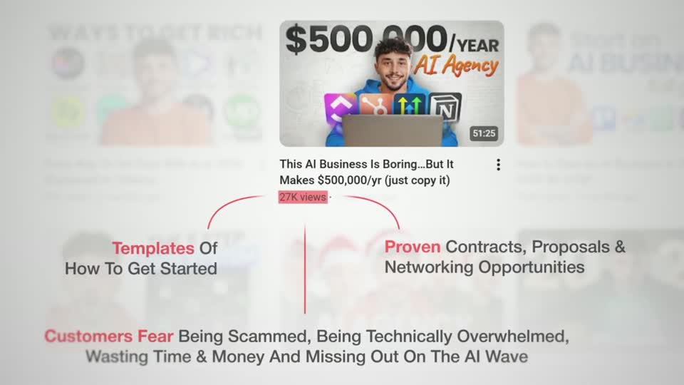 | A mind-map grown out of a real tile: the root is the red-blocked view count, three thin red connectors lead to 38 px labels whose first word is bold red italic ('Templates', 'Proven', 'Customers Fear') and the rest dark grey italic. Four planes — washed grid, sharp tile, red lines, perspective text with defocus — keep a 20 s shot alive with only three beats. |
| problem-with-clay s027 ★ | 4:07.5–4:11.3 | 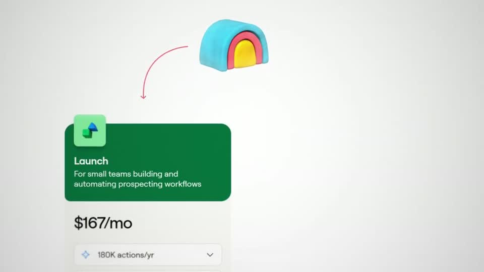 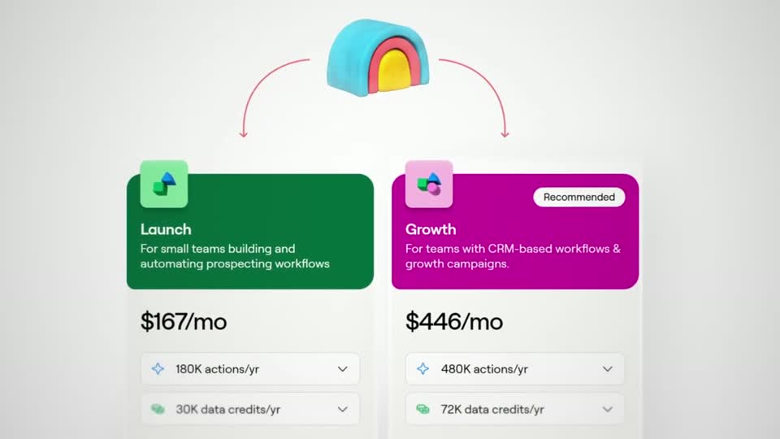 | A mind-map grown out of a real logo with real UI as leaves: the tier cards are cut-outs of the actual pricing page (colour headers, prices) and the connectors are thin hand-drawn red curves, not rigid lines. |
| problem-with-clay s035 ★ | 6:40.2–6:47.6 |  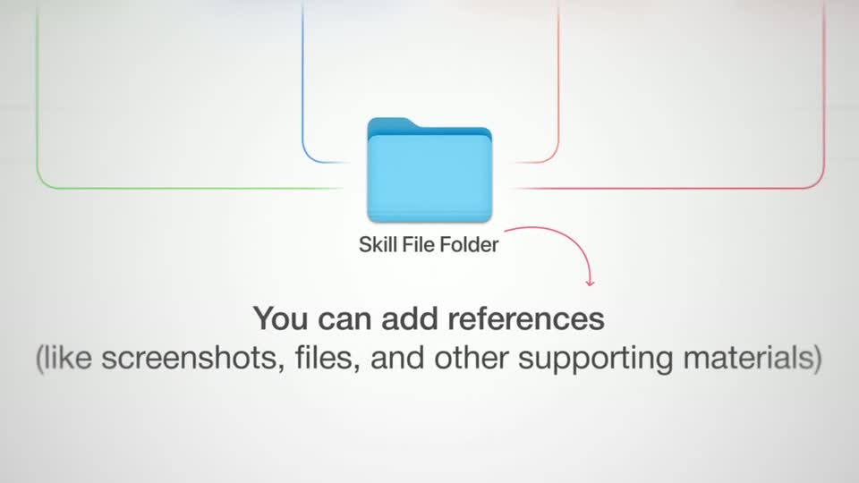 | A converging tree: colour-coded connectors keep the identity of each agent all the way into the shared folder, and the camera follows the lines, so the structure is read as motion. Main line 40 px charcoal, parenthetical in lighter grey. |
| spent-10k-on-mentors s008 ★ | 0:22.4–0:33.9 | 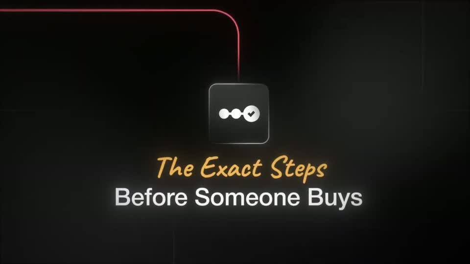 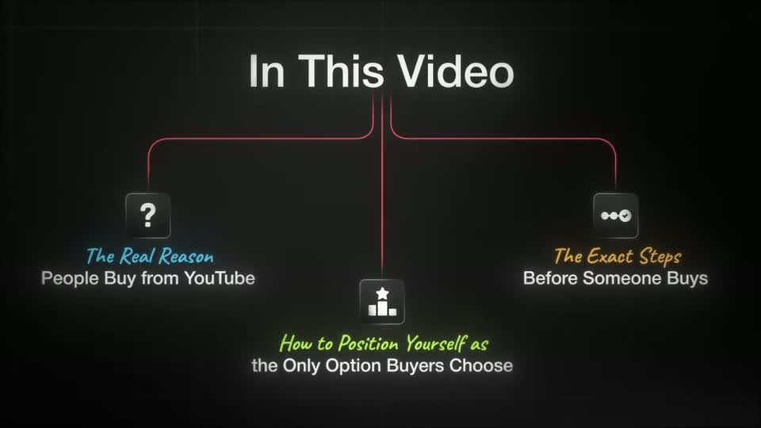 | An agenda told as a tree the camera walks: thin red connectors are the path the camera follows from title to each node, each node pairs a glass icon chip with a script kicker in its own colour (cyan, orange, lime) over a white sans line, and the walk ends on a pulled-back overview held 2 s so the whole map reads at once. |
| ultra-predictable-funnel s059 ★ | 6:25.7–6:43.7 | 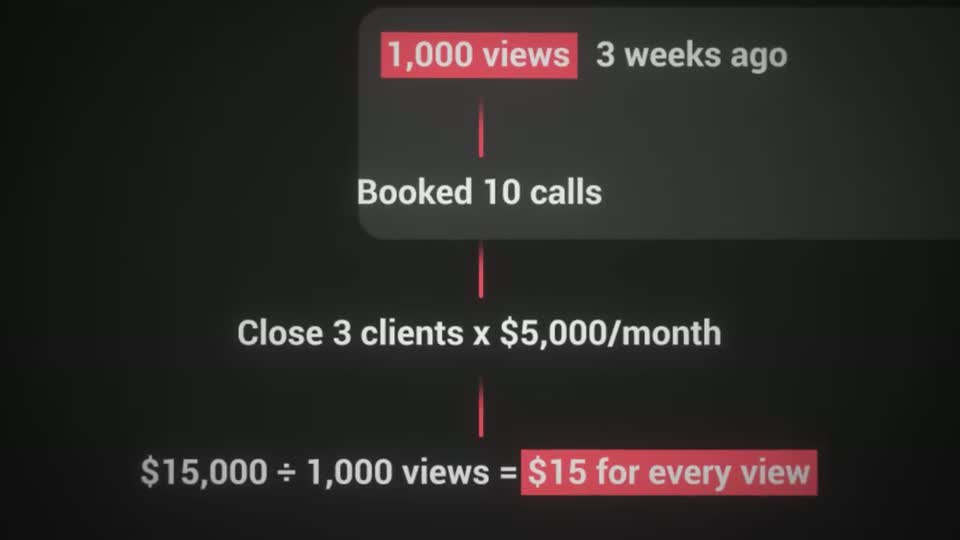 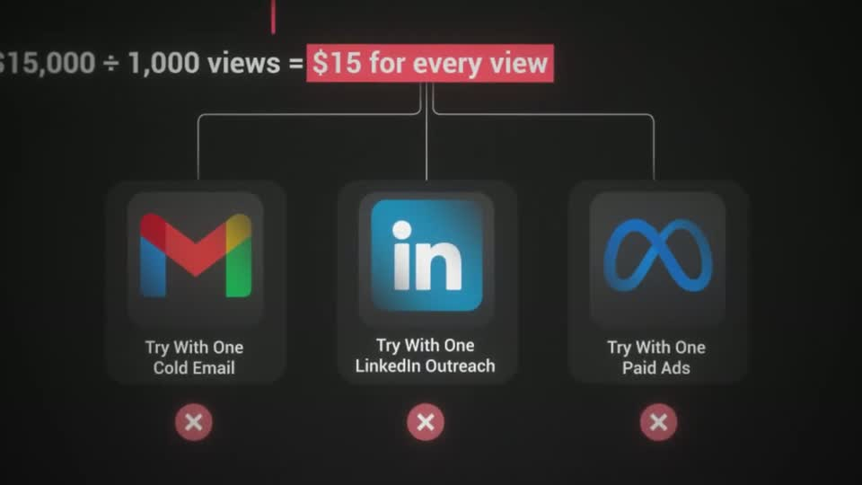 | A formula told top to bottom: thin red connectors draw from the views chip to 'Booked 10 calls' → 'Close 3 clients x $5,000/month' → '$15,000 ÷ 1,000 views = $15 for every view' (red block), then branch to three real-logo tiles (Gmail, LinkedIn, Meta) in dark glass cards that arrive one per phrase ≈2 s apart; three red ✕ badges land together at the end. The camera only moves when a new row appears. |
| liam-ottley-540k s009 | 1:03.4–1:13.6 | 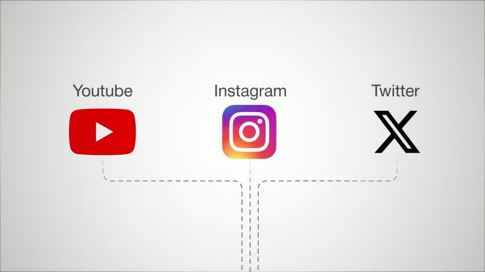 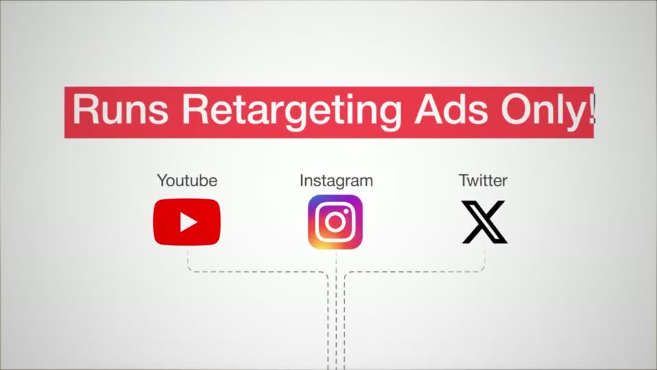 | A three-to-one funnel told vertically: real platform logos on top, thin dashed connectors that merge into a single line, and a real dark landing page in a browser card at the bottom, so the camera's up/down legs are the argument. The 130 px glowing 'VSL Page' title sits on the dark page (glow only on the dark surface), while the light canvas text stays flat dark grey. |
| liam-ottley-540k s013 | 3:32.0–3:35.0 | 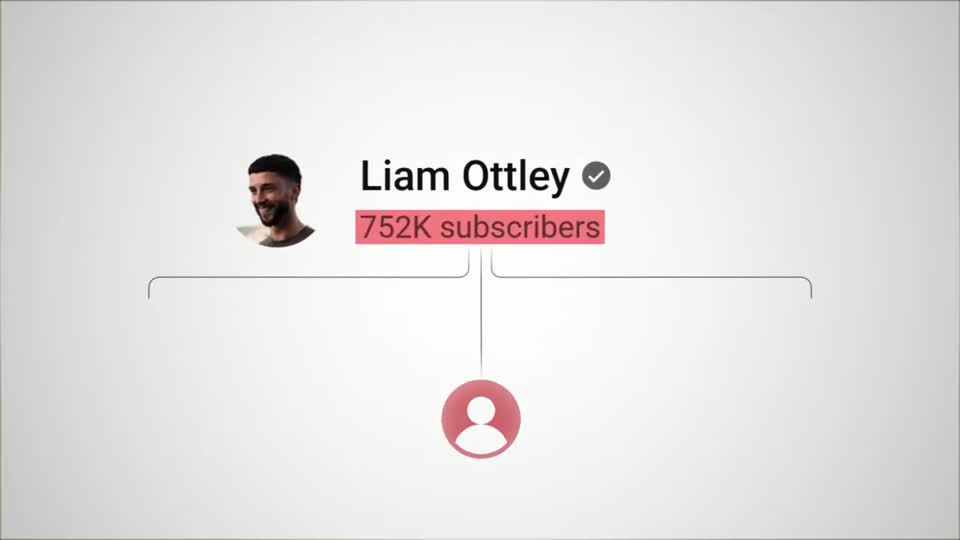 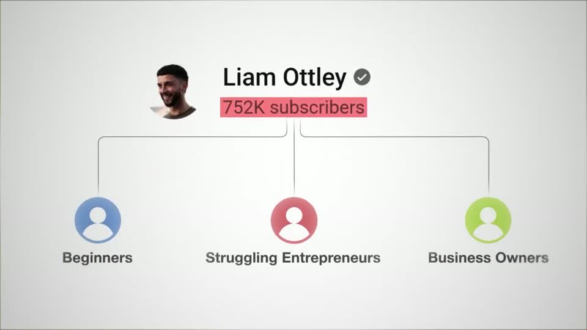 | The tree grows out of a real UI element (the channel's name and subscriber count, marked with a red block), with flat coloured avatar circles (≈150 px) and bold dark grey labels — three colours that become the three column codes for the rest of the canvas. |

…and 3 more in references/index.json.
<!-- generated:end -->
