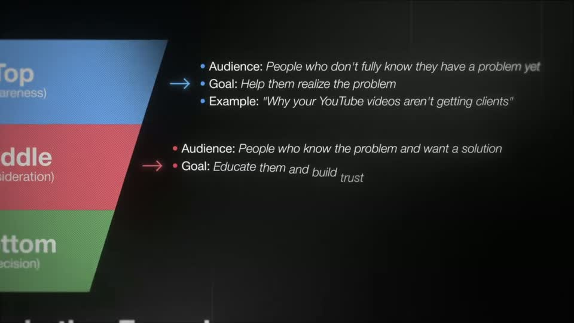
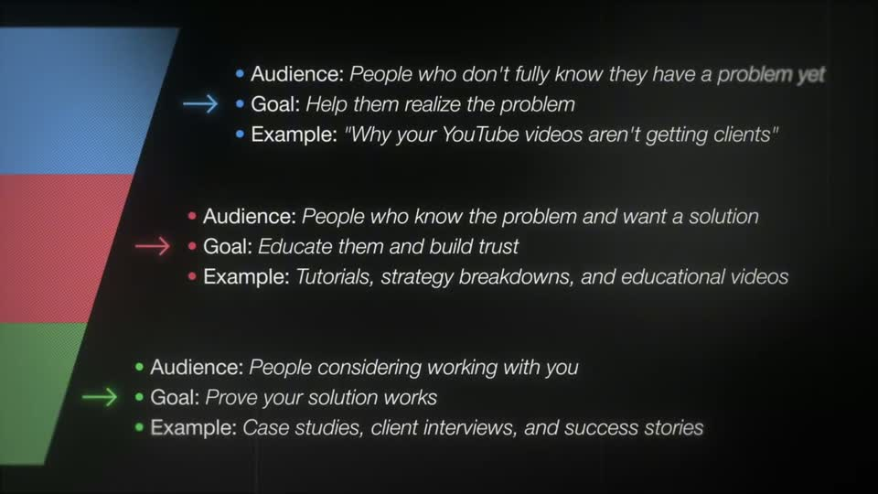
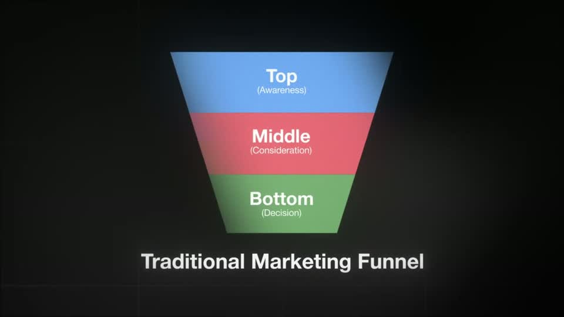
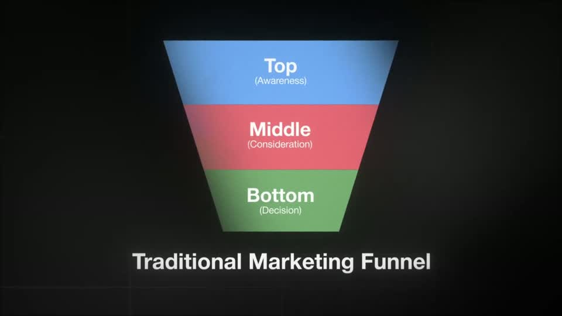

# C3 — Funnel / bands

Rule: `standards/formats/long-form.md` (catalogue row C3). This card holds the evidence and the quality bar; the rule stays in the format profile.

## Quality bar

- Single exemplar video (Mentors s032/s034), so the evidence is thin.
- The bands are one object: a 3-band trapezoid with a slight perspective tilt, one colour per band (blue / red / green). It builds by sliding the missing band into place (≈ 0.4 s). The title (≈ 48 px) builds word by word beneath.
- One loop per band: an arrow in the band's colour draws out, the camera pushes onto that band's bullet block (≈ 1.5–2 s, `ease.camera`) while the bullets type one per phrase, then pulls back to the overview (≈ 1.5 s) before the next band.
- Bullets are a bold lead word plus an italic grey example and read ≥ 36 px at the pushed framing. The exemplar's ≈ 25 px is too small; don't copy it.
- One persistent canvas across face cut-ins. It resumes exactly and ends on a pull-back to the funnel with every bullet block.
- A slow push (≈ 2 %/s) keeps the static intro alive; holds run 1.5–4 s.

<!-- generated:start -->
## Evidence (generated by tools/ref_index.py — do not edit)

**2 exemplars** from 1 video · duration median 22.33 s · largest text median 36.5 px at 1080 · word build 0.23 s/word · hold 2.75 s

| Video | Time | Stills | Why it works |
|---|---|---|---|
| spent-10k-on-mentors s034 ★ | 9:11.7–9:48.3 |   | One persistent funnel the camera steps through band by band: each band's arrow is drawn in its own colour, the camera pushes onto its bullet block while the bullets type to the speech, then pulls back so the viewer re-anchors on the whole funnel before the next band. Three-colour coding carries the structure without any extra labels. |
| spent-10k-on-mentors s032 | 9:00.7–9:08.7 |   | A clean three-colour funnel with a slight perspective tilt so it reads as an object, not a flat chart; the missing middle band sliding into place is the only motion besides a slow push and the title build. |
<!-- generated:end -->
