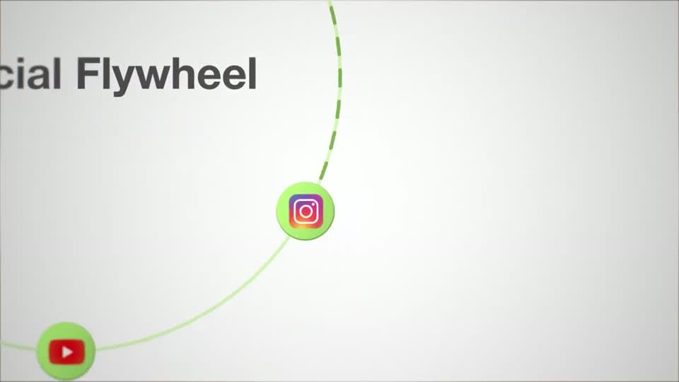
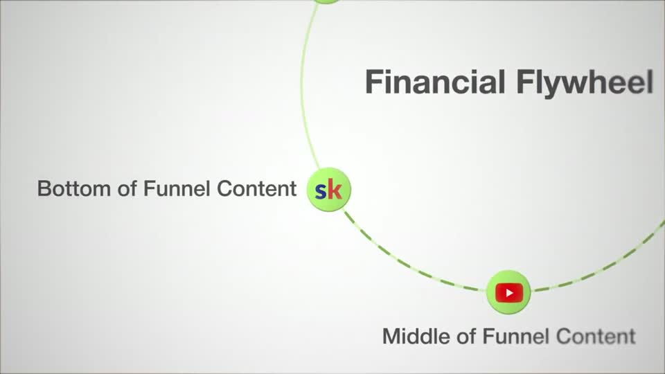
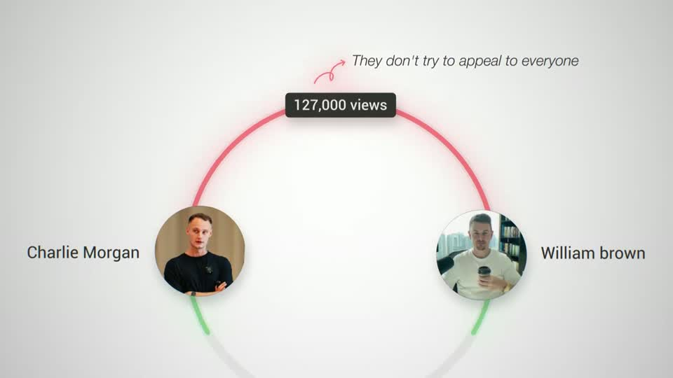
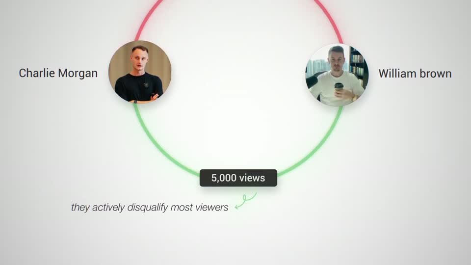
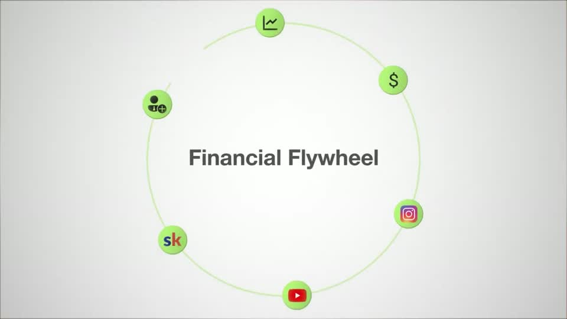
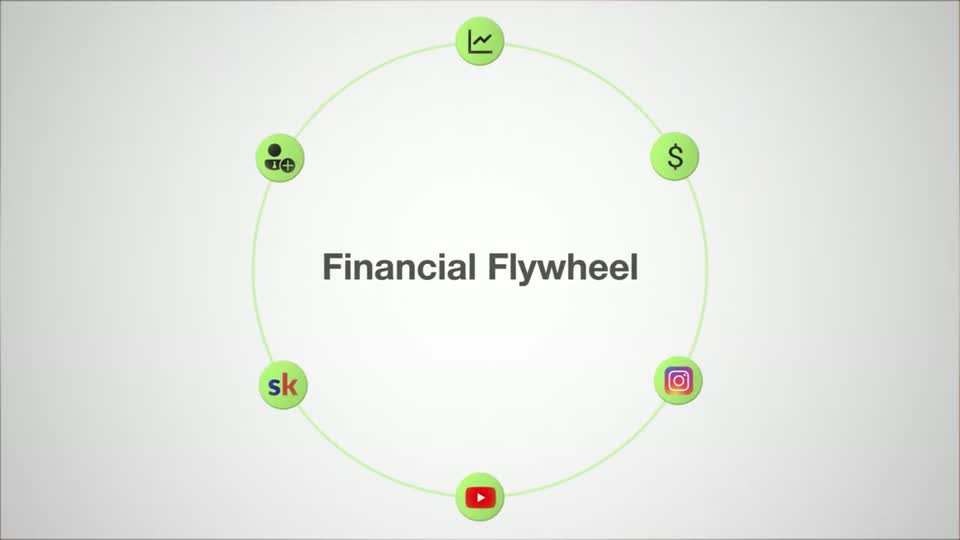

# C4 — Orbit / flywheel

Rule: `standards/formats/long-form.md` (catalogue row C4). This card holds the evidence and the quality bar; the rule stays in the format profile.

## Quality bar

- A thin ring (pale green or pale grey) carries 2–6 nodes: lime circles ≈ 90 px with real glyphs (YouTube, Instagram, Skool), or round avatars. The title is centred (≈ 54 px at full view). Use one accent colour per ring, or a meaning colour per arc.
- Intro: the title builds word by word, the ring draws, and the nodes pop ≈ 0.15 s apart.
- Tour: at ≈ 2×, the camera travels node to node in legs of ≈ 1–1.2 s (`ease.camera`) with ≈ 2 s readable stops. A darker dashed segment draws along the ring ahead of the camera, and each label (≈ 58 px at the push) types on as the camera arrives. The title drifts out of frame as context (Ottley s028).
- Comparison variant (Stupidly s029): two avatars on the ring, a red top arc and a green bottom arc, each with a dark counter chip that rolls while its arc draws; the camera tilts top → bottom. When the point is the contrast, prefer C9.
- Persistent canvas: it resumes exactly after a face cut-in, and ends on a full pull-back (≈ 2 s) to the labelled ring, held ≈ 1.5 s (Ottley s030).
- Light ground: flat dark grey type, no glow; small italic grey notes with hook arrows in the arc's colour.

<!-- generated:start -->
## Evidence (generated by tools/ref_index.py — do not edit)

**4 exemplars** from 2 videos · duration median 11.04 s (p25–p75 5.61–17.69 s) · largest text median 52.0 px at 1080 · word build 0.28 s/word · hold 1.25 s

| Video | Time | Stills | Why it works |
|---|---|---|---|
| liam-ottley-540k s028 ★ | 7:22.2–7:42.0 |   | Orbit tour done by the camera: at ≈2× the title (90 px) drifts out of frame as context while each node and its 58 px grey label sit at a readable stop; the dashed darker-green segment drawing ahead of the camera is what makes it feel like a loop rather than a list. |
| stupidly-simple-youtube-strategy s029 ★ | 1:29.9–1:40.7 |   | A comparison folded into a ring: the same two creators are joined by two arcs, red on top for the expected high-view path and green below for what they actually do, and the camera moves between the two halves so the contrast is a direction. Counters live in small dark pill chips on the arcs and roll while the arc draws; annotations are small italic grey notes with tiny hand-drawn hook arrows in the arc's colour. |
| liam-ottley-540k s026 | 7:11.0–7:14.8 |   | Minimal flywheel: title centred at 54 px, a thin pale-green ring and six lime circle nodes (≈90 px) with real platform/tool glyphs (YouTube, Instagram, Skool) — only one accent colour on the light ground. |
| liam-ottley-540k s030 | 7:44.8–7:56.0 |   | The loop closes on a full pull-back: six labelled nodes around a 50 px title with every segment now dashed, held ≈1.5 s — the overview the tour earned. |
<!-- generated:end -->
