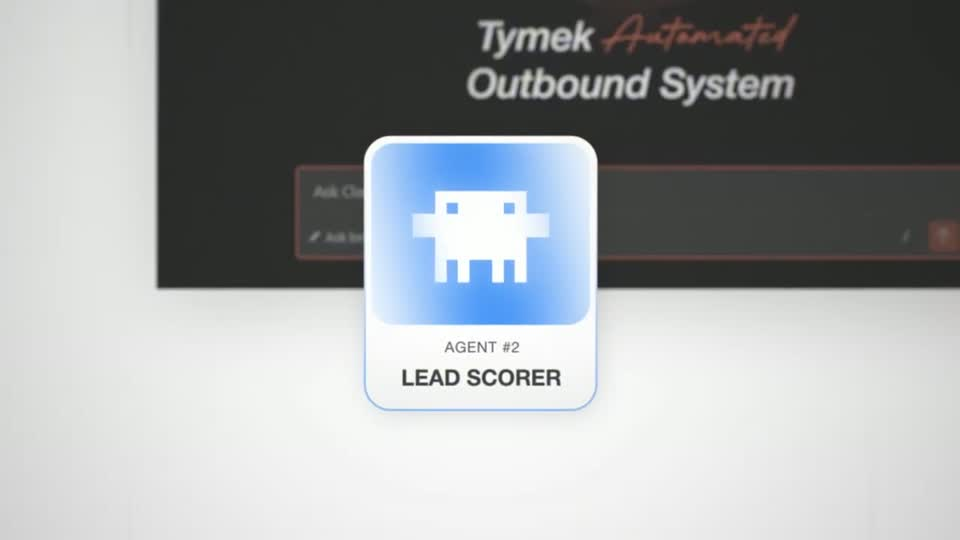
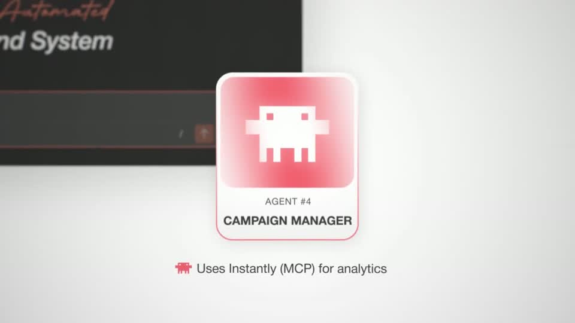
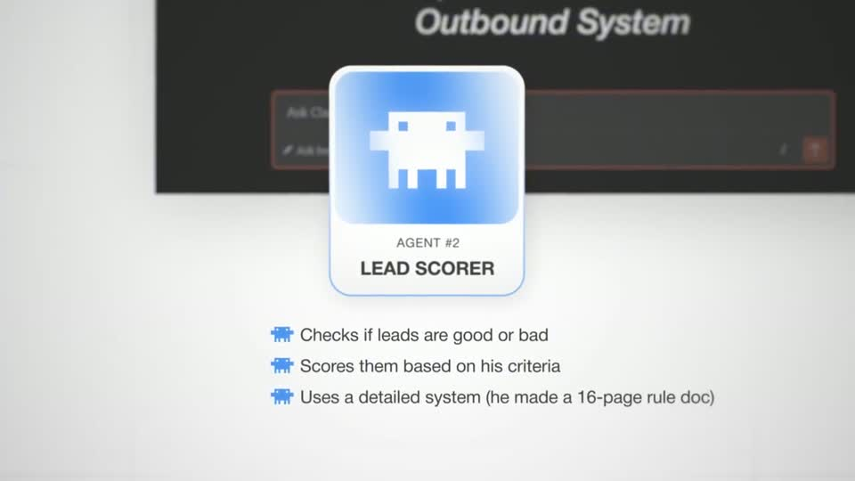
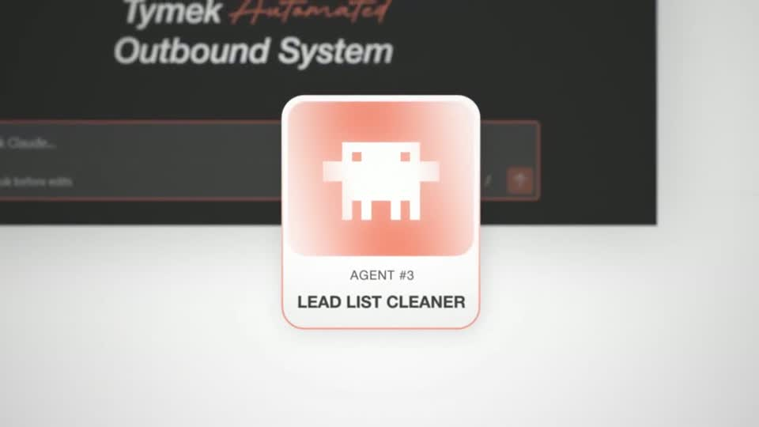
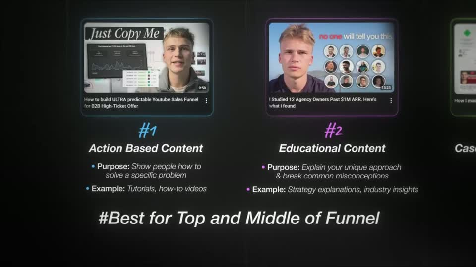

# C5 — Card roster

Rule: `standards/formats/long-form.md` (catalogue row C5). This card holds the evidence and the quality bar; the rule stays in the format profile.

## Quality bar

- 3–4 cards in a row, each with its own identity colour. Three looks: glass with a real thumbnail in a thin frame plus a coloured script "#n" and a bold title (Mentors s036); tall tinted glass tiles with a glossy icon and a "Content #n" label (Instantly s120); glossy gradient tiles with a coloured outer glow (Clay s029).
- The roster stands in front of real context, blurred: the previous thumbnail wall dimmed to ≈ 20 % (Instantly), or the real tool window (Clay). That gives ≥ 4 depth layers. The title (≈ 50–67 px; sans + script, with an optional glowing underline) sits above.
- Cards rise or pop ≈ 0.2–0.25 s apart, without overshoot (Instantly's slight overshoot is not copied).
- The camera pushes into one card (≈ 1–2 s, `ease.camera`) so only one bullet block is readable. Bullets type one per spoken phrase (≈ 2.5–4 s apart) and read ≥ 30 px at the pushed framing. Then the camera pans (≈ 1 s) to the next card. (outside the rule — open for Tymek; build to the rule/kit)
- Long stretches between pans are slow drifts, never freezes (Mentors s040 drifts ≈ 20 s).
- Persistent canvas across face cut-ins, resumed at the exact framing. A verdict line may build beneath the cards it covers (Mentors s038). Close on a pull-back to the whole row (≈ 1 s), optionally with a chip under each card (Clay s033).
- Don't: change cards with a cross-fade (one video, Clay s029–s033). Long-form never dissolves; pan to the next card.

<!-- generated:start -->
## Evidence (generated by tools/ref_index.py — do not edit)

**7 exemplars** from 3 videos · duration median 25.67 s (p25–p75 4.27–38.47 s) · largest text median 50 px at 1080 · word build 0.2 s/word · hold 1.35 s

| Video | Time | Stills | Why it works |
|---|---|---|---|
| instantly-1m-arr-channel s120 ★ | 0:13.3–0:17.6 |   | Three tall glass tiles (≈375 px, 20 % W each) tinted green / amber / maroon with a vertical gradient into black, a glossy cream play-stack icon and an italic 'Content #n' label, sitting on the dimmed, blurred thumbnail wall — four depth layers. Sans + script headline over a glowing blue underline makes a 3-item list feel like a chapter card. |
| problem-with-clay s029 ★ | 4:55.8–5:21.5 |   | Each agent is a soft glossy tile (gradient fill, white rim, coloured outer glow) in front of the real terminal, which stays as a blurred dark backdrop — so the roster always lives inside the tool. Bullets use a small robot glyph in the card's own colour, one per phrase. |
| problem-with-clay s033 ★ | 5:55.8–6:34.3 |   | The pull-back to the full row with a tinted 'AI Skill File' chip under each card closes the roster as a system, and every colour in the video's long middle is carried by these four agent hues. |
| spent-10k-on-mentors s036 ★ | 9:50.2–10:20.9 |   | Real thumbnails in thin glass frames make each type concrete, the coloured script '#n' labels give each card its own identity, and the camera pushes into one card at a time so only one bullet block is ever readable — the row of four stays as context at the edge of frame. |
| spent-10k-on-mentors s040 ★ | 10:30.3–11:15.7 |   | The same roster continued: each pan is short and lands squarely on the next card, and the long stretches between pans are slow drifts rather than freezes, so a 45 s explanation never fully stops moving. |
| problem-with-clay s031 | 5:33.7–5:49.8 |   | Same roster grammar resumed after a face cut — the canvas persists, so the viewer never re-orients. |
| spent-10k-on-mentors s038 | 10:24.1–10:27.1 |   | The canvas is held exactly where it was before the face cut-in and the verdict line simply builds beneath the two cards it applies to, so the cut-in reads as an aside, not a scene change. |
<!-- generated:end -->
