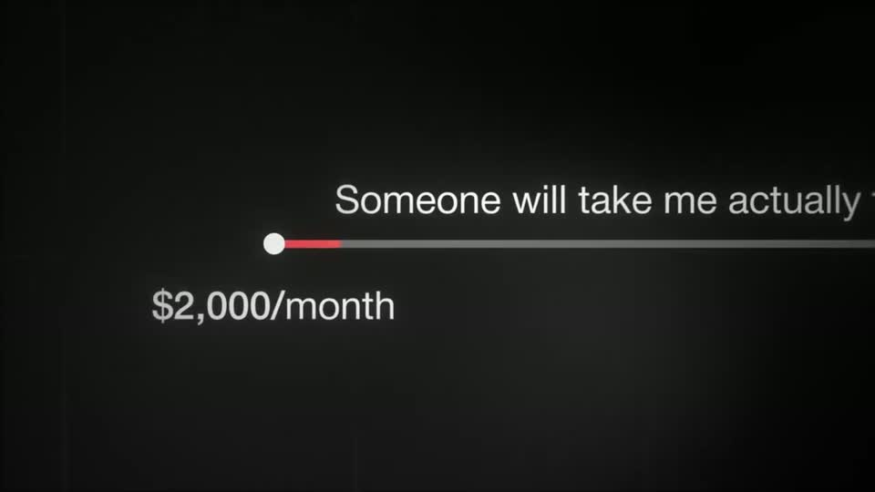
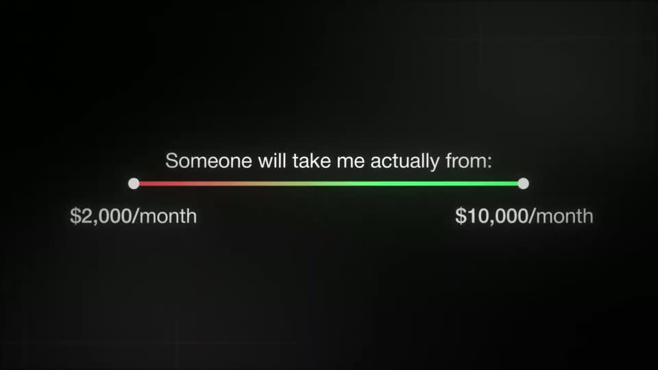
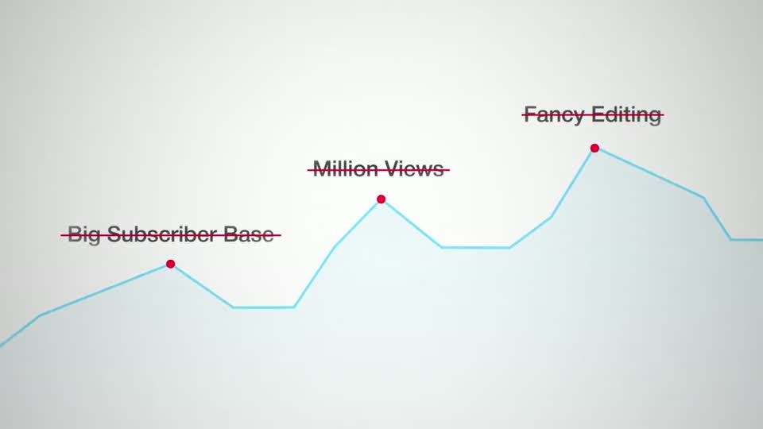
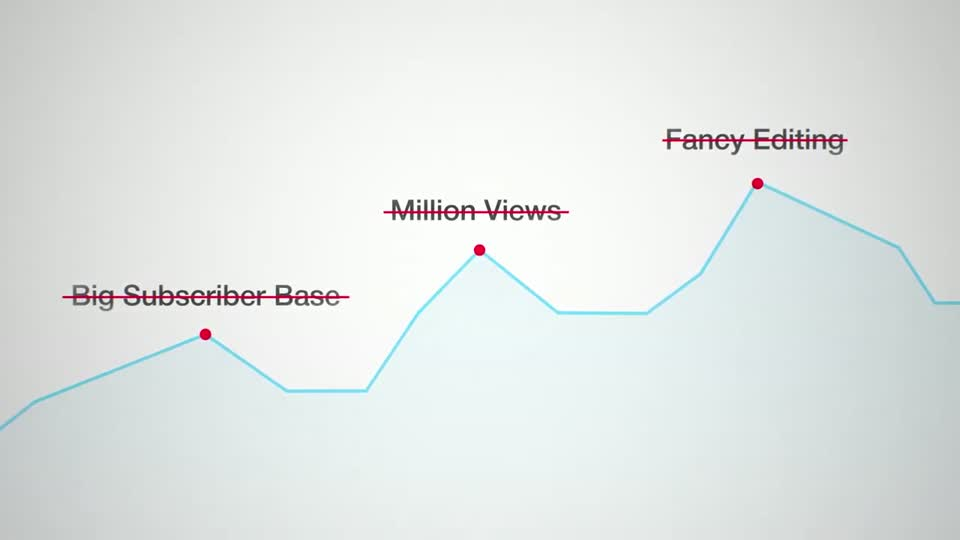
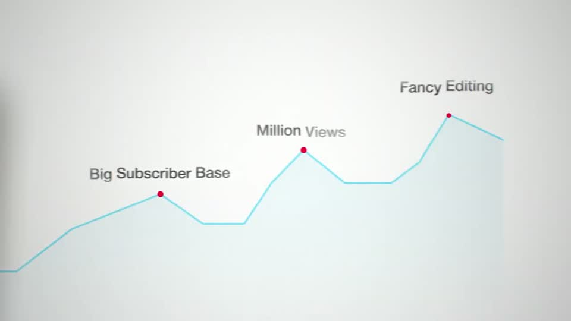
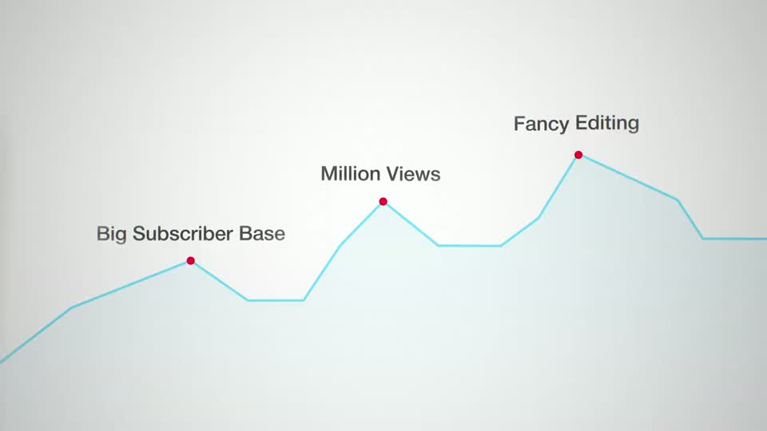

# C6 — Range line / annotated chart

Rule: `standards/formats/long-form.md` (catalogue row C6). This card holds the evidence and the quality bar; the rule stays in the format profile.

## Quality bar

- Minimal: one thin line (a hairline chart stroke, or a range line with a dot at each end), small dots, labels ≈ 35–45 px. The ground dominates.
- Range line (Mentors s019): the camera pushes onto the start dot (≈ 0.5 s) and the start figure fades in. The camera then pans along while the line recolours `status.x` red → `status.ok` green L → R (≈ 0.7 s), and the end figure lands at the end dot. Pull back (≈ 0.5 s) and hold ≥ 1.5 s.
- Chart (Stupidly s104): the line draws L → R while the camera tracks its tip; dots pop on the peaks and labels build word by word (≈ 0.13–0.25 s/word).
- The strike-through is the payoff (Stupidly s006). Thin red strikes draw L → R through each label, one per spoken item ≈ 0.4 s apart, and the labels turn red. Strikes go through the words, never across the chart.
- Persistent canvas: after a face cut-in it resumes unchanged.
- Light ground: a hairline light-blue stroke with a pale gradient fill, red dots, grey labels. Dark ground: a grey line with white dots on a vignette.

<!-- generated:start -->
## Evidence (generated by tools/ref_index.py — do not edit)

**3 exemplars** from 2 videos · duration median 3.5 s · largest text median 35 px at 1080 · word build 0.19 s/word · hold 1.5 s

| Video | Time | Stills | Why it works |
|---|---|---|---|
| spent-10k-on-mentors s019 ★ | 2:22.4–2:28.6 |   | Minimal and exact: one thin line, two dots, two numbers. The camera rides along the line while it recolours red → green, so the gradient literally travels from the problem figure to the goal figure, then pulls back to show the whole range and holds. |
| stupidly-simple-youtube-strategy s006 ★ | 0:13.4–0:16.9 |   | The shared canvas pays off: the same three labels the viewer just read are struck through in red one per phrase, so the negation is visual, not spoken. The strikes are thin, the same red as the dots, and they land on the words, never across the line chart itself. |
| stupidly-simple-youtube-strategy s104 | 0:04.4–0:06.3 |   | A deliberately quiet chart: hairline light-blue stroke with a pale gradient fill under it, small red dots and small grey labels, so the light ground stays dominant and the payoff (the strike-through in s006) has room to land. |
<!-- generated:end -->
