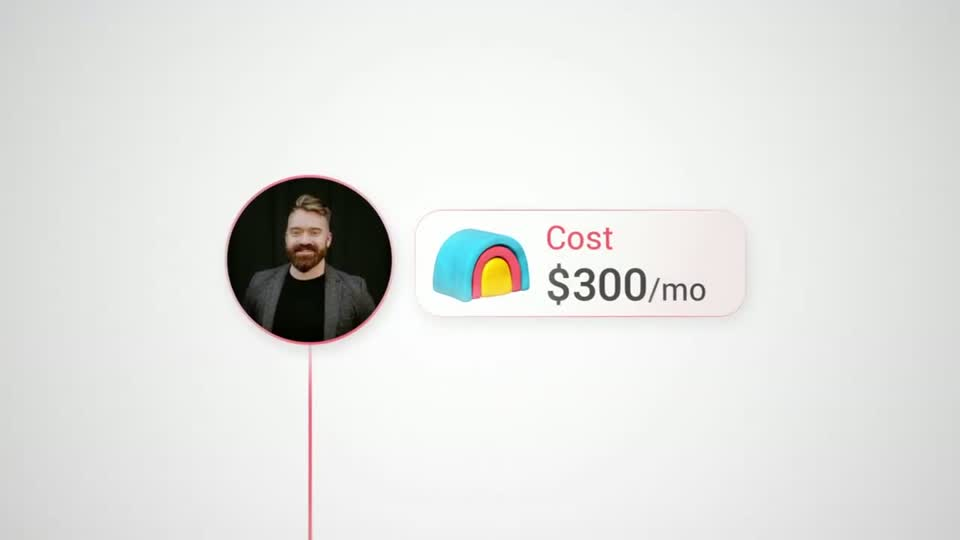
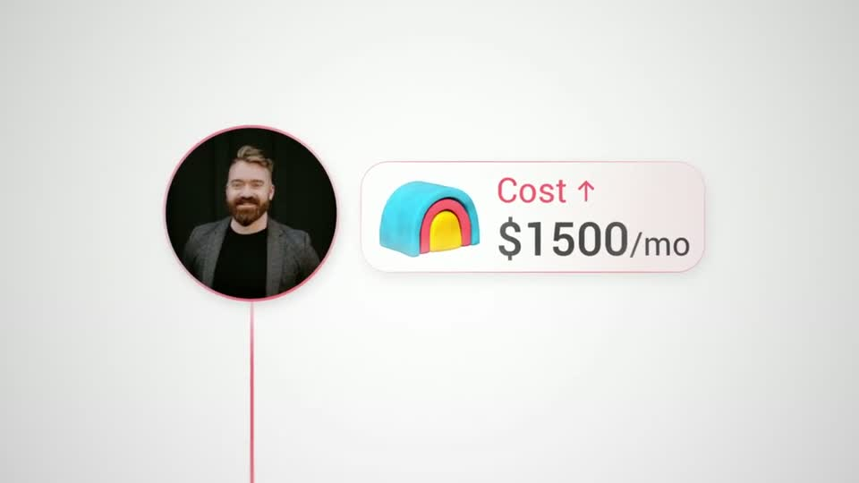

# C7 — Avatar + escalating ticker

Rule: `standards/formats/long-form.md` (catalogue row C7). This card holds the evidence and the quality bar; the rule stays in the format profile.

## Quality bar

- Single exemplar (Clay s046), so the evidence is thin.
- A thin vertical line in one soft red drops out of the previous page. The camera tilts down it (≈ 0.7 s) onto a round avatar with a ring in the same red.
- A glass cost chip (logo + label + number, tinted border, soft shadow) slides out to the right. The number reads ≈ 70 px and the label ≈ 50 px.
- The number holds its first value (≈ 2.5 s), then odometers up with deceleration (≈ 2 s) and lands on the spoken figure. The label gains a "↑" as it climbs.
- Exit by tilting back up the same line to the page it came from (s047).
- Light ground: no dark plate; the chip separates from the ground by its shadow and tinted border only.

<!-- generated:start -->
## Evidence (generated by tools/ref_index.py — do not edit)

**1 exemplar** from 1 video · duration median 8.4 s · largest text median 70 px at 1080 · hold 1.8 s

| Video | Time | Stills | Why it works |
|---|---|---|---|
| problem-with-clay s046 ★ | 2:19.0–2:27.4 |   | The escalating ticker on a light ground: avatar ring, line and the 'Cost ↑' label share one soft red, the chip is a white glass pill with a pink-tinted border and soft shadow, and the number decelerates into $1,500 so the jump is felt. The red line is literally the path between the pricing page and the person paying it. |
<!-- generated:end -->
