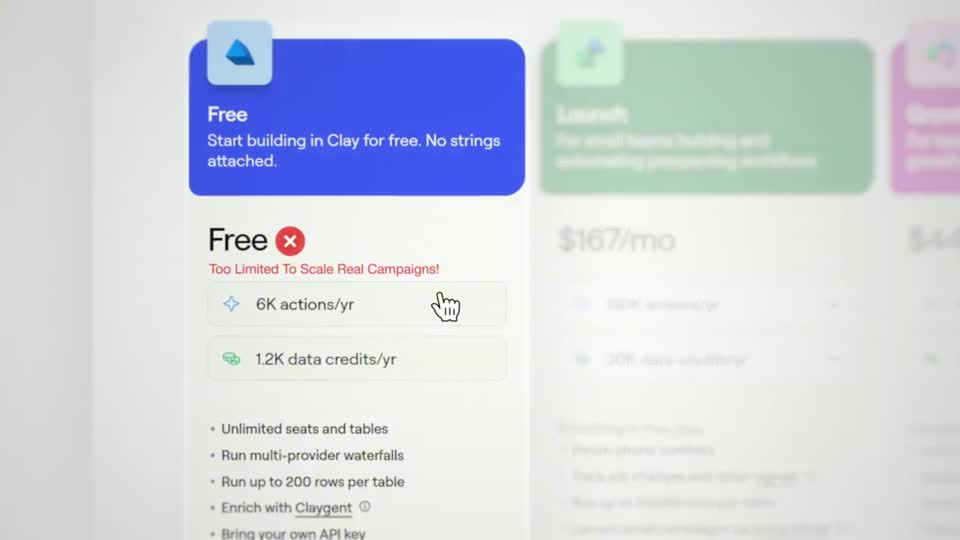
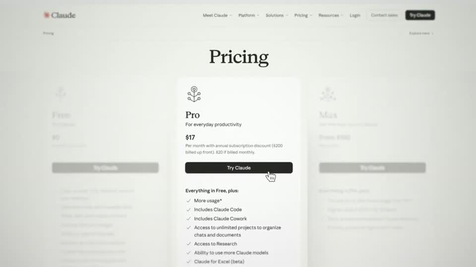
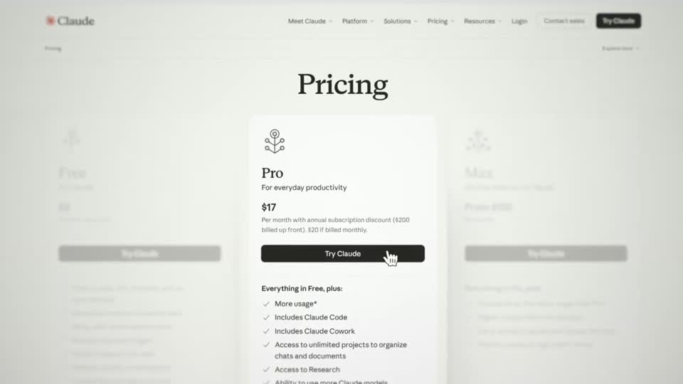

# C8 — Focus card, dim siblings

Rule: `standards/formats/long-form.md` (catalogue row C8). This card holds the evidence and the quality bar; the rule stays in the format profile.

## Quality bar

- Single exemplar video (Clay s023/s025), so the evidence is thin.
- Focus happens on the real page, in place. The chosen column or card stays fully saturated and sharp while its neighbours fade to ≈ 20–25 % and blur (`focus`), as the camera pushes onto it (≈ 1–1.5 s).
- The focus element is ≈ 25–38 % W. A pricing column reads ≈ 25–30 % (one video); the rule's card is ≈ 38 %. (outside the rule — open for Tymek; build to the rule/kit)
- Verdict: a small red ✕ (or ✓) badge beside the option's name, plus at most one red caption line. The quietest version has no badge: only focus and a cursor on the button (s025).
- To move the choice, pan (≈ 0.6 s) to the next option, which sharpens as the previous one fades.
- Hold ≈ 1 s on each choice.

<!-- generated:start -->
## Evidence (generated by tools/ref_index.py — do not edit)

**2 exemplars** from 1 video · duration median 5.05 s · largest text median 44.0 px at 1080 · hold 1.0 s

| Video | Time | Stills | Why it works |
|---|---|---|---|
| problem-with-clay s023 ★ | 3:36.8–3:43.4 |   | Picking one option on the real page instead of redrawn cards: the focus column stays fully saturated while its neighbours fade and blur in place, and the verdict is a small red ✕ badge plus a red script-like caption, so the page keeps its own design. |
| problem-with-clay s025 ★ | 4:02.5–4:06.0 |   | The quietest focus beat in the video: no badge, no text — just the chosen card left sharp and full contrast while its siblings fade into the white page, and a cursor on the button. |
<!-- generated:end -->
