# C9 — Comparison split

Rule: `standards/formats/long-form.md` (catalogue row C9). This card holds the evidence and the quality bar; the rule stays in the format profile.

## Quality bar

- Both sides get the same treatment (same card size, ≈ 42 % W each in a two-column split; same heading style; same kind of mark), so the only difference is the content (pilot s043, Clay s004).
- Two layouts. Hub: a real video tile, logo, the year, or a line with two pills, with thin hand-drawn arcs out to a left and a right branch (pilot s008, Ottley s039, Stupidly s033/s098). Columns: two sides split by a thin vertical divider, optionally with a label chip on it ("$ Price", Clay s004).
- Left is the wrong or first side, right the right or second. Meaning colour goes on the marks only: red ✕, red script or a red strike on the wrong branch; `status.ok` ✓, a green arrow or a green chip on the right one; two neutral colours (red / blue pills) for a choice.
- Each branch is real evidence: a real video card with its view count in a red block, a real price card with only the price sharp, a real results list tilted in 3D, or a logo over a ghost (blurred, faded) of its own homepage.
- The camera is the argument. It visits the first side and holds ≥ 1 s, then pans past the hub to the other (≈ 0.7–1.3 s, `ease.camera`; a whip with directional blur is allowed). Or it pulls back once to frame both (pilot s043, Ottley s039).
- Text per branch is ≤ 2 lines at ≈ 40–60 px, and a script label may name each branch. A verdict headline (≈ 60–65 px) may land under both with a full-width underline (Clay s004), or the hub itself takes the block (Ottley s039, 140 px year in red).
- Persistent canvas: the comparison often spans a face cut-in and resumes exactly. It ends on the second side or the pulled-back pair, held ≥ 1 s.
- Light ground: paper cards with a 1 px light border and a very soft shadow on the grid or silver radial ground, dark grey or navy type, no glow.

<!-- generated:start -->
## Evidence (generated by tools/ref_index.py — do not edit)

**10 exemplars** from 4 videos · duration median 6.47 s (p25–p75 3.35–10.03 s) · largest text median 60.0 px at 1080 · word build 0.25 s/word · hold 1.0 s

| Video | Time | Stills | Why it works |
|---|---|---|---|
| liam-ottley-540k s039 ★ | 0:26.1–0:29.1 | 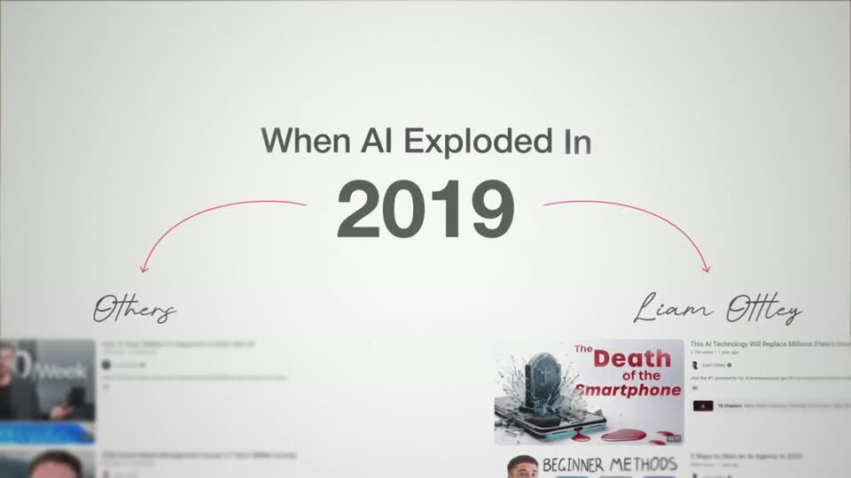 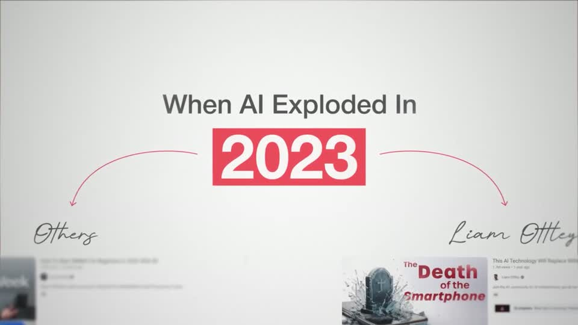 | The payoff of the comparison canvas: the camera pulls back so both branches and their real lists frame a central 140 px year in a red block (#F25857, white numerals), with a 63 px dark grey headline above. The year rolls 2019 → 2023 inside the block, so the correction is one beat, not a new scene. |
| problem-with-clay s004 ★ | 0:09.6–0:13.0 | 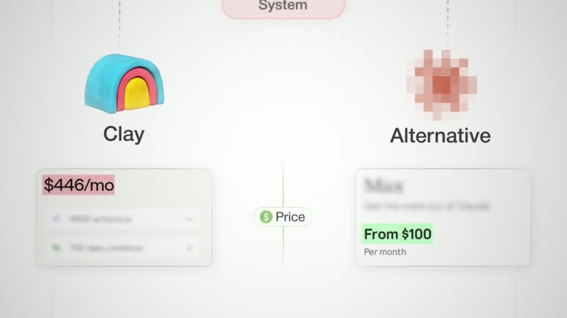 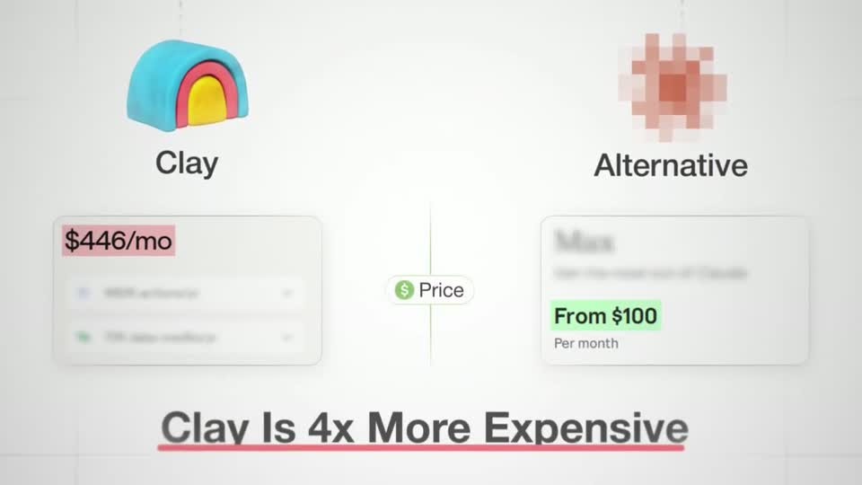 | A verdict on one canvas: two real price cards (blurred detail rows, only the price sharp) face each other across a thin divider labelled 'Price', and the prices carry the colour — pink block on '$446/mo', green block on 'From $100'. The 65 px charcoal headline 'Clay Is 4x More Expensive' lands under them with a soft red underline sweeping full width; on the light grid ground everything has a 1 px light border and a very soft shadow, so it reads as paper cards, not flat shapes. |
| problem-with-clay s006 ★ | 0:19.0–0:24.5 | 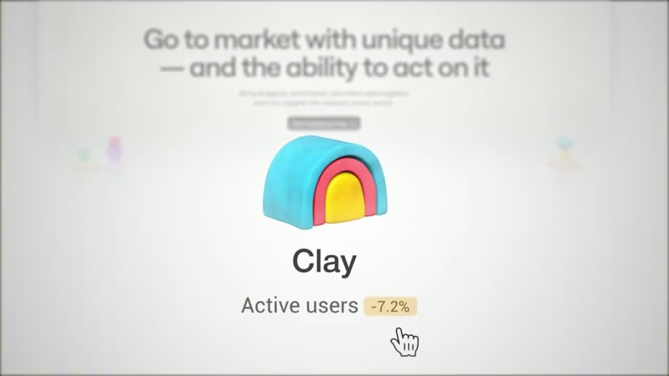 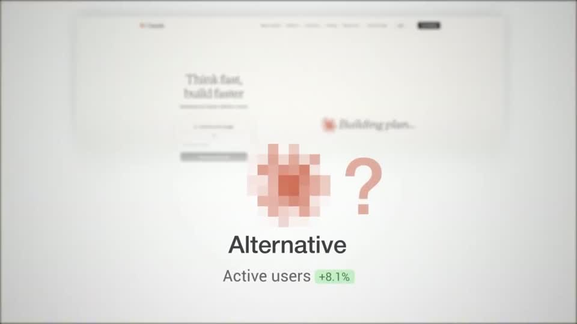 | Each side is a logo object over a ghost of its own website (blurred + faded, still recognisable as a landing page), so the comparison carries context for free. The metric chip is the only colour per side — amber for falling, green for rising — and the pan itself is the argument (left = losing, right = winning). |
| stupidly-simple-youtube-strategy s033 ★ | 1:49.2–1:58.4 | 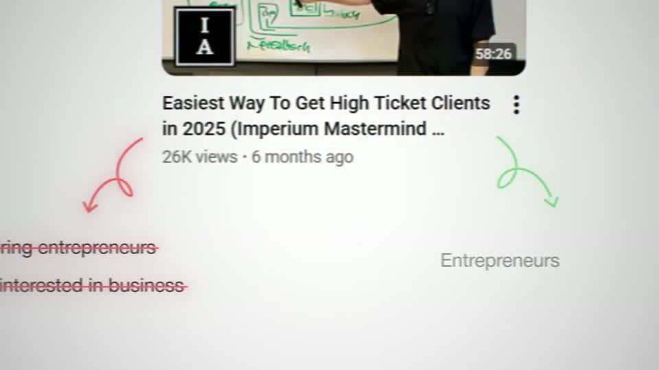 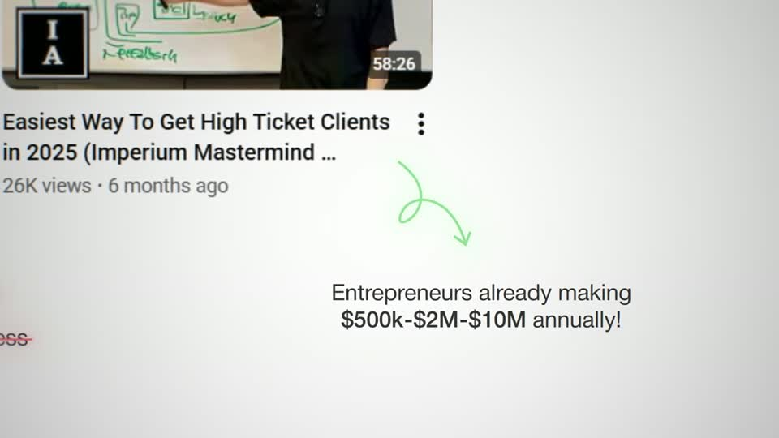 | The verdict is a camera direction: the wrong audience hangs off the real video tile on the left with a red arrow and gets struck through, the right audience on the right with a green arrow and builds number by number ($500k → $2M → $10M). Hand-drawn arrows are thin, curved and coloured by meaning; type stays small grey/dark so the marks carry the emotion. |
| stupidly-simple-youtube-strategy s098 ★ | 8:13.0–8:28.2 | 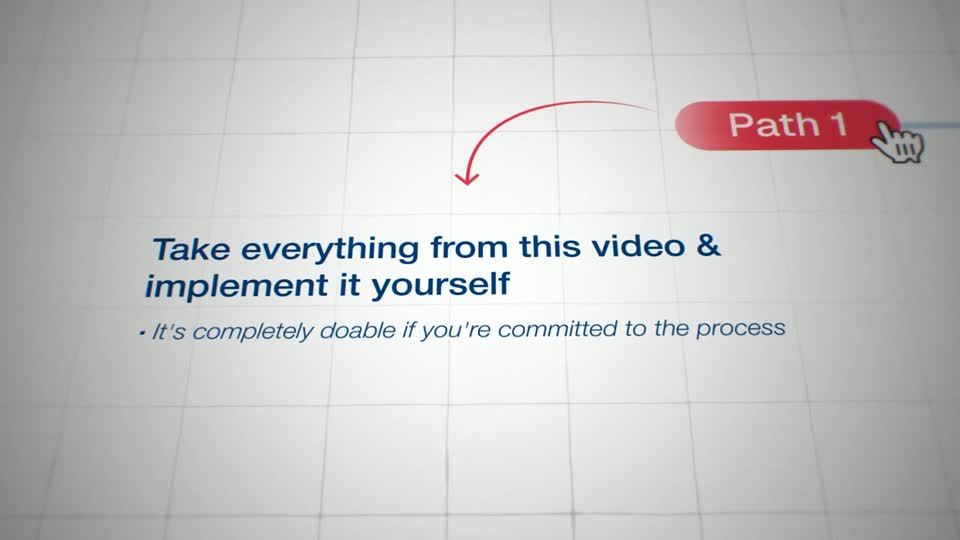 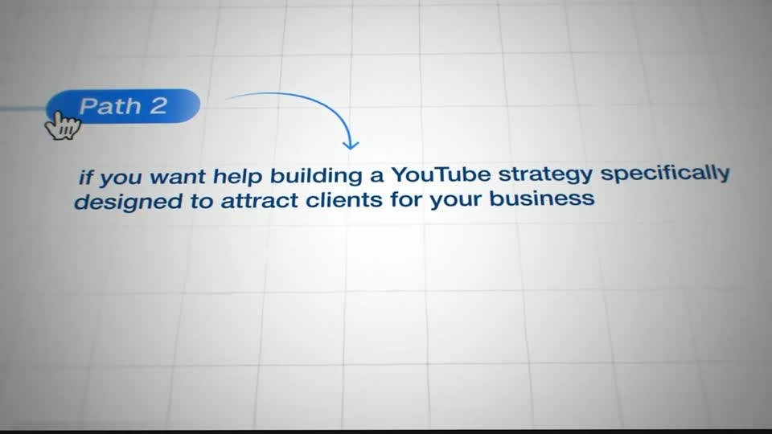 | A choice laid out as a horizontal canvas: one hub line, two coloured pill buttons, a synthetic cursor that clicks each one and the camera that follows the click — the viewer is walked down each path in turn. Coloured hand-drawn arrows match their pills; text is navy bold italic on a faint grid, never more than two lines per branch. |
| ultra-predictable-funnel s043 ★ | 4:18.4–4:29.2 | 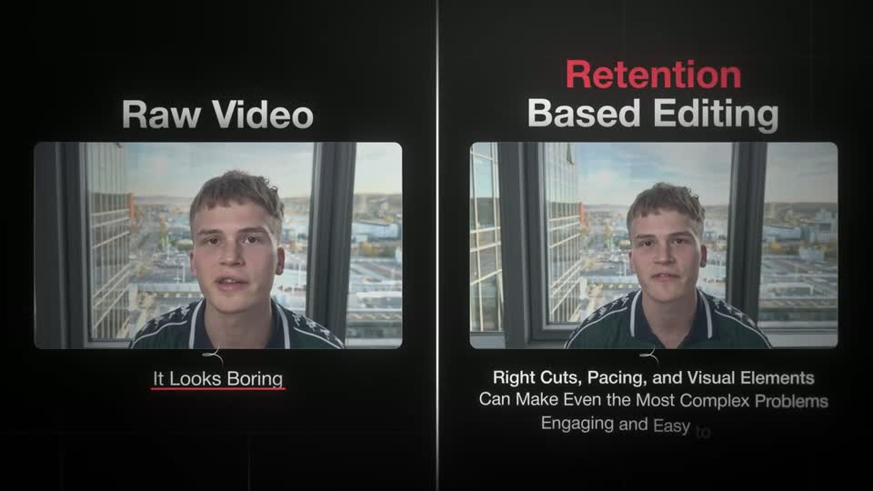 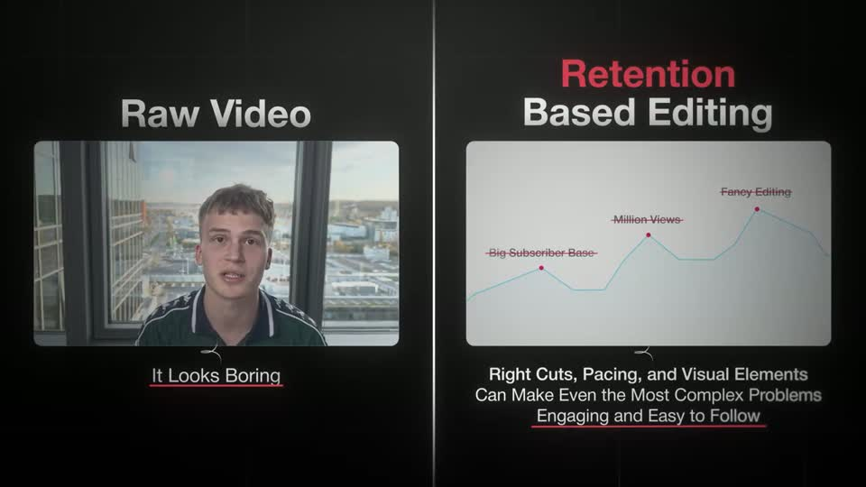 | Symmetric two-column comparison with matching card sizes (≈42 % W each), matching headings and matching underlined verdicts, so the only thing that differs is the content — boring raw footage vs a living card. The right card ends on a light retention chart where the vanity labels ('Big Subscriber Base', 'Million Views', 'Fancy Editing') are struck through in red. |
| liam-ottley-540k s003 | 0:09.4–0:12.1 | 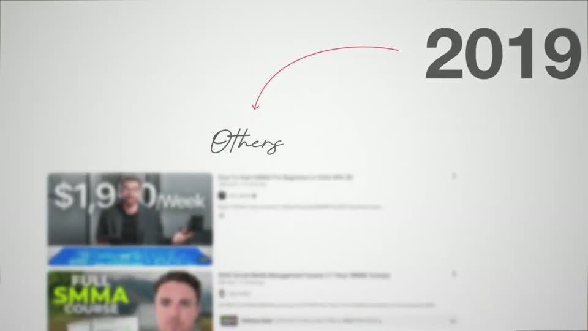 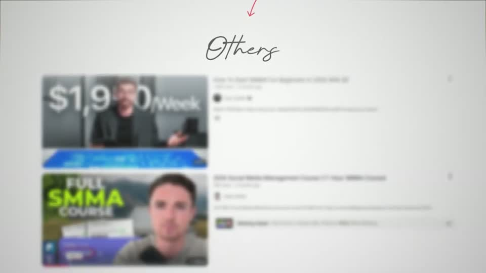 | Opens the shared comparison canvas with only three things: a dark grey year, a thin hand-drawn red arc and a script label (≈80 px tall) — the real search results it points to arrive blurred, so the arc and the word are read first. |
| liam-ottley-540k s005 | 0:15.4–0:22.8 | 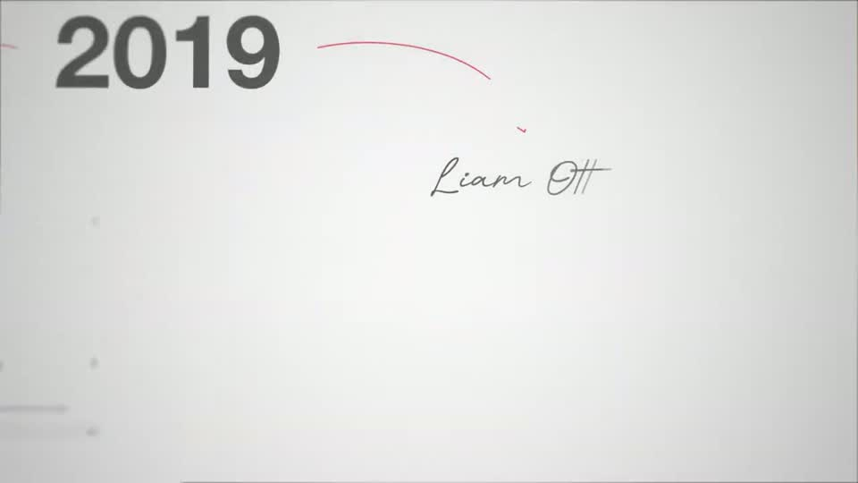 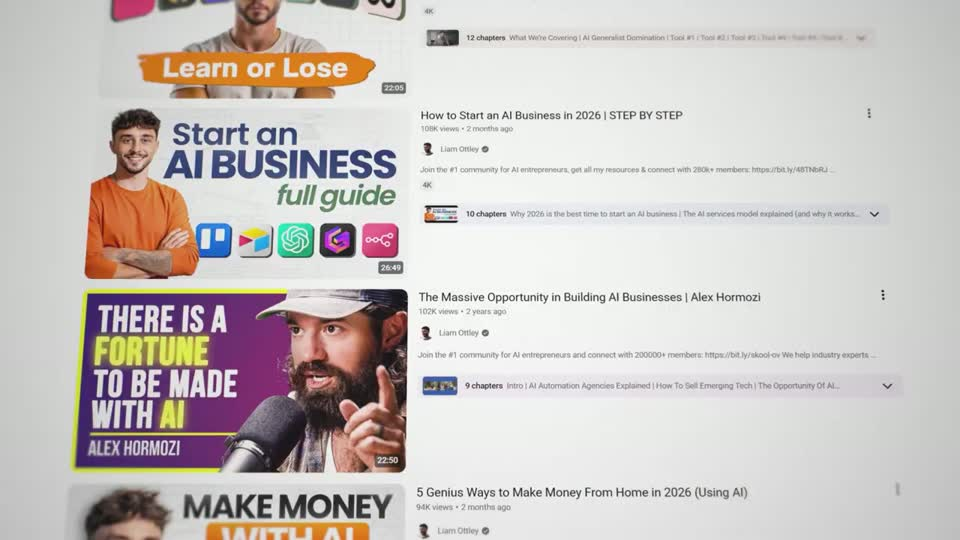 | The two branches are told with the same device (red arc + script name + real tilted results list), so the contrast is purely the content — SMMA guru thumbnails vs AI-automation thumbnails. The 3D tilt plus depth-of-field (near rows sharp, far rows soft) gives a long list depth without a card frame. |

…and 2 more in references/index.json.
<!-- generated:end -->
