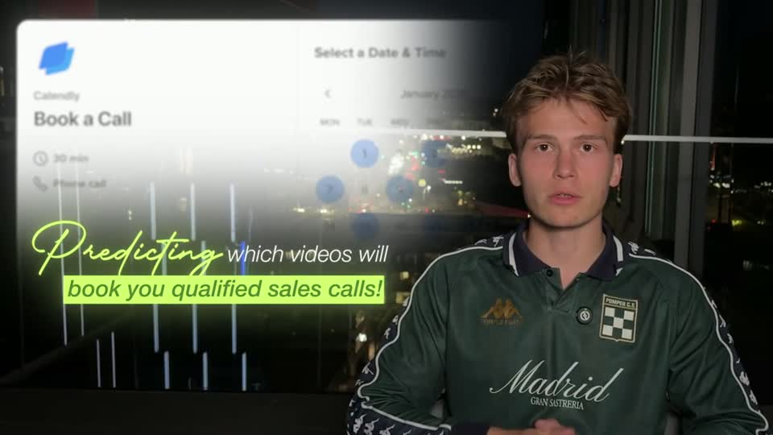
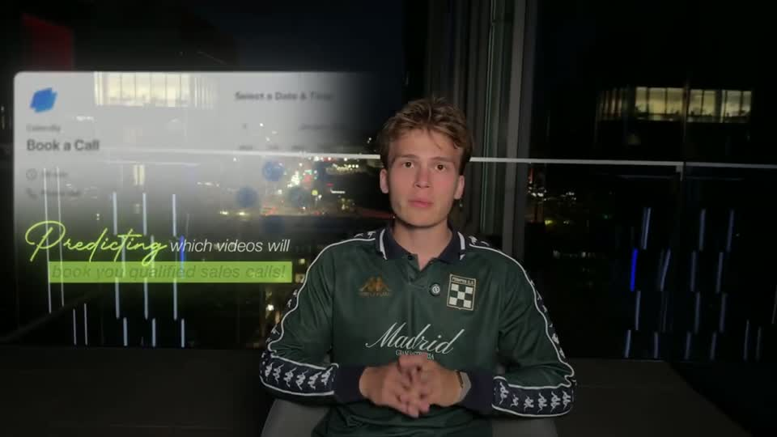

# D2 — Side screenshot + script + highlight

Rule: `standards/formats/long-form.md` (catalogue row D2). This card holds the evidence and the quality bar; the rule stays in the format profile.

## Quality bar

- Single exemplar (Hormozi s036), so the evidence is thin.
- A real screenshot fills the empty side at ≈ 60 % W, with an alpha fade toward the face so the footage shows through. The face is reframed to the other side (≈ 0.3 s) as it fades in.
- The script accent word comes first, large (≈ 120 px cap height), in the accent colour with a glow over the dark footage. The rest builds word by word (≈ 0.15 s/word).
- An `accent.block` highlight wipes L → R behind the key line in ≈ 0.4 s, only after the line has settled.
- Everything fades out together ≈ 0.4 s before the cut back. On screen ≈ 4.5 s, with a ≈ 1.5 s hold.

<!-- generated:start -->
## Evidence (generated by tools/ref_index.py — do not edit)

**1 exemplar** from 1 video · duration median 4.5 s · largest text median 120 px at 1080 · word build 0.15 s/word · hold 1.5 s

| Video | Time | Stills | Why it works |
|---|---|---|---|
| hormozi-100-posts s036 ★ | 0:14.5–0:19.0 |   | Script accent word 'Predicting' writes on in glowing lime (≈120 px cap) over a real booking page that fades into the night window, then 'which videos will / book you qualified sales calls!' builds word by word and a lime highlight block wipes left → right behind the second line (≈0.4 s) once it has settled. The screenshot is bright and the footage is dark, so the alpha fade is what makes it feel composited rather than pasted. |
<!-- generated:end -->
