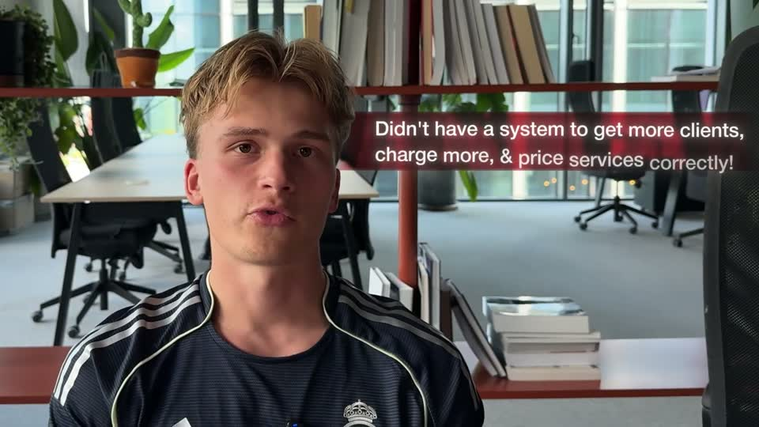

# D3 — Caption bar

Rule: `standards/formats/long-form.md` (catalogue row D3). This card holds the evidence and the quality bar; the rule stays in the format profile.

## Quality bar

- Single exemplar (Mentors s044), so the evidence is thin.
- The face punches in ≈ 1.15× and is reframed to clear each bar.
- Bars are semi-transparent, tinted dark `status.ok` green or `status.x` red, and fade at their outer edge into the footage. They sit upper-left or upper-right and enter from their own side.
- Text is white, ≈ 32 px, 1–2 lines. The positive → negative swap lands on the spoken turn word ("but").
- Each bar stays on screen ≈ 2.5–5 s, with a hold ≥ 1 s.

<!-- generated:start -->
## Evidence (generated by tools/ref_index.py — do not edit)

**1 exemplar** from 1 video · duration median 8.2 s · largest text median 32 px at 1080 · hold 1.0 s

| Video | Time | Stills | Why it works |
|---|---|---|---|
| spent-10k-on-mentors s044 ★ | 1:21.8–1:30.0 |   | Meaning-coded bars that fade into the footage at their outer edge, so they read as a tint on the shot rather than a box on top; the face is punched in and reframed to clear each bar, and the green → red swap lands on the 'but' in the sentence. |
<!-- generated:end -->
