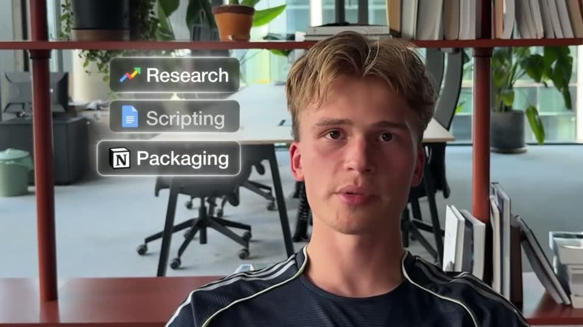

# D4 — Tool chip stack

Rule: `standards/formats/long-form.md` (catalogue row D4). This card holds the evidence and the quality bar; the rule stays in the format profile.

## Quality bar

- Single exemplar (Mentors s048), so the evidence is thin.
- 2–4 small stacked glass pills, each with a real app icon and a ≈ 30 px label, upper-left beside the face.
- One pill after another, ≈ 0.3 s apart, each on its spoken name.
- The stack may hand off directly to the CTA: the booking page rises over it (s048 → s049).
- On screen ≈ 2 s, with a ≈ 0.6 s hold.

<!-- generated:start -->
## Evidence (generated by tools/ref_index.py — do not edit)

**1 exemplar** from 1 video · duration median 2.0 s · largest text median 30 px at 1080 · hold 0.6 s

| Video | Time | Stills | Why it works |
|---|---|---|---|
| spent-10k-on-mentors s048 ★ | 12:05.5–12:07.5 |   | Small, quiet glass pills with real app icons stack beside the face one per spoken word, then the closing CTA rises straight over them, so the deliverables lead directly into the booking ask. |
<!-- generated:end -->
