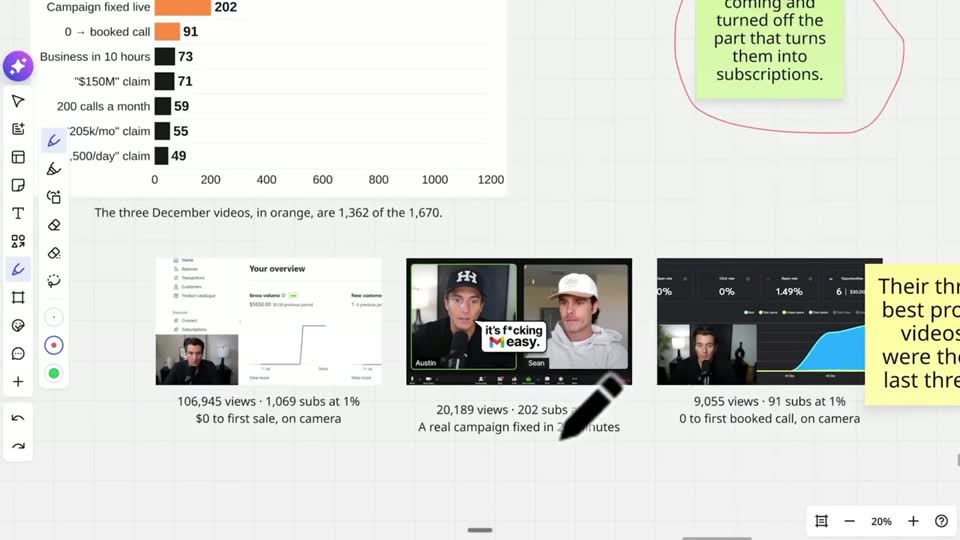
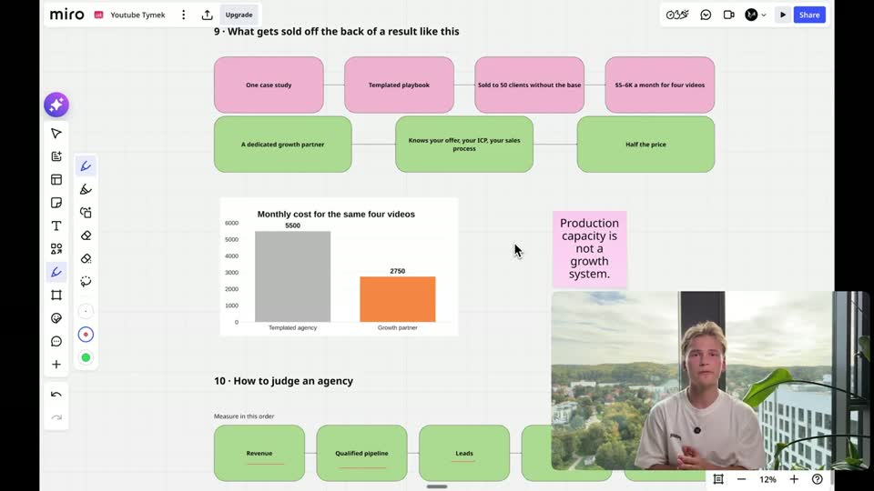
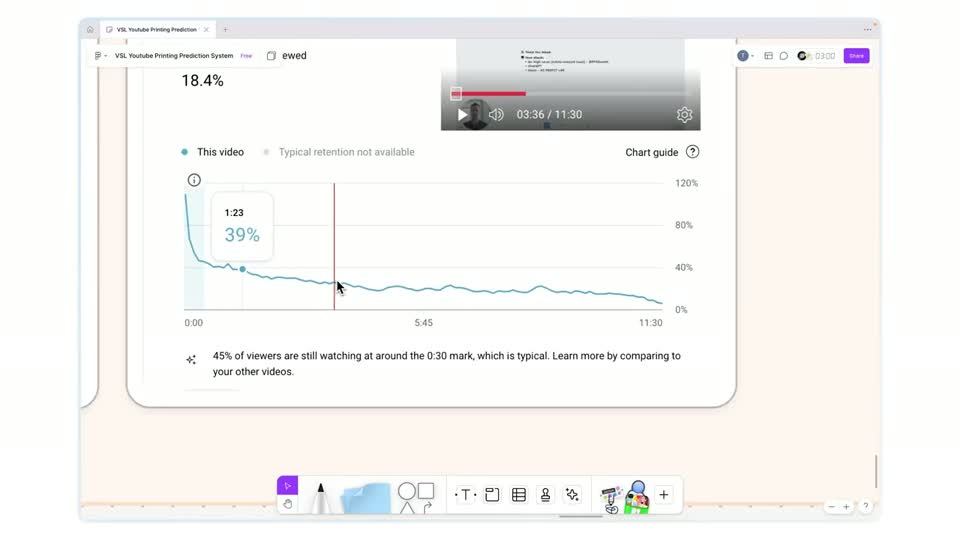
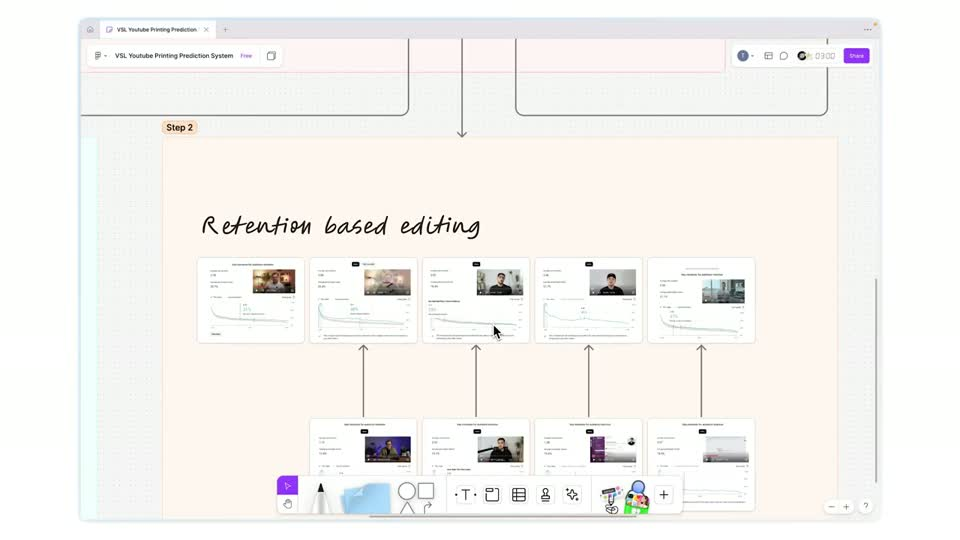

# E1 — Board walkthrough + face PiP

Rule: `standards/formats/long-form.md` (catalogue row E1). This card holds the evidence and the quality bar; the rule stays in the format profile.

## Quality bar

- Recorded, not built: a real board (Miro) with real evidence pasted on it (Studio retention panels, thumbnails). The cursor and the live pen marks drawn during the recording (circles, underlines, handwritten titles) are the proof, not overlays.
- A light ground is acceptable inside a section, even in a dark-ground video (both exemplars).
- The board is organised under numbered section headers. Charts on it give the bar that carries the point one accent colour (orange) and leave the rest grey or black (Instantly s019).
- The face PiP is optional (the pilot has none). When used, it sits ≈ 25 % W bottom-right with a small margin, rounded, with a soft shadow; it may grow to ≈ 36 % W while the recording is inset (Instantly s019). (outside the rule — open for Tymek; build to the rule/kit)
- The editor punches into the recording (≈ 150–250 %, cropping the board UI) to follow the speaker, and zooms out to the overview between sections.
- Enter and exit on a hard cut (Instantly's one-frame dissolve out is not copied). Sections are declared as `screen_share` in the BRIEF and are exempt from cadence; graphics go on top only on request.

<!-- generated:start -->
## Evidence (generated by tools/ref_index.py — do not edit)

**2 exemplars** from 2 videos · duration median 509.07 s · largest text median 17.5 px at 1080

| Video | Time | Stills | Why it works |
|---|---|---|---|
| instantly-1m-arr-channel s019 ★ | 0:57.4–17:41.0 |   | Recorded, not built: a real Miro board with numbered sections, coloured stickies and real charts (orange bar = the point, black/grey = the rest), real thumbnails as evidence, and live pen marks drawn as he speaks. The face PiP (≈25 % W, rounded, bottom-right) keeps the presenter present for 16 minutes; near the end it grows to ≈36 % W with the board inset. |
| ultra-predictable-funnel s050 | 5:02.5–5:17.0 |   | Raw recorded board, light ground: the retention graphs are the real Studio panels with the cursor scrubbing them, which is the proof. No designed graphics on top. |
<!-- generated:end -->
