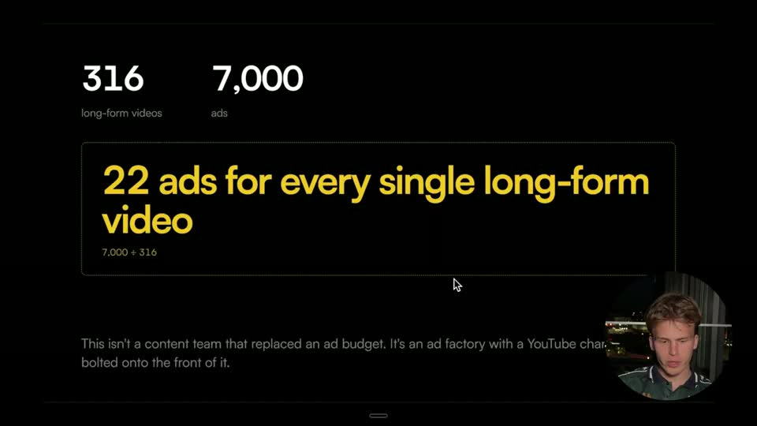
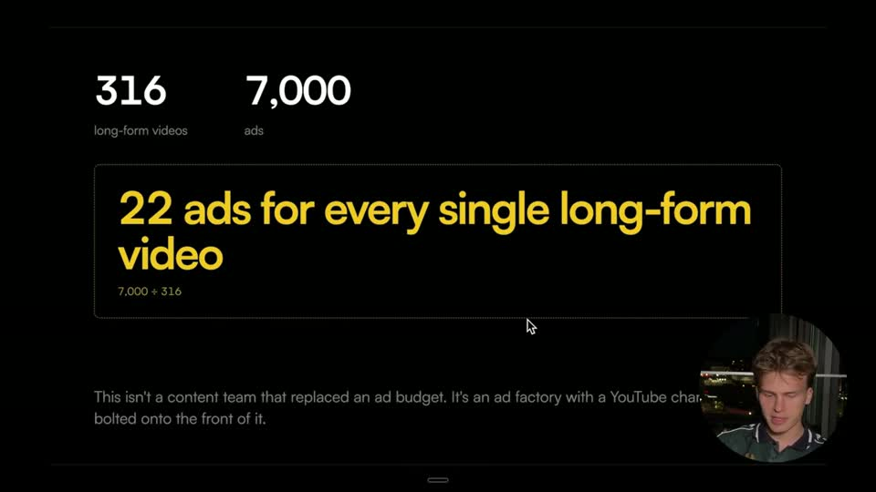
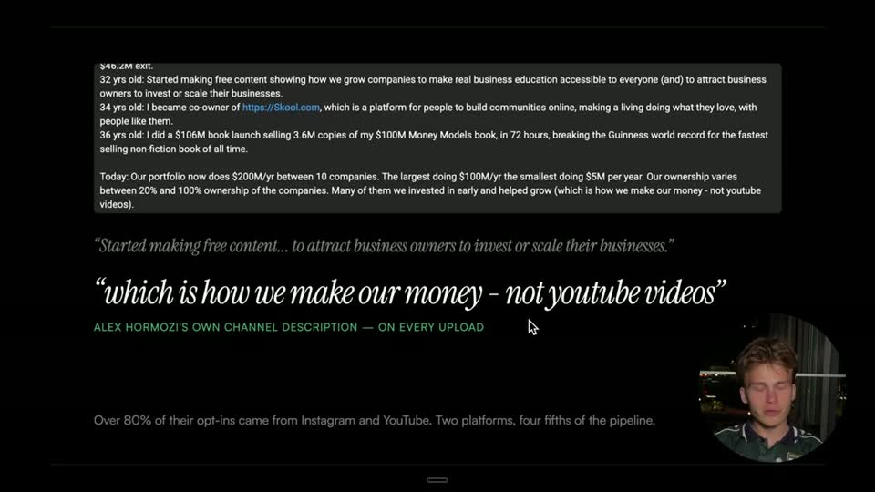
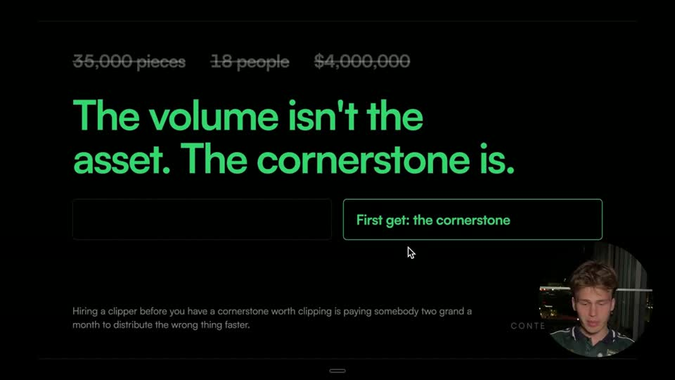
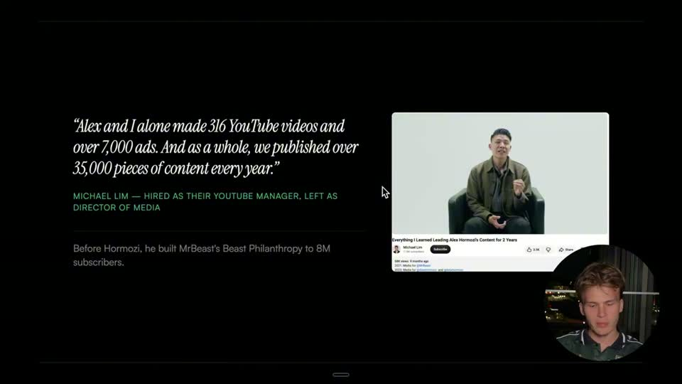
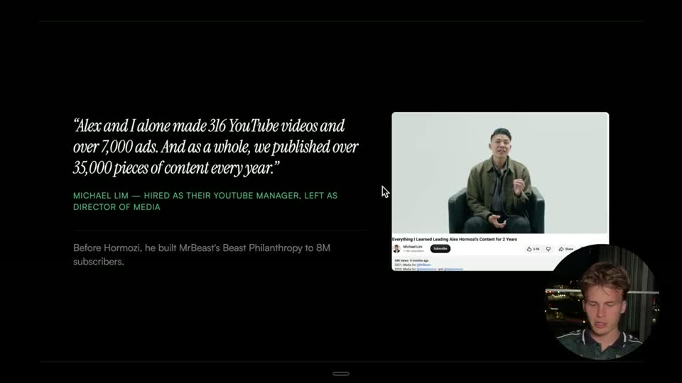
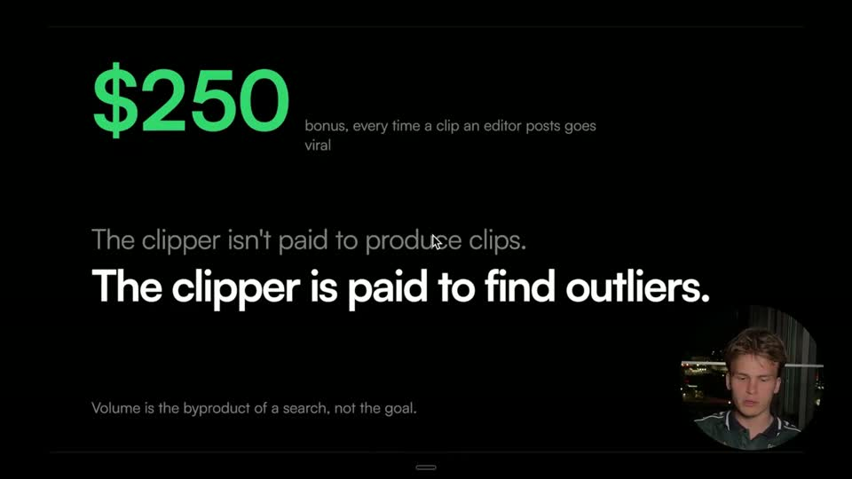
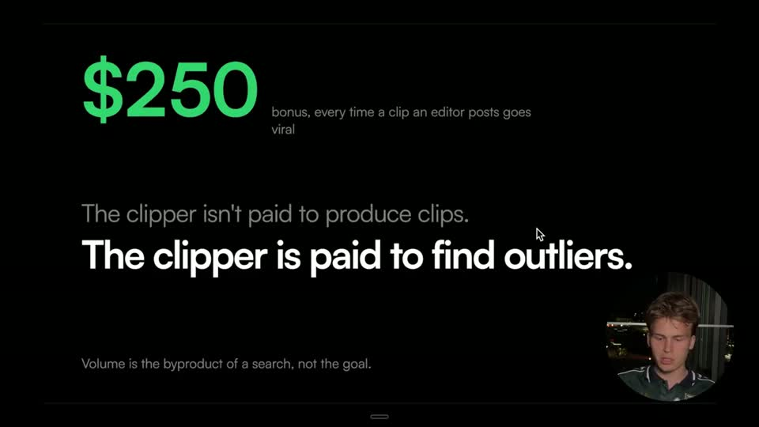

# E2 — Slide deck + round face-cam

Rule: `standards/formats/long-form.md` (catalogue row E2). This card holds the evidence and the quality bar; the rule stays in the format profile.

## Quality bar

- Single exemplar video (Hormozi s017–s025), so the evidence is thin.
- A round face-cam ≈ 17 % W (≈ 320 px at 1080) sits bottom-right, low enough to overlap only the slide's empty corner.
- Slides are plain and dark: one claim per slide at ≈ 65 px cap height in a meaning-coded colour (yellow stats, green thesis, red warning), with a muted grey sentence beneath. Stats sit in a dashed box with the arithmetic in small type.
- Screenshots (job board, channel, article) go on the slides as plain images. The cursor stays visible and nothing is overlaid on the deck.
- Hard cuts between slides and to and from the face. Sections are declared as `screen_share` in the BRIEF and are exempt from cadence.

<!-- generated:start -->
## Evidence (generated by tools/ref_index.py — do not edit)

**4 exemplars** from 1 video · duration median 73.05 s (p25–p75 19.16–288.6 s) · largest text median 65.0 px at 1080

| Video | Time | Stills | Why it works |
|---|---|---|---|
| hormozi-100-posts s019 ★ | 2:05.0–2:29.8 |   | A plain dark HTML-style deck: one big claim per slide (≈65 px cap, yellow/green/red meaning-coded), a muted grey sentence beneath, and a round face-cam ≈17 % W (≈320 px) in the bottom-right corner over the slide's empty space — the face stays present without boxing the content. |
| hormozi-100-posts s025 ★ | 6:08.4–11:52.8 |   | A plain dark HTML-style deck: one big claim per slide (≈65 px cap, yellow/green/red meaning-coded), a muted grey sentence beneath, and a round face-cam ≈17 % W (≈320 px) in the bottom-right corner over the slide's empty space — the face stays present without boxing the content. |
| hormozi-100-posts s017 | 1:32.1–1:49.4 |   | A plain dark HTML-style deck: one big claim per slide (≈65 px cap, yellow/green/red meaning-coded), a muted grey sentence beneath, and a round face-cam ≈17 % W (≈320 px) in the bottom-right corner over the slide's empty space — the face stays present without boxing the content. |
| hormozi-100-posts s022 | 2:48.0–4:49.2 |   | A plain dark HTML-style deck: one big claim per slide (≈65 px cap, yellow/green/red meaning-coded), a muted grey sentence beneath, and a round face-cam ≈17 % W (≈320 px) in the bottom-right corner over the slide's empty space — the face stays present without boxing the content. |
<!-- generated:end -->
