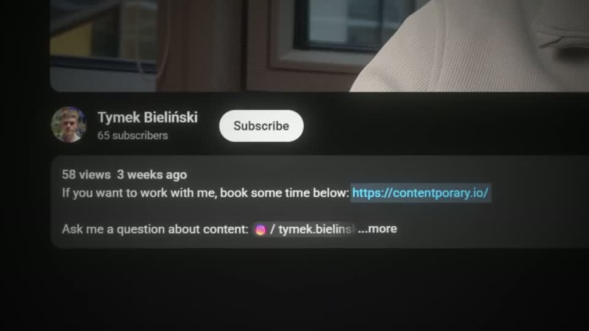
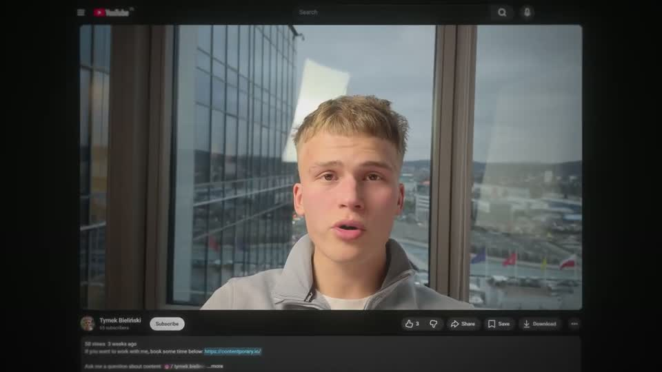
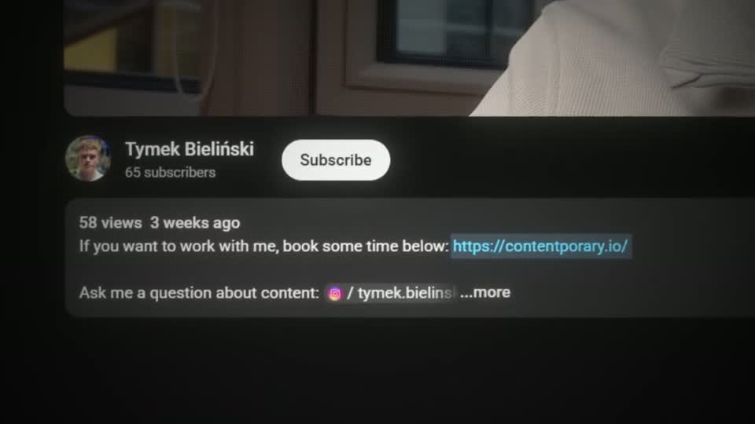
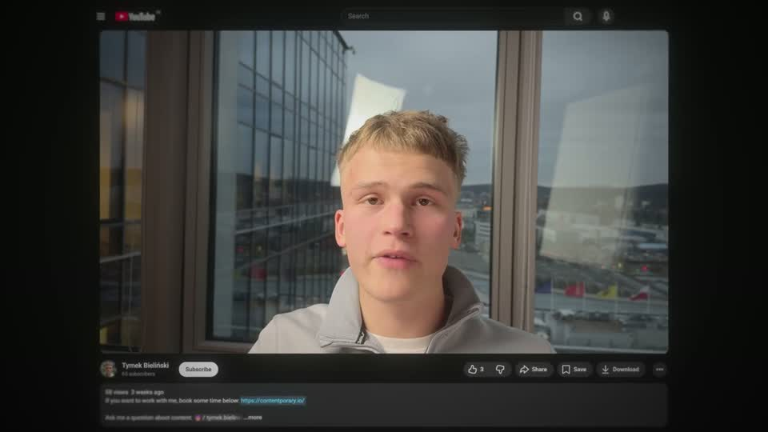
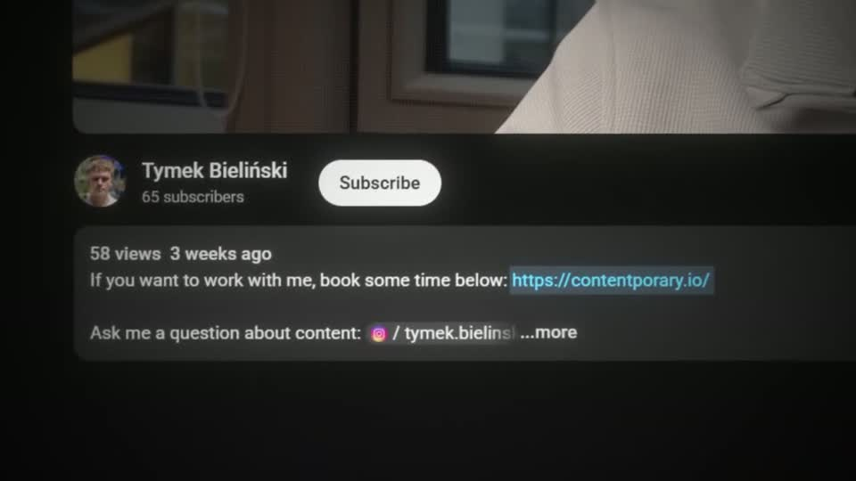
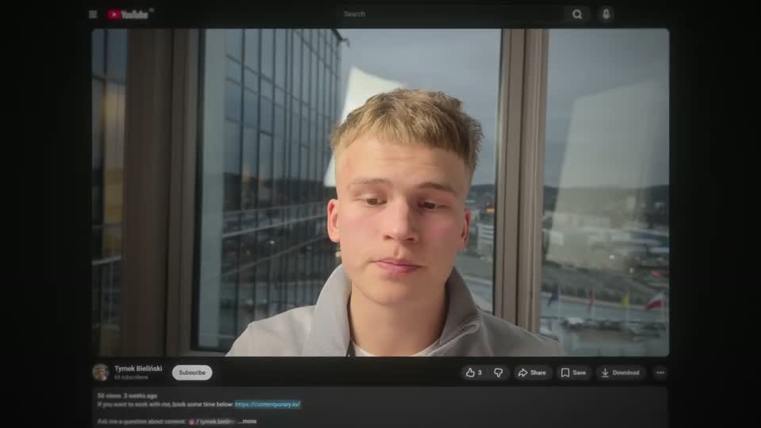

# cta-youtube — HFKit.ctaYoutube

Rule: `standards/formats/long-form.md` (kit table). This card holds the evidence and the quality bar; the rule stays in the format profile.

## Quality bar

- The speaker's own footage keeps playing inside the player of a **real** watch page — never a still frame, never a mock page.
- Identical every time in the video: scale to ≈ 0.80 → dive ≈ 2× onto the description link → hold ≈ 1.7 s with the link legible at full size → reverse → face; all `ease.camera`.
- The link reads ≥ 30 px at the hold; the surrounding page stays real (channel name, subscribe button, view count).
- The extended variant (once per video) walks the real funnel — link → website sections → a cursor clicking the booking button → booking calendar — and ends on a glow title (≥ 120 px, red meaning words) over the booking page dimmed and blurred.
- Total ≈ 5 s for the standard CTA, ≈ 10 s for the extended one.

<!-- generated:start -->
## Evidence (generated by tools/ref_index.py — do not edit)

**4 exemplars** from 1 video · duration median 5.5 s (p25–p75 5.39–8.97 s) · largest text median 0.0 px at 1080 · word build 0.4 s/word · hold 1.7 s

| Video | Time | Stills | Why it works |
|---|---|---|---|
| ultra-predictable-funnel s086 ★ | 9:15.4–9:25.5 |   | The extended CTA walks the real funnel the viewer will take — link, website, button click with a cursor, booking calendar — and only then lands a glow title ('Custom Road Map', ≈130 px, 'Road Map' red with halo) over the booking page dimmed and blurred behind it, with a thin swoosh line through the title. |
| ultra-predictable-funnel s080 | 1:56.3–2:01.8 |   | The CTA never leaves the speaker: his own talking footage keeps playing inside the real watch-page player, and the camera dives straight onto the actual description link, which is legible at full size. Same move every time, so viewers learn it. |
| ultra-predictable-funnel s084 | 8:44.5–8:49.9 |   | Identical CTA treatment to s080 — repetition is the point. |
| ultra-predictable-funnel s087 | 9:50.1–9:55.6 |   | Identical CTA treatment; closes the video with the same move it opened the CTAs with. |
<!-- generated:end -->
