# cta-youtube — HFKit.ctaYoutube

Rule: `standards/formats/long-form.md` (kit table). This card holds the evidence and the quality bar; the rule stays in the format profile.

## Quality bar

- The speaker's own footage keeps playing inside the player of a **real** watch page (channel name, subscribe button and subscriber count stay real), never a still frame or a mock page. The page is a real capture, so it may be YouTube's dark theme in a light-ground video (Ottley s032).
- Identical every time within a video (Mentors s042 = s046, Clay s044 = s052): scale to ≈ 0.80 → hold → dive ≈ 2× onto the description link → hold → reverse → face, all `ease.camera`.
- Measured legs across 4 videos: scale 0.25–0.5 s, dive 0.4–0.7 s, link hold 1.4–2 s, reverse 0.5–0.8 s. The standard CTA totals 4.2–5.5 s; the kit builds 4.9 s.
- The link reads ≥ 30 px at the hold, optionally on a blue highlight block (Instantly s121).
- The extended variant runs once per video, usually as the last CTA. The real booking page plays in the player or rises over the face, a synthetic cursor clicks a date, then comes the same dive to the link and back to the face, ≈ 7 s (Hormozi s040, Mentors s049, Clay s044). The pilot's longer walk (link → website → booking → glow title ≥ 120 px over the dimmed booking page) runs ≈ 10 s.
- One video dives into the pinned comment instead of the watch page (Stupidly s113). The kit does not build that; use the watch-page dive.
- Don't: put directional motion blur on the dive or the tilt (Clay s044, Stupidly s113). The kit's DOM camera dives without blur.

<!-- generated:start -->
## Evidence (generated by tools/ref_index.py — do not edit)

**13 exemplars** from 7 videos · duration median 5.5 s (p25–p75 5.43–7.05 s) · largest text median 28 px at 1080 · word build 0.4 s/word · hold 1.5 s

| Video | Time | Stills | Why it works |
|---|---|---|---|
| hormozi-100-posts s040 ★ | 5:59.0–6:06.0 | 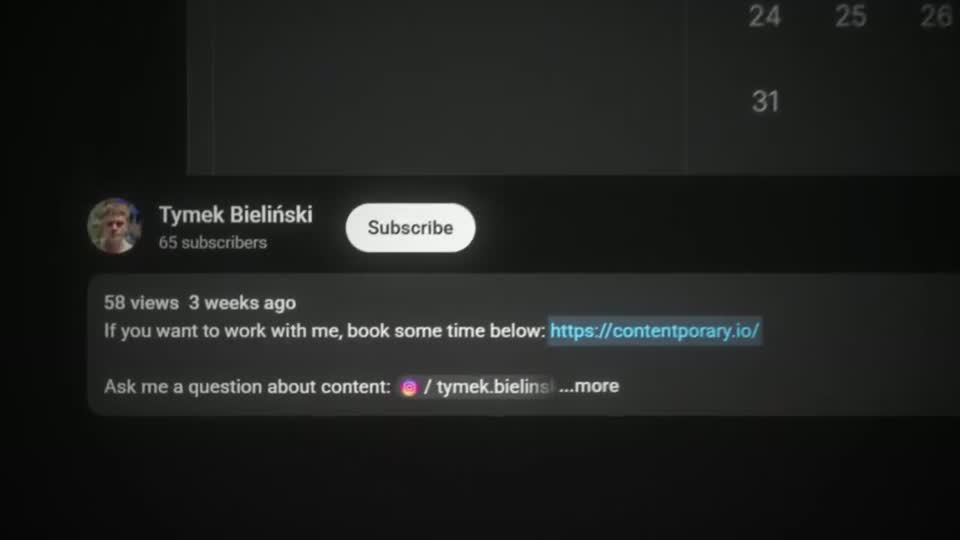 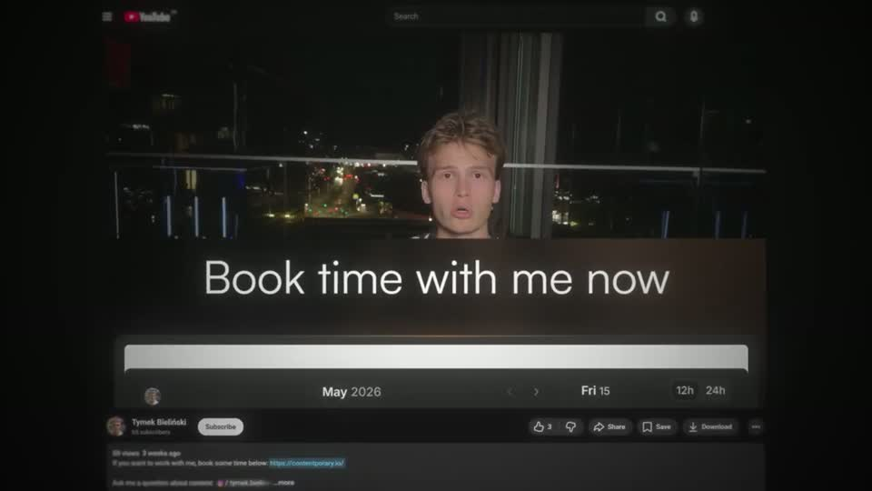 | Same CTA grammar as the pilot (watch page, dive to the description link, return), but the player shows a real booking calendar under a warm-glow 'Book time with me now' title (≈70 px cap), and a synthetic cursor clicks a date — the ask becomes an action the viewer can picture. Every element is a real, readable UI. |
| instantly-1m-arr-channel s121 ★ | 0:52.4–0:56.6 | 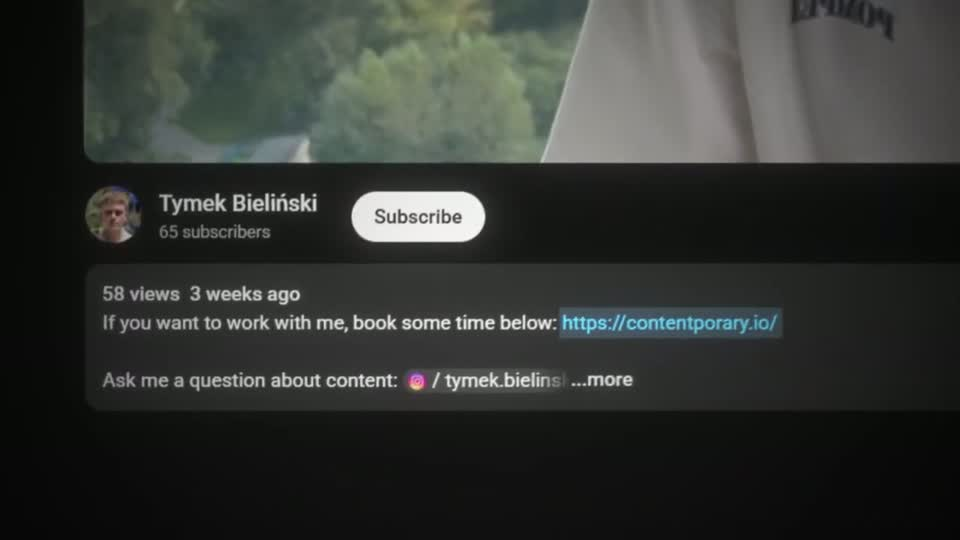 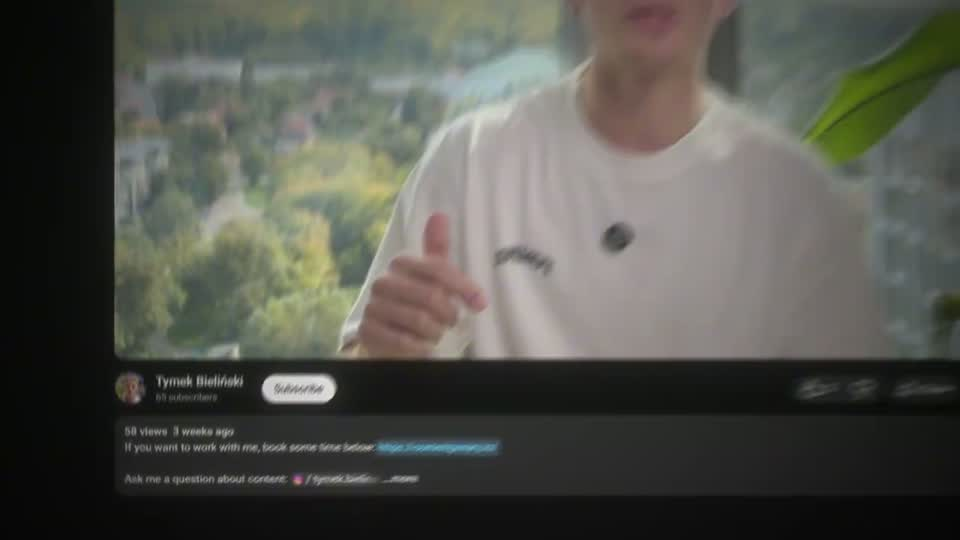 | The CTA is the viewer's own screen: the talking head keeps playing inside a genuine watch page with the creator's real subscriber count, so the dive to the link feels like a pointer, not an ad. Heavy vignette keeps the eye on the player and the link. |
| liam-ottley-540k s032 ★ | 9:39.9–9:45.4 | 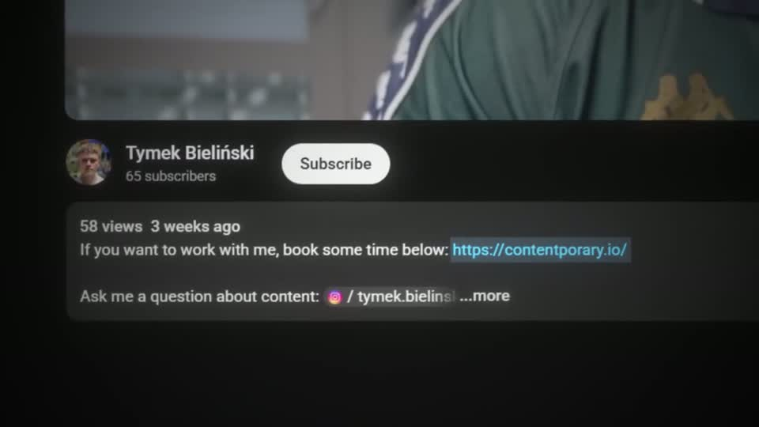 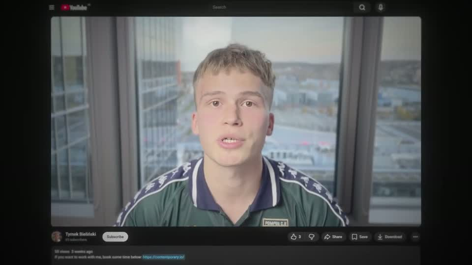 | Matches the kit CTA beat for beat: real watch page with the live face in the player, a 2× dive to the actual booking link in the description, a long readable hold, and the exact reverse. The page is YouTube's dark theme even though the video is light-ground. |
| problem-with-clay s044 ★ | 1:04.1–1:11.4 | 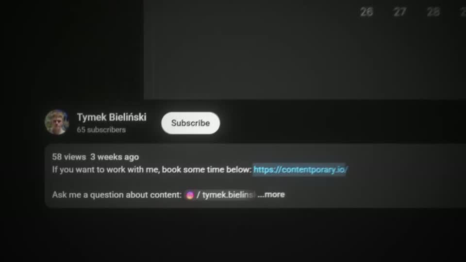 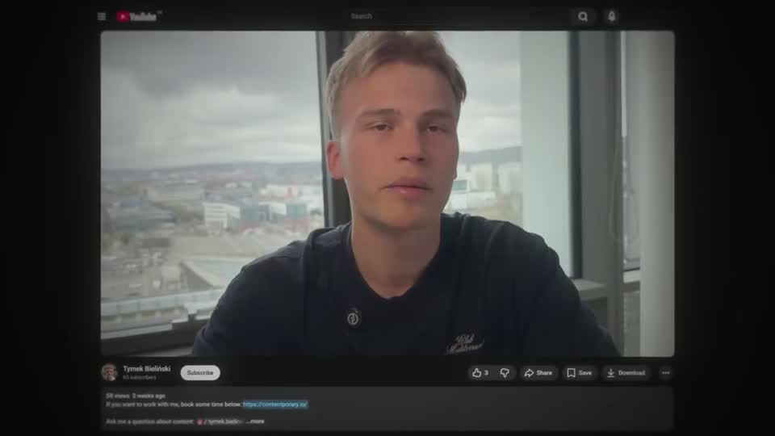 | A variant of the watch-page CTA where the player content is the booking page itself: the viewer sees exactly what clicking the link gives them, then the real description link, then the speaker drops back into the player. Every move carries strong directional motion blur, so the 7 s trip feels like one gesture. |
| spent-10k-on-mentors s042 ★ | 0:49.9–0:55.4 | 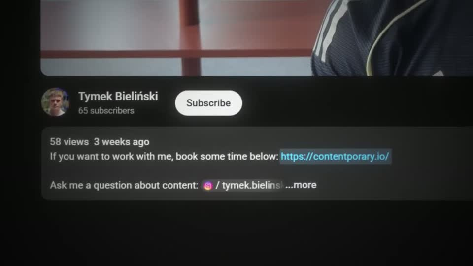 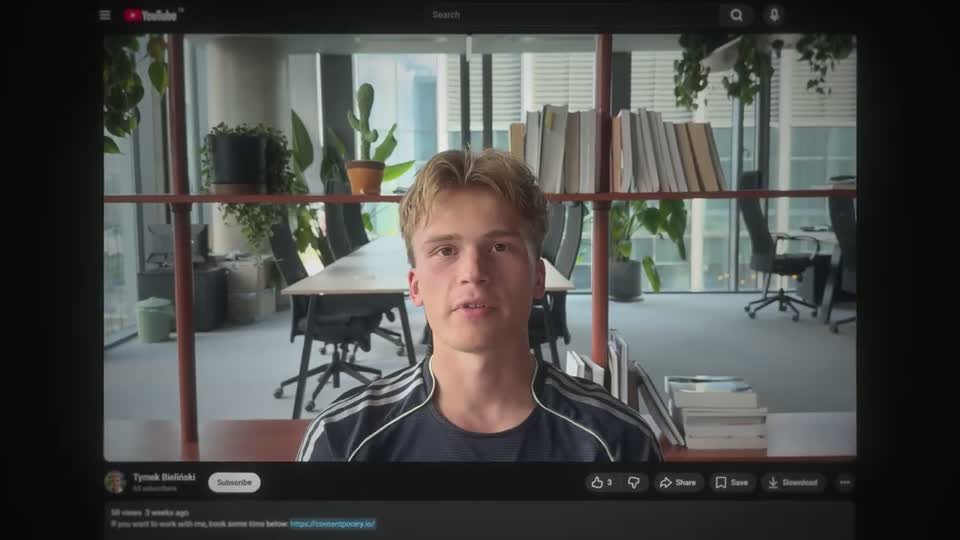 | The face never leaves: it shrinks into the player of a real watch page and keeps talking while the camera dives onto the actual description link, holds long enough to read it, and returns, so the CTA feels like part of the same shot rather than an ad break. |
| spent-10k-on-mentors s049 ★ | 12:07.5–12:14.5 |  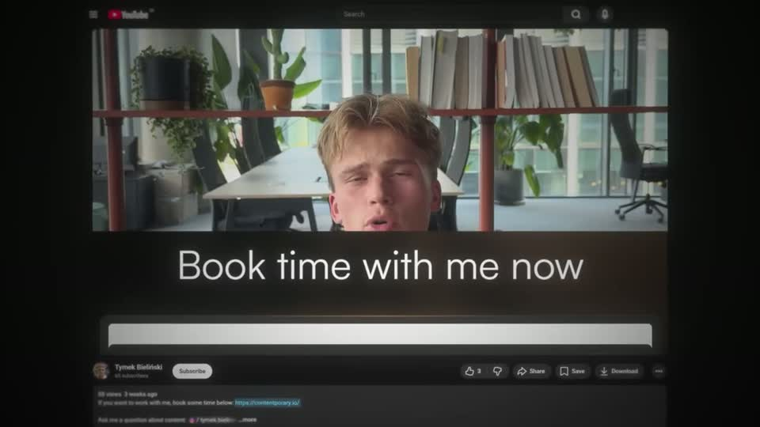 | The extended CTA chains the booking page into the same watch-page dive as every other CTA, so the viewer sees the destination and then exactly where the link is; a synthetic cursor selecting a date makes the booking feel one click away. |
| stupidly-simple-youtube-strategy s113 ★ | 8:28.2–8:30.3 | 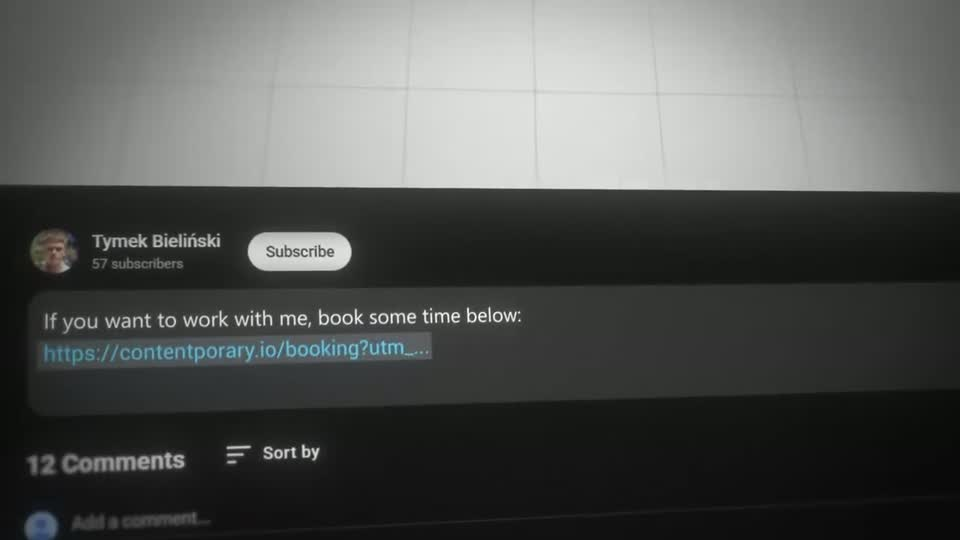 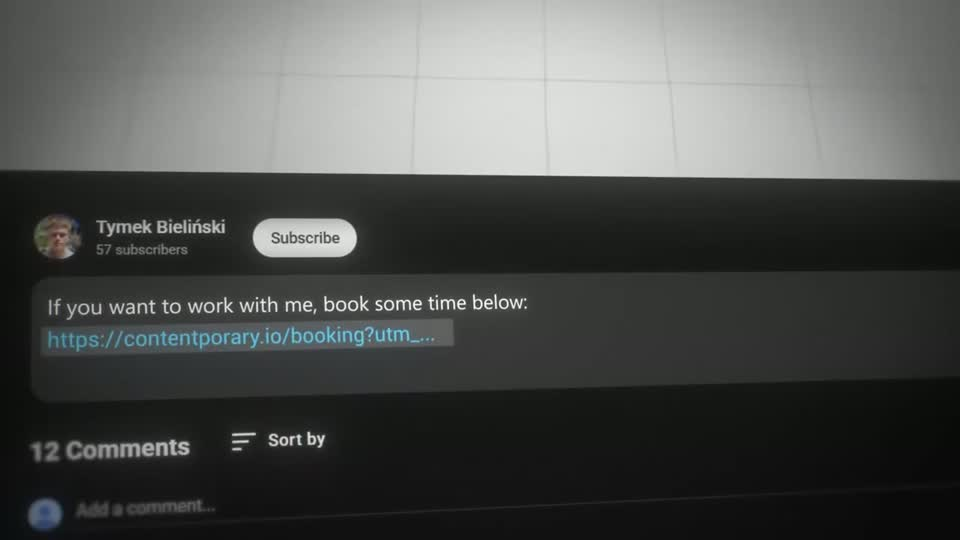 | The CTA lands on the real place the viewer will click: the pinned comment with the booking link, at large scale in dark YouTube UI, reached by one continuous dive from the path canvas and left by sliding back into the face. |
| ultra-predictable-funnel s086 ★ | 9:15.4–9:25.5 | 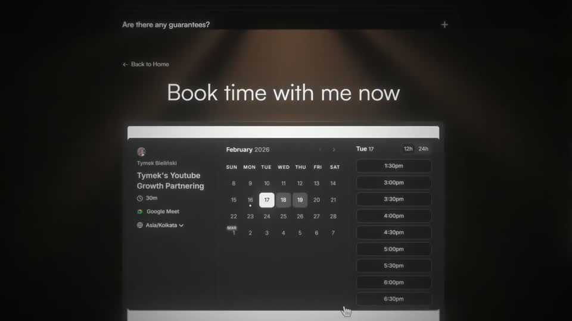 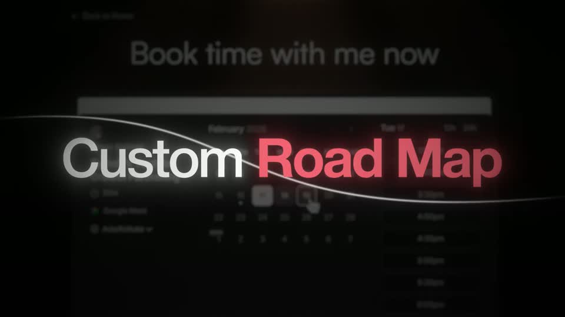 | The extended CTA walks the real funnel the viewer will take — link, website, button click with a cursor, booking calendar — and only then lands a glow title ('Custom Road Map', ≈130 px, 'Road Map' red with halo) over the booking page dimmed and blurred behind it, with a thin swoosh line through the title. |

…and 5 more in references/index.json.
<!-- generated:end -->
