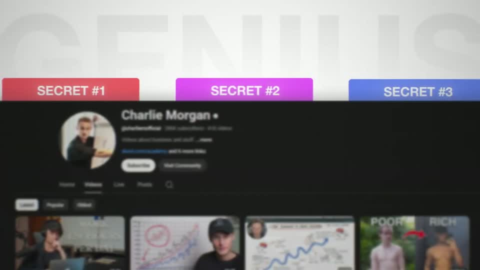
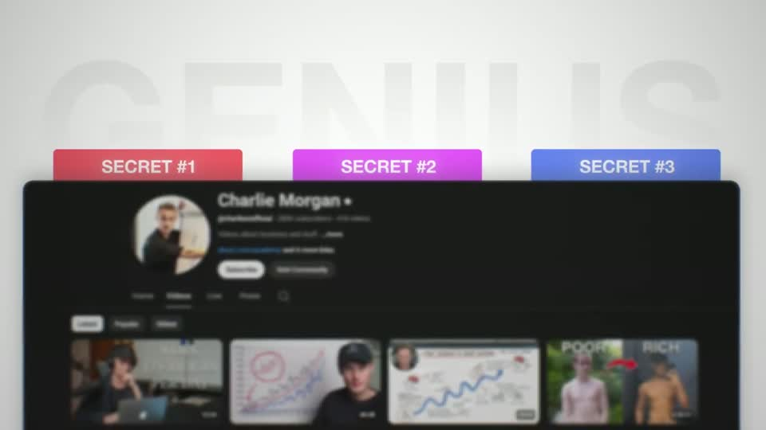
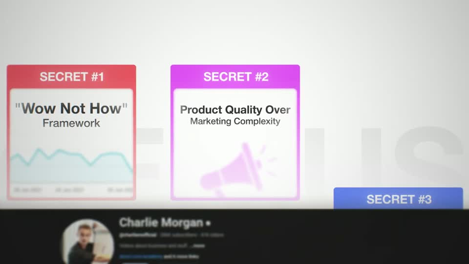
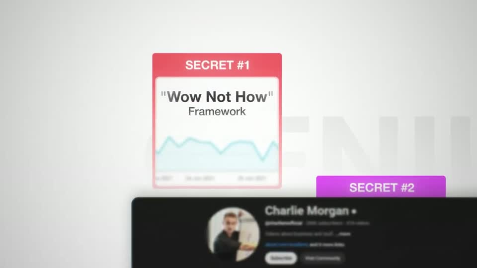
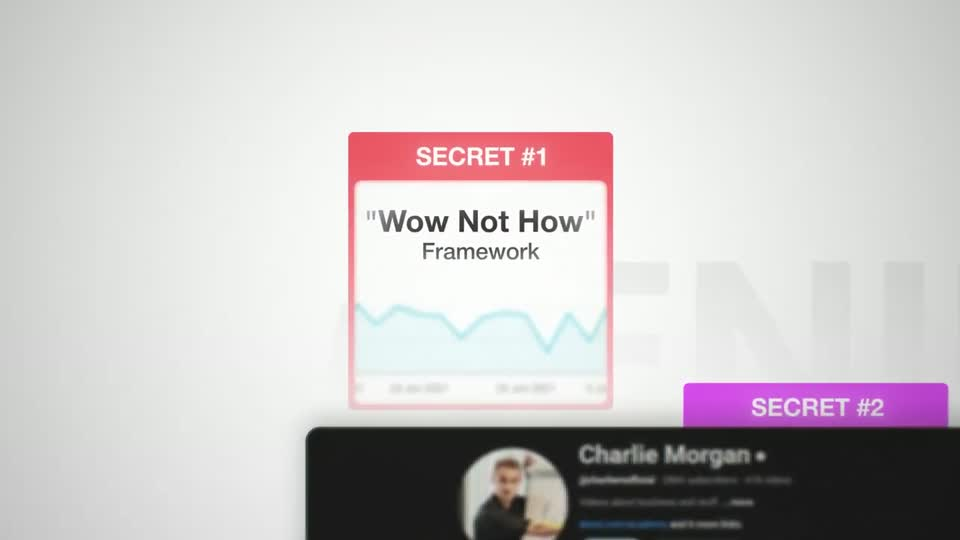
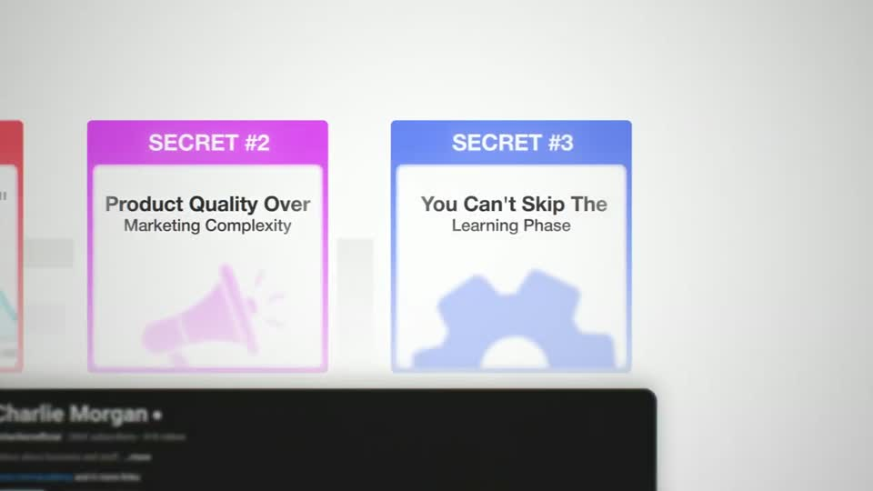
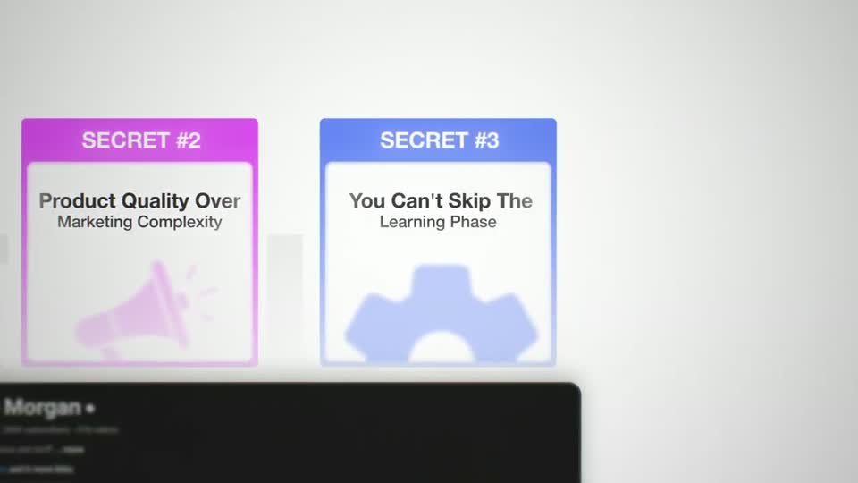

# roadmap — HFKit.roadmap

Rule: `standards/formats/long-form.md` (kit table). This card holds the evidence and the quality bar; the rule stays in the format profile.

## Quality bar

- Every visit opens on the previous visit's end state. The new card docks (≈ 0.8 s, card entrance) and the camera travels to frame it: ≈ 1.6–1.8 s at ≈ 1.8× in the pilot, ≈ 0.8–1.2 s in Stupidly. Earlier cards stay docked and visible. (outside the rule — open for Tymek; build to the rule/kit)
- Dark ground: the system name is set as large grey caps (≈ 110–130 px at the settled framing) **behind** the path and slightly defocused, so the path and cards own the foreground. The path glows (a pink-red line with bloom) and runs past both frame edges. Its nodes are numbered dark spheres with a white numeral that pop as the line reaches them. (outside the rule — open for Tymek; build to the rule/kit)
- Dark-ground cards are dark maroon glass tiles (≈ 250×290 at 1080 before the push) with a 1–2 px light border, a large white line icon above, a 2-line label below, and the node sphere sitting on the card.
- Light ground (Stupidly s018/s112): no glow or bloom anywhere. The system can be a real screenshot (the creator's channel page as a card), with chapter tabs in distinct colours tucked behind its top edge, popping ≈ 0.3 s apart. A huge pale ghost word sits behind. (outside the rule — open for Tymek; build to the rule/kit)
- Light-ground visits: each visit grows its tab into a tall card with a coloured border and header tab, a 2-line ≈ 45 px title and a pale icon or chart. (outside the rule — open for Tymek; build to the rule/kit)
- The intro may end by travelling along the path to the goal (a real booking calendar) and handing off to a B1 headline.
- A foreground element may pass through the depth (here sourced 3D bills). Hold ≥ 1 s per visit.

<!-- generated:start -->
## Evidence (generated by tools/ref_index.py — do not edit)

**8 exemplars** from 2 videos · duration median 5.0 s (p25–p75 3.83–5.33 s) · largest text median 77.5 px at 1080 · word build 0.4 s/word · hold 1.5 s

| Video | Time | Stills | Why it works |
|---|---|---|---|
| stupidly-simple-youtube-strategy s018 ★ | 0:54.9–1:00.3 |   | A roadmap built from the proof itself: the 'system' is literally the creator's channel page, and the three chapters are coloured file tabs tucked behind it, so every later visit (s064, s112, s082) can pull one tab up into a card. Depth from four planes: ghost word, ground vignette, dark page card with soft shadow, saturated tabs. |
| stupidly-simple-youtube-strategy s112 ★ | 6:10.2–6:15.2 |   | Each chapter adds one card to a growing row: card #1 stays standing, #2 rises next to it in its own colour with a soft pale icon, #3 waits as a tab — the roadmap shows both progress and what is left. Cards are light with a coloured border and header tab, so they read on the light ground without shadows. |
| ultra-predictable-funnel s016 ★ | 0:59.5–1:06.0 |   | The roadmap is an object in space, not a slide: the title is set as defocused metallic caps behind the path, the path has a soft bloom and runs off both frame edges, and 3D dollar bills fall through the shot. The camera then travels along the path to its destination (a real booking calendar), so the system visibly leads to the result. |
| ultra-predictable-funnel s024 ★ | 2:06.8–2:11.8 |   | Return visit feels continuous: same path, same defocused caps title, the camera simply resumes and the new card docks exactly on its node. The card is a dark maroon glass tile with a 1–2 px light border, a big white line icon and two-line label, read at ≈25 % W after the push. |
| stupidly-simple-youtube-strategy s064 | 5:02.9–5:07.3 |   | Chapter visit with continuity: the canvas is exactly where the intro left it, the tab becomes the card (same red, same label) and the camera travels to it — the viewer sees progress through the system, not a new title card. |
| stupidly-simple-youtube-strategy s082 | 7:02.5–7:06.0 |   | Third visit completes the row; the camera keeps moving right along the same canvas, so the sequence of three visits reads as one continuous pan through the system. |
| ultra-predictable-funnel s037 | 3:54.2–3:57.9 |   | Continuity again carries it: card 1 stays docked as the camera leaves it, so the viewer sees progress along the path; the docking card brightens and sharpens as it lands. |
| ultra-predictable-funnel s055 | 5:40.3–5:45.3 |   | Same continuity as the other visits; by the third visit the path carries two docked cards behind the camera, so progress is visible in one frame. |
<!-- generated:end -->
