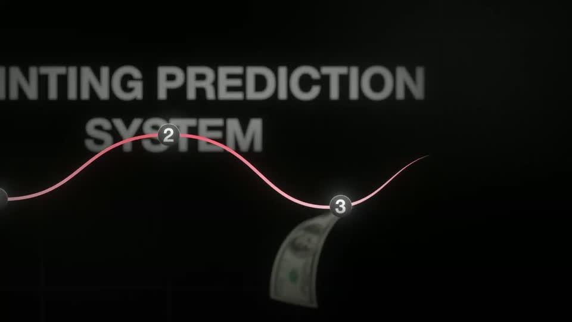
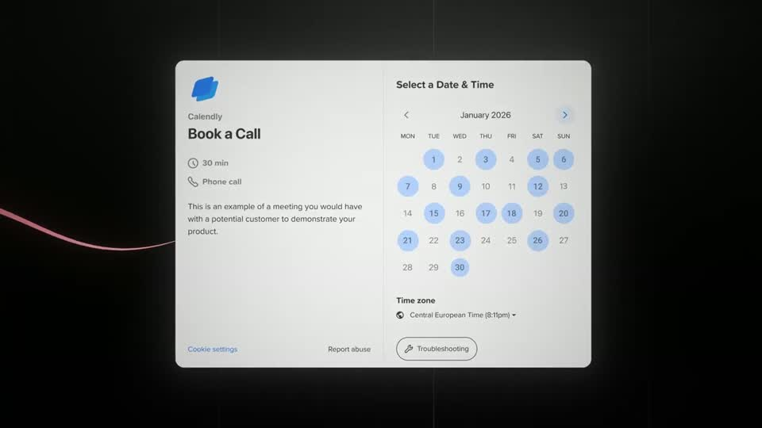
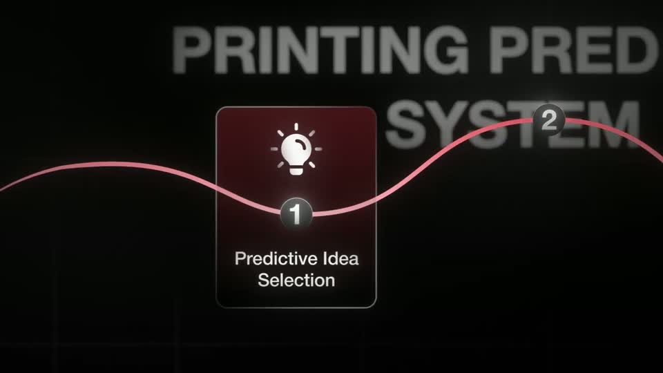
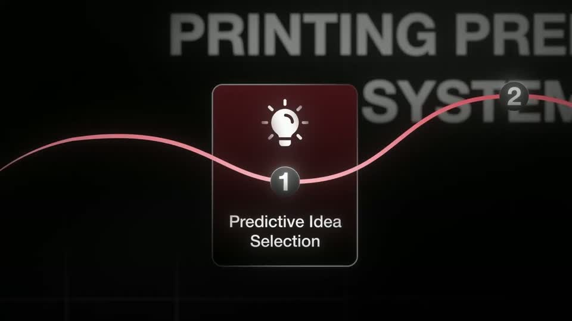
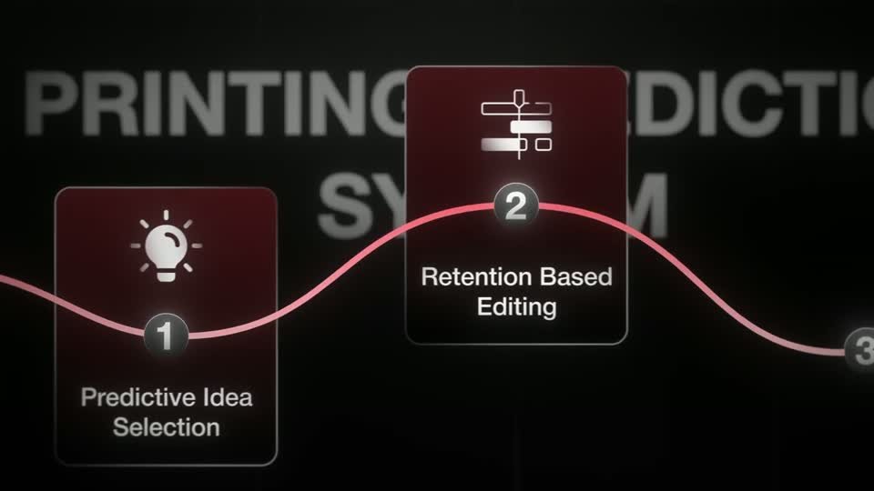
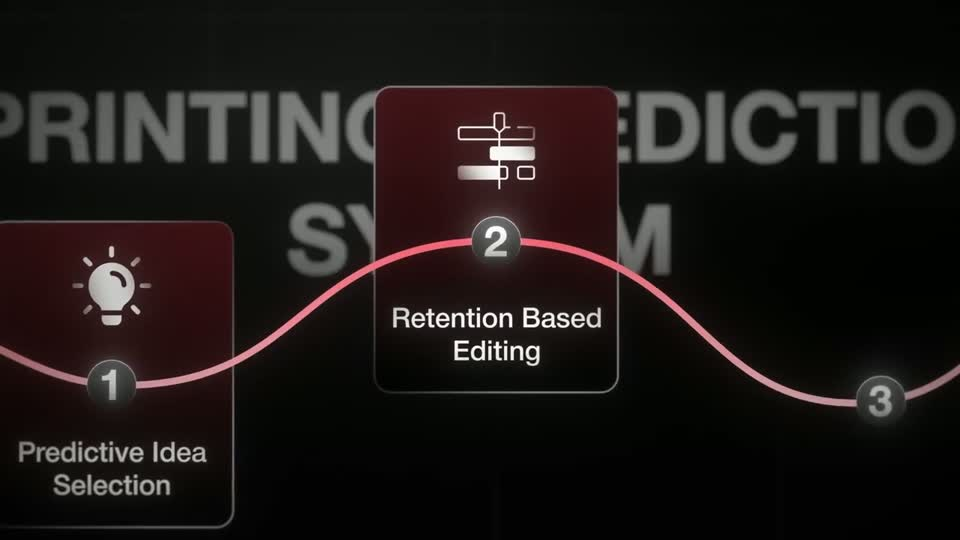
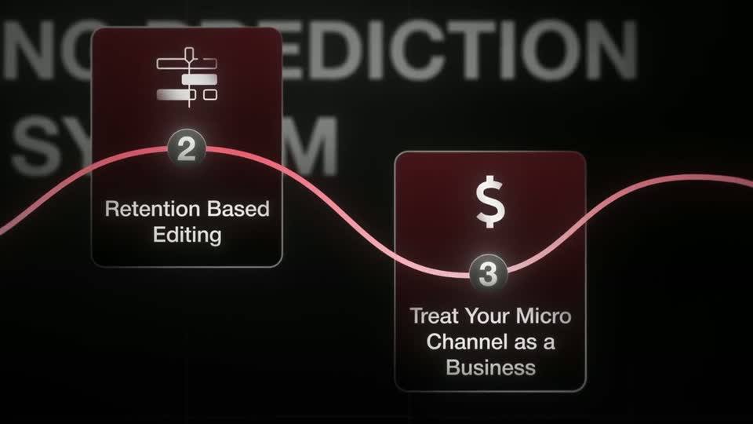
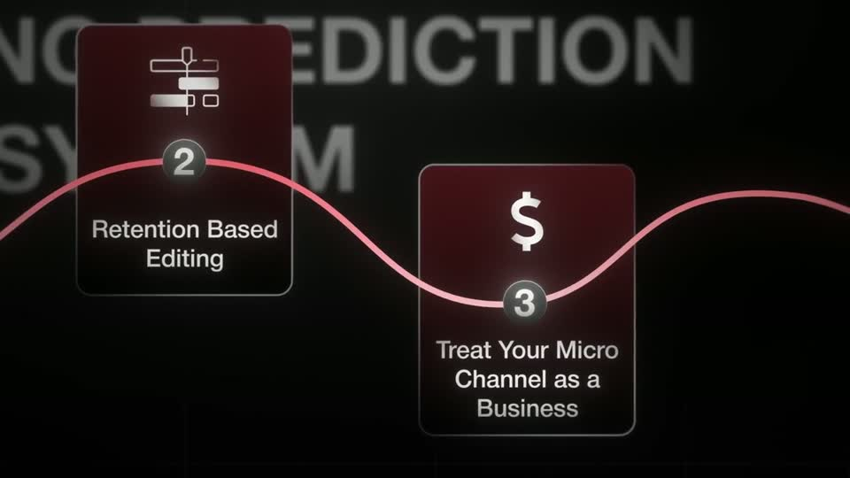

# roadmap — HFKit.roadmap

Rule: `standards/formats/long-form.md` (kit table). This card holds the evidence and the quality bar; the rule stays in the format profile.

## Quality bar

- The system name is set as large grey caps (≈ 110–130 px at the settled framing) **behind** the path and slightly defocused, so the path and cards own the foreground.
- The path glows (pink-red line with bloom), runs past both frame edges, and its nodes are numbered dark spheres with a white numeral that pop as the line reaches them.
- Docked cards are dark maroon glass tiles (≈ 250×290 at 1080 before the push), 1–2 px light border, a large white line icon above, a 2-line label below, the node sphere sitting on the card.
- Every visit opens on the previous visit's end state; the new card docks (≈ 0.8 s, card entrance) and the camera travels ≈ 1.6–1.8 s (`ease.camera`) to frame it at ≈ 1.8×; earlier cards stay docked and visible behind.
- The intro may end by travelling along the path to the goal (a real booking calendar) and handing off to a B1 headline.
- A foreground element may pass through the depth (here sourced 3D bills); hold ≥ 1 s per visit.

<!-- generated:start -->
## Evidence (generated by tools/ref_index.py — do not edit)

**4 exemplars** from 1 video · duration median 5.0 s (p25–p75 3.98–6.1 s) · largest text median 120.0 px at 1080 · word build 0.4 s/word · hold 1.25 s

| Video | Time | Stills | Why it works |
|---|---|---|---|
| ultra-predictable-funnel s016 ★ | 0:59.5–1:06.0 |   | The roadmap is an object in space, not a slide: the title is set as defocused metallic caps behind the path, the path has a soft bloom and runs off both frame edges, and 3D dollar bills fall through the shot. The camera then travels along the path to its destination (a real booking calendar), so the system visibly leads to the result. |
| ultra-predictable-funnel s024 ★ | 2:06.8–2:11.8 |   | Return visit feels continuous: same path, same defocused caps title, the camera simply resumes and the new card docks exactly on its node. The card is a dark maroon glass tile with a 1–2 px light border, a big white line icon and two-line label, read at ≈25 % W after the push. |
| ultra-predictable-funnel s037 | 3:54.2–3:57.9 |   | Continuity again carries it: card 1 stays docked as the camera leaves it, so the viewer sees progress along the path; the docking card brightens and sharpens as it lands. |
| ultra-predictable-funnel s055 | 5:40.3–5:45.3 |   | Same continuity as the other visits; by the third visit the path carries two docked cards behind the camera, so progress is visible in one frame. |
<!-- generated:end -->
