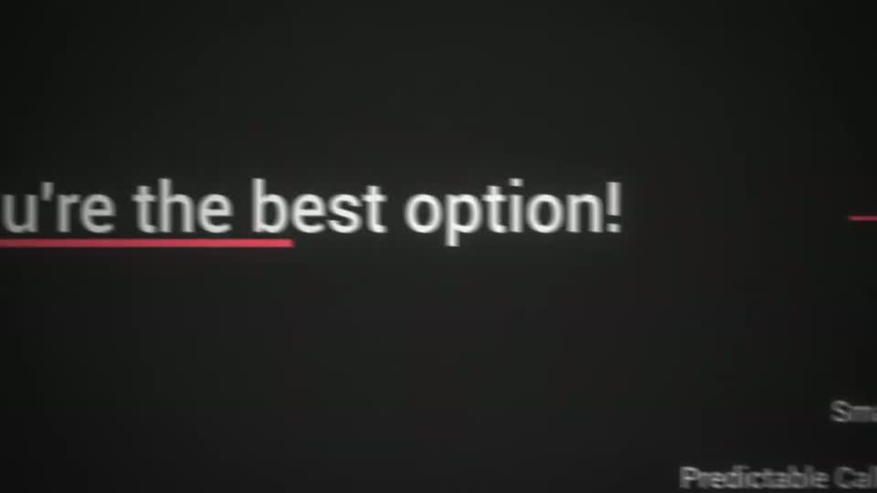
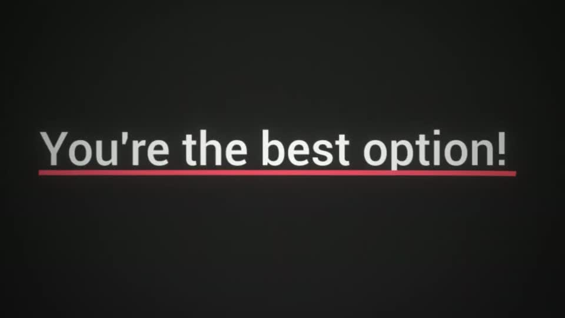

# title — HFKit.title

Rule: `standards/formats/long-form.md` (kit table). This card holds the evidence and the quality bar; the rule stays in the format profile.

## Quality bar

- One centred line, cap height ≥ 100 px (≈ 10 % H), white; the line spans ≤ 85 % W.
- On a dark ground the line sits on the same canvas as the scene it concludes — reach it with a camera move (a whip ≈ 0.5 s with directional motion blur, 180° shutter), not a cut to a blank card.
- One thick red underline (≈ 10–12 px) sweeps under the line or its emphasis phrase after the camera settles.
- No other elements in frame except faint canvas edges; hold 0.6–1 s.
- When the title closes a CTA (s086 'Custom Road Map') it takes the full glow treatment: red meaning words, halo, the booking page dimmed and blurred behind it.

<!-- generated:start -->
## Evidence (generated by tools/ref_index.py — do not edit)

**1 exemplar** from 1 video · duration median 1.93 s · largest text median 115 px at 1080 · hold 0.7 s

| Video | Time | Stills | Why it works |
|---|---|---|---|
| ultra-predictable-funnel s065 | 7:04.4–7:06.3 |   | The title lives on the same canvas as the tree (its labels are still visible at the frame edge), so the whip is spatial, not a transition. One centred line ≈115 px with a thick red underline spanning ≈84 % W. |
<!-- generated:end -->
