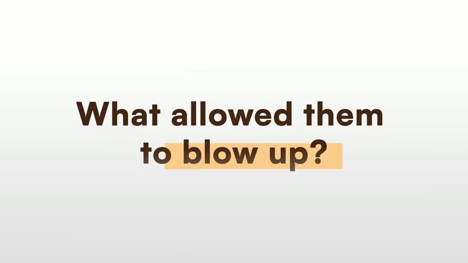
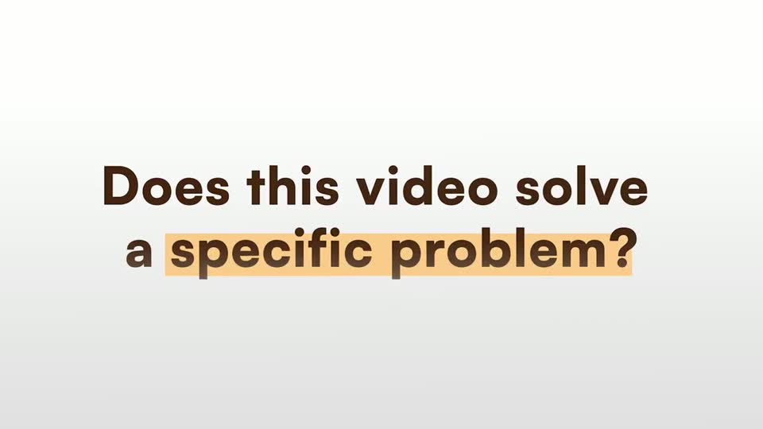
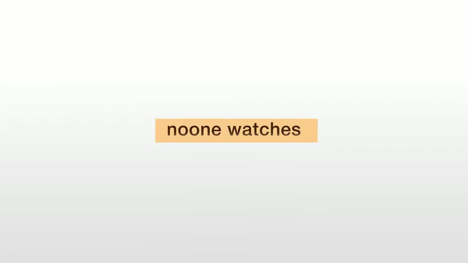
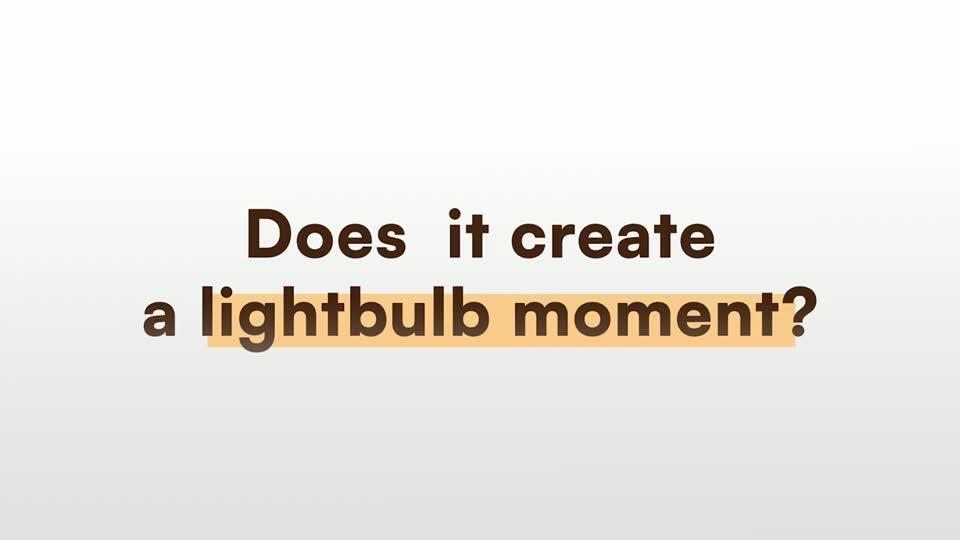
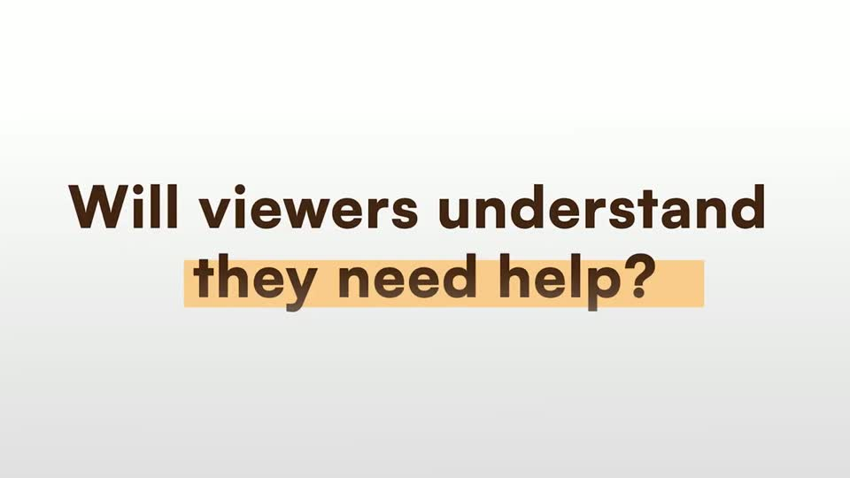
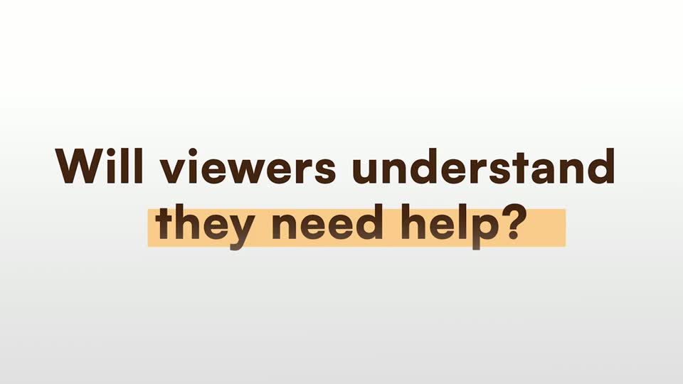

# title — HFKit.title

Rule: `standards/formats/long-form.md` (kit table). This card holds the evidence and the quality bar; the rule stays in the format profile.

## Quality bar

- Cap height ≥ 95 px (≈ 9–10 % H). One line on the dark ground, up to 2 centred lines on the light ground; the longest line spans ≤ 85 % W.
- Words build one by one (≈ 0.2 s/word) with a short blur → sharp. Never per character.
- Dark ground: white, on the same canvas as the scene it concludes. Reach it with a camera move (a whip ≈ 0.5 s with directional motion blur, 180° shutter), not a cut to a blank card. One thick red underline (≈ 10–12 px) sweeps under the line or its emphasis phrase after the camera settles.
- Light ground (Stupidly s024/s057): dark warm text (brown, not black) with no glow, on a plain gradient ground with a soft vignette, and a locked camera. Once the line is complete, a marker (`accent.block`, here peach) wipes L → R behind the emphasis words in ≈ 0.35 s, sitting low like a real highlighter.
- Nothing else is in frame except faint canvas edges. Hold 0.6–1.8 s.
- One template is reused verbatim for a series, such as a 3-question checklist with face cut-ins between the questions (Stupidly s057/s059/s061).
- When the title closes a CTA (pilot s086 'Custom Road Map'), it takes the full glow treatment on the dark ground: red meaning words, a halo, and the booking page dimmed and blurred behind it.

<!-- generated:start -->
## Evidence (generated by tools/ref_index.py — do not edit)

**6 exemplars** from 2 videos · duration median 3.13 s (p25–p75 2.11–3.34 s) · largest text median 95.0 px at 1080 · word build 0.2 s/word · hold 1.8 s

| Video | Time | Stills | Why it works |
|---|---|---|---|
| stupidly-simple-youtube-strategy s024 ★ | 1:12.3–1:15.4 |   | Light-ground title done right: no glow, dark warm-brown text (not black) at ≈ 95 px cap height, two centred lines, and one soft peach marker that sits slightly below the x-height like a real highlighter stroke — it lands only after the line is complete. Same template every time, so the three checklist questions read as a set. |
| stupidly-simple-youtube-strategy s057 ★ | 4:33.0–4:36.1 |   | Light-ground title done right: no glow, dark warm-brown text (not black) at ≈ 95 px cap height, two centred lines, and one soft peach marker that sits slightly below the x-height like a real highlighter stroke — it lands only after the line is complete. Same template every time, so the three checklist questions read as a set. |
| stupidly-simple-youtube-strategy s041 | 2:42.5–2:45.7 |   | Small-type variant of the light title: one short line at ≈ 40 px in the middle of an empty frame, so the emptiness is the point ('noone watches'); the peach marker is the only colour. |
| stupidly-simple-youtube-strategy s059 | 4:38.3–4:40.5 |   | Light-ground title done right: no glow, dark warm-brown text (not black) at ≈ 95 px cap height, two centred lines, and one soft peach marker that sits slightly below the x-height like a real highlighter stroke — it lands only after the line is complete. Same template every time, so the three checklist questions read as a set. |
| stupidly-simple-youtube-strategy s061 | 4:42.3–4:45.8 |   | Light-ground title done right: no glow, dark warm-brown text (not black) at ≈ 95 px cap height, two centred lines, and one soft peach marker that sits slightly below the x-height like a real highlighter stroke — it lands only after the line is complete. Same template every time, so the three checklist questions read as a set. |
| ultra-predictable-funnel s065 | 7:04.4–7:06.3 |   | The title lives on the same canvas as the tree (its labels are still visible at the frame edge), so the whip is spatial, not a transition. One centred line ≈115 px with a thick red underline spanning ≈84 % W. |
<!-- generated:end -->
